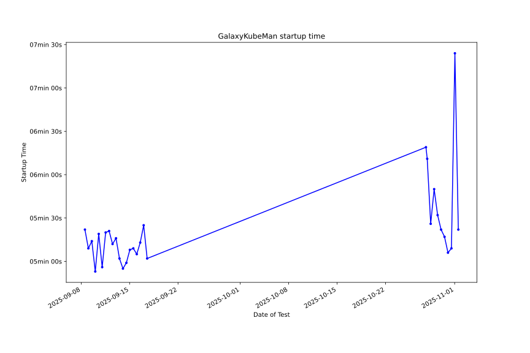

# Automated Tests for Galaxy on Kubernetes Stacks

## Deployment testing

Twice a day, [GalaxyKubeMan
(GKM)](https://github.com/galaxyproject/galaxykubeman-helm) is deployed on GKE,
mimicking an AnVIL deployment. The purpose of these tests is to provide
reasonable confidence that Galaxy can be launched on the AnVIL everyday.

Below is a plot summarizing successful deployments and GKM install times. <a
href="https://htmlpreview.github.io/?https://github.com/anvilproject/galaxy-tests/blob/main/reports/anvil-production/deployments.html">Click
here</a> or on the image for more details.

## Tool testing
After each successful deployment, automated tool tests are also run against the
instance. These serve as an end-to-end-like test for Galaxy, providing
confidence that Galaxy deployments are functional. These tests cycle on a weekly
basis through the entire suite of tools installed by default on AnVIL, providing
reasonable confidence that the tools encountered by most users remain
functional, and automating the detection and reporting of tools breaking.

### Tool test reports

Latest tool test reports for each chunk:

<table id="toolreports"><thead><tr><th>Report ID</th><th>Tool List</th><th>Latest report</th><th>Previous report</th></tr></thead><tbody>
    <tr>
        <td>0</td>
        <td><a href="https://github.com/anvilproject/galaxy-tests/blob/main/reports/anvil-production/tool-tests/gxy-auto-2022-07-04-04-45-48-1/tools.yaml">Toolset</a></td>
        <td><a href="https://htmlpreview.github.io/?https://github.com/anvilproject/galaxy-tests/blob/main/reports/anvil-production/tool-tests/gxy-auto-2022-07-04-04-45-48-1/results.html">Mon Jul 04 04:53:29 2022</a></td>
        <td><a href="https://htmlpreview.github.io/?https://github.com/anvilproject/galaxy-tests/blob/main/reports/anvil-production/tool-tests/gxy-auto-2022-06-27-04-50-06-1/results.html">Mon Jun 27 04:58:07 2022</a></td>
    </tr>
    <tr>
        <td>1</td>
        <td><a href="https://github.com/anvilproject/galaxy-tests/blob/main/reports/anvil-production/tool-tests/gxy-auto-2022-07-04-16-15-58-1/tools.yaml">Toolset</a></td>
        <td><a href="https://htmlpreview.github.io/?https://github.com/anvilproject/galaxy-tests/blob/main/reports/anvil-production/tool-tests/gxy-auto-2022-07-04-16-15-58-1/results.html">Mon Jul 04 16:23:44 2022</a></td>
        <td><a href="https://htmlpreview.github.io/?https://github.com/anvilproject/galaxy-tests/blob/main/reports/anvil-production/tool-tests/gxy-auto-2022-06-27-16-15-31-1/results.html">Mon Jun 27 16:25:09 2022</a></td>
    </tr>
    <tr>
        <td>2</td>
        <td><a href="https://github.com/anvilproject/galaxy-tests/blob/main/reports/anvil-production/tool-tests/gxy-auto-2022-07-05-04-34-51-1/tools.yaml">Toolset</a></td>
        <td><a href="https://htmlpreview.github.io/?https://github.com/anvilproject/galaxy-tests/blob/main/reports/anvil-production/tool-tests/gxy-auto-2022-07-05-04-34-51-1/results.html">Tue Jul 05 04:42:21 2022</a></td>
        <td><a href="https://htmlpreview.github.io/?https://github.com/anvilproject/galaxy-tests/blob/main/reports/anvil-production/tool-tests/gxy-auto-2022-07-05-04-34-51-1/results.html">Tue Jul 05 04:42:21 2022</a></td>
    </tr>
    <tr>
        <td>3</td>
        <td><a href="https://github.com/anvilproject/galaxy-tests/blob/main/reports/anvil-production/tool-tests/gxy-auto-2022-07-05-16-15-58-1/tools.yaml">Toolset</a></td>
        <td><a href="https://htmlpreview.github.io/?https://github.com/anvilproject/galaxy-tests/blob/main/reports/anvil-production/tool-tests/gxy-auto-2022-07-05-16-15-58-1/results.html">Tue Jul 05 16:23:31 2022</a></td>
        <td><a href="https://htmlpreview.github.io/?https://github.com/anvilproject/galaxy-tests/blob/main/reports/anvil-production/tool-tests/gxy-auto-2022-06-28-16-15-57-1/results.html">Tue Jun 28 16:24:15 2022</a></td>
    </tr>
    <tr>
        <td>4</td>
        <td><a href="https://github.com/anvilproject/galaxy-tests/blob/main/reports/anvil-production/tool-tests/gxy-auto-2022-07-06-04-46-51-1/tools.yaml">Toolset</a></td>
        <td><a href="https://htmlpreview.github.io/?https://github.com/anvilproject/galaxy-tests/blob/main/reports/anvil-production/tool-tests/gxy-auto-2022-07-06-04-46-51-1/results.html">Wed Jul 06 04:54:42 2022</a></td>
        <td><a href="https://htmlpreview.github.io/?https://github.com/anvilproject/galaxy-tests/blob/main/reports/anvil-production/tool-tests/gxy-auto-2022-06-29-04-45-16-1/results.html">Wed Jun 29 04:54:02 2022</a></td>
    </tr>
    <tr>
        <td>5</td>
        <td><a href="https://github.com/anvilproject/galaxy-tests/blob/main/reports/anvil-production/tool-tests/gxy-auto-2022-07-06-16-15-52-1/tools.yaml">Toolset</a></td>
        <td><a href="https://htmlpreview.github.io/?https://github.com/anvilproject/galaxy-tests/blob/main/reports/anvil-production/tool-tests/gxy-auto-2022-07-06-16-15-52-1/results.html">Wed Jul 06 16:23:52 2022</a></td>
        <td><a href="https://htmlpreview.github.io/?https://github.com/anvilproject/galaxy-tests/blob/main/reports/anvil-production/tool-tests/gxy-auto-2022-06-29-16-33-30-1/results.html">Wed Jun 29 16:44:12 2022</a></td>
    </tr>
    <tr>
        <td>6</td>
        <td><a href="https://github.com/anvilproject/galaxy-tests/blob/main/reports/anvil-production/tool-tests/gxy-auto-2022-07-07-04-45-30-1/tools.yaml">Toolset</a></td>
        <td><a href="https://htmlpreview.github.io/?https://github.com/anvilproject/galaxy-tests/blob/main/reports/anvil-production/tool-tests/gxy-auto-2022-07-07-04-45-30-1/results.html">Thu Jul 07 04:53:31 2022</a></td>
        <td><a href="https://htmlpreview.github.io/?https://github.com/anvilproject/galaxy-tests/blob/main/reports/anvil-production/tool-tests/gxy-auto-2022-06-30-04-37-13-1/results.html">Thu Jun 30 04:45:54 2022</a></td>
    </tr>
    <tr>
        <td>7</td>
        <td><a href="https://github.com/anvilproject/galaxy-tests/blob/main/reports/anvil-production/tool-tests/gxy-auto-2022-07-07-16-17-51-1/tools.yaml">Toolset</a></td>
        <td><a href="https://htmlpreview.github.io/?https://github.com/anvilproject/galaxy-tests/blob/main/reports/anvil-production/tool-tests/gxy-auto-2022-07-07-16-17-51-1/results.html">Thu Jul 07 16:25:33 2022</a></td>
        <td><a href="https://htmlpreview.github.io/?https://github.com/anvilproject/galaxy-tests/blob/main/reports/anvil-production/tool-tests/gxy-auto-2022-06-30-16-16-35-1/results.html">Thu Jun 30 16:24:33 2022</a></td>
    </tr>
    <tr>
        <td>8</td>
        <td><a href="https://github.com/anvilproject/galaxy-tests/blob/main/reports/anvil-production/tool-tests/gxy-auto-2022-07-08-04-38-47-1/tools.yaml">Toolset</a></td>
        <td><a href="https://htmlpreview.github.io/?https://github.com/anvilproject/galaxy-tests/blob/main/reports/anvil-production/tool-tests/gxy-auto-2022-07-08-04-38-47-1/results.html">Fri Jul 08 04:47:02 2022</a></td>
        <td><a href="https://htmlpreview.github.io/?https://github.com/anvilproject/galaxy-tests/blob/main/reports/anvil-production/tool-tests/gxy-auto-2022-07-01-04-54-48-1/results.html">Fri Jul 01 05:02:14 2022</a></td>
    </tr>
    <tr>
        <td>9</td>
        <td><a href="https://github.com/anvilproject/galaxy-tests/blob/main/reports/anvil-production/tool-tests/gxy-auto-2022-07-01-16-15-53-1/tools.yaml">Toolset</a></td>
        <td><a href="https://htmlpreview.github.io/?https://github.com/anvilproject/galaxy-tests/blob/main/reports/anvil-production/tool-tests/gxy-auto-2022-07-01-16-15-53-1/results.html">Fri Jul 01 16:25:03 2022</a></td>
        <td><a href="https://htmlpreview.github.io/?https://github.com/anvilproject/galaxy-tests/blob/main/reports/anvil-production/tool-tests/gxy-auto-2022-06-24-16-14-44-1/results.html">Fri Jun 24 16:24:07 2022</a></td>
    </tr>
    <tr>
        <td>10</td>
        <td><a href="https://github.com/anvilproject/galaxy-tests/blob/main/reports/anvil-production/tool-tests/gxy-auto-2022-07-02-04-34-40-1/tools.yaml">Toolset</a></td>
        <td><a href="https://htmlpreview.github.io/?https://github.com/anvilproject/galaxy-tests/blob/main/reports/anvil-production/tool-tests/gxy-auto-2022-07-02-04-34-40-1/results.html">Sat Jul 02 04:41:55 2022</a></td>
        <td><a href="https://htmlpreview.github.io/?https://github.com/anvilproject/galaxy-tests/blob/main/reports/anvil-production/tool-tests/gxy-auto-2022-06-25-04-26-17-1/results.html">Sat Jun 25 04:34:53 2022</a></td>
    </tr>
    <tr>
        <td>11</td>
        <td><a href="https://github.com/anvilproject/galaxy-tests/blob/main/reports/anvil-production/tool-tests/gxy-auto-2022-07-02-16-13-36-1/tools.yaml">Toolset</a></td>
        <td><a href="https://htmlpreview.github.io/?https://github.com/anvilproject/galaxy-tests/blob/main/reports/anvil-production/tool-tests/gxy-auto-2022-07-02-16-13-36-1/results.html">Sat Jul 02 16:20:57 2022</a></td>
        <td><a href="https://htmlpreview.github.io/?https://github.com/anvilproject/galaxy-tests/blob/main/reports/anvil-production/tool-tests/gxy-auto-2022-06-25-16-13-29-1/results.html">Sat Jun 25 16:20:53 2022</a></td>
    </tr>
    <tr>
        <td>12</td>
        <td><a href="https://github.com/anvilproject/galaxy-tests/blob/main/reports/anvil-production/tool-tests/gxy-auto-2022-07-03-04-26-23-1/tools.yaml">Toolset</a></td>
        <td><a href="https://htmlpreview.github.io/?https://github.com/anvilproject/galaxy-tests/blob/main/reports/anvil-production/tool-tests/gxy-auto-2022-07-03-04-26-23-1/results.html">Sun Jul 03 04:34:26 2022</a></td>
        <td><a href="https://htmlpreview.github.io/?https://github.com/anvilproject/galaxy-tests/blob/main/reports/anvil-production/tool-tests/gxy-auto-2022-06-26-04-28-24-1/results.html">Sun Jun 26 04:36:37 2022</a></td>
    </tr>
    <tr>
        <td>13</td>
        <td><a href="https://github.com/anvilproject/galaxy-tests/blob/main/reports/anvil-production/tool-tests/gxy-auto-2022-07-03-16-13-46-1/tools.yaml">Toolset</a></td>
        <td><a href="https://htmlpreview.github.io/?https://github.com/anvilproject/galaxy-tests/blob/main/reports/anvil-production/tool-tests/gxy-auto-2022-07-03-16-13-46-1/results.html">Sun Jul 03 16:20:37 2022</a></td>
        <td><a href="https://htmlpreview.github.io/?https://github.com/anvilproject/galaxy-tests/blob/main/reports/anvil-production/tool-tests/gxy-auto-2022-06-26-16-13-28-1/results.html">Sun Jun 26 16:21:13 2022</a></td>
    </tr></tbody></table>

### Individual tool tests results over time:

<table id="tooltests"><thead<tr><th>#</th><th>Report ID</th><th>Tool ID</th><th>Test #</th><th>Test results</th></thead><tbody>
    <tr>
        <td>1</td>
        <td><a href="https://htmlpreview.github.io/?https://github.com/anvilproject/galaxy-tests/blob/main/reports/anvil-production/tool-tests/gxy-auto-2022-07-04-04-45-48-1/results.html">0</a></td>
        <td>iuc/sra_tools@e08a7ad4378b</td>
        <td>Test #1</td>
        <td>FP</td>
    <tr>
        <td></td><td></td><td></td>
        <td>Test #2</td>
        <td>FP</td>
    </tr>
    <tr>
        <td></td><td></td><td></td>
        <td>Test #3</td>
        <td>FP</td>
    </tr></tr>
    <tr>
        <td>2</td>
        <td><a href="https://htmlpreview.github.io/?https://github.com/anvilproject/galaxy-tests/blob/main/reports/anvil-production/tool-tests/gxy-auto-2022-07-04-04-45-48-1/results.html">0</a></td>
        <td>iuc/ncbi_acc_download@1c58de56d587</td>
        <td>Test #1</td>
        <td>FP</td>
    <tr>
        <td></td><td></td><td></td>
        <td>Test #2</td>
        <td>FP</td>
    </tr>
    <tr>
        <td></td><td></td><td></td>
        <td>Test #3</td>
        <td>FP</td>
    </tr></tr>
    <tr>
        <td>3</td>
        <td><a href="https://htmlpreview.github.io/?https://github.com/anvilproject/galaxy-tests/blob/main/reports/anvil-production/tool-tests/gxy-auto-2022-07-04-04-45-48-1/results.html">0</a></td>
        <td>nml/collapse_collections@90981f86000f</td>
        <td>Test #1</td>
        <td>FP</td>
    <tr>
        <td></td><td></td><td></td>
        <td>Test #2</td>
        <td>FP</td>
    </tr>
    <tr>
        <td></td><td></td><td></td>
        <td>Test #3</td>
        <td>FP</td>
    </tr></tr>
    <tr>
        <td>4</td>
        <td><a href="https://htmlpreview.github.io/?https://github.com/anvilproject/galaxy-tests/blob/main/reports/anvil-production/tool-tests/gxy-auto-2022-07-04-04-45-48-1/results.html">0</a></td>
        <td>bgruening/split_file_to_collection@6cbe2f30c2d7</td>
        <td>Test #1</td>
        <td>FP</td>
    <tr>
        <td></td><td></td><td></td>
        <td>Test #2</td>
        <td>FP</td>
    </tr>
    <tr>
        <td></td><td></td><td></td>
        <td>Test #3</td>
        <td>FP</td>
    </tr></tr>
    <tr>
        <td>5</td>
        <td><a href="https://htmlpreview.github.io/?https://github.com/anvilproject/galaxy-tests/blob/main/reports/anvil-production/tool-tests/gxy-auto-2022-07-04-04-45-48-1/results.html">0</a></td>
        <td>iuc/collection_element_identifiers@d3c07d270a50</td>
        <td>Test #1</td>
        <td>FP</td>
    <tr>
        <td></td><td></td><td></td>
        <td>Test #2</td>
        <td>FP</td>
    </tr>
    <tr>
        <td></td><td></td><td></td>
        <td>Test #3</td>
        <td>FP</td>
    </tr></tr>
    <tr>
        <td>6</td>
        <td><a href="https://htmlpreview.github.io/?https://github.com/anvilproject/galaxy-tests/blob/main/reports/anvil-production/tool-tests/gxy-auto-2022-07-04-04-45-48-1/results.html">0</a></td>
        <td>iuc/collection_column_join@071084070619</td>
        <td>Test #1</td>
        <td>FP</td>
    <tr>
        <td></td><td></td><td></td>
        <td>Test #2</td>
        <td>FP</td>
    </tr>
    <tr>
        <td></td><td></td><td></td>
        <td>Test #3</td>
        <td>FP</td>
    </tr></tr>
    <tr>
        <td>7</td>
        <td><a href="https://htmlpreview.github.io/?https://github.com/anvilproject/galaxy-tests/blob/main/reports/anvil-production/tool-tests/gxy-auto-2022-07-04-04-45-48-1/results.html">0</a></td>
        <td>iuc/filter_tabular@6544e4b87a4f</td>
        <td>Test #1</td>
        <td>FP</td>
    <tr>
        <td></td><td></td><td></td>
        <td>Test #2</td>
        <td>FP</td>
    </tr>
    <tr>
        <td></td><td></td><td></td>
        <td>Test #3</td>
        <td>FP</td>
    </tr></tr>
    <tr>
        <td>8</td>
        <td><a href="https://htmlpreview.github.io/?https://github.com/anvilproject/galaxy-tests/blob/main/reports/anvil-production/tool-tests/gxy-auto-2022-07-04-04-45-48-1/results.html">0</a></td>
        <td>iuc/query_tabular@83069b38aa85</td>
        <td>Test #1</td>
        <td>FP</td>
    <tr>
        <td></td><td></td><td></td>
        <td>Test #2</td>
        <td>FP</td>
    </tr>
    <tr>
        <td></td><td></td><td></td>
        <td>Test #3</td>
        <td>FP</td>
    </tr></tr>
    <tr>
        <td>9</td>
        <td><a href="https://htmlpreview.github.io/?https://github.com/anvilproject/galaxy-tests/blob/main/reports/anvil-production/tool-tests/gxy-auto-2022-07-04-04-45-48-1/results.html">0</a></td>
        <td>devteam/column_maker@02026300aa45</td>
        <td>Test #1</td>
        <td>FP</td>
    <tr>
        <td></td><td></td><td></td>
        <td>Test #2</td>
        <td>FP</td>
    </tr>
    <tr>
        <td></td><td></td><td></td>
        <td>Test #3</td>
        <td>FP</td>
    </tr></tr>
    <tr>
        <td>10</td>
        <td><a href="https://htmlpreview.github.io/?https://github.com/anvilproject/galaxy-tests/blob/main/reports/anvil-production/tool-tests/gxy-auto-2022-07-04-04-45-48-1/results.html">0</a></td>
        <td>iuc/sqlite_to_tabular@bce29ec10b78</td>
        <td>Test #1</td>
        <td>FP</td>
    <tr>
        <td></td><td></td><td></td>
        <td>Test #2</td>
        <td>FP</td>
    </tr>
    <tr>
        <td></td><td></td><td></td>
        <td>Test #3</td>
        <td>FP</td>
    </tr></tr>
    <tr>
        <td>11</td>
        <td><a href="https://htmlpreview.github.io/?https://github.com/anvilproject/galaxy-tests/blob/main/reports/anvil-production/tool-tests/gxy-auto-2022-07-04-04-45-48-1/results.html">0</a></td>
        <td>iuc/annotatemyids@44018dd6b447</td>
        <td>Test #1</td>
        <td>FP</td>
    <tr>
        <td></td><td></td><td></td>
        <td>Test #2</td>
        <td>FP</td>
    </tr>
    <tr>
        <td></td><td></td><td></td>
        <td>Test #3</td>
        <td>FP</td>
    </tr></tr>
    <tr>
        <td>12</td>
        <td><a href="https://htmlpreview.github.io/?https://github.com/anvilproject/galaxy-tests/blob/main/reports/anvil-production/tool-tests/gxy-auto-2022-07-04-04-45-48-1/results.html">0</a></td>
        <td>mvdbeek/concatenate_multiple_datasets@201c568972c3</td>
        <td>Test #1</td>
        <td>FP</td>
    <tr>
        <td></td><td></td><td></td>
        <td>Test #2</td>
        <td>FP</td>
    </tr>
    <tr>
        <td></td><td></td><td></td>
        <td>Test #3</td>
        <td>FP</td>
    </tr></tr>
    <tr>
        <td>13</td>
        <td><a href="https://htmlpreview.github.io/?https://github.com/anvilproject/galaxy-tests/blob/main/reports/anvil-production/tool-tests/gxy-auto-2022-07-04-04-45-48-1/results.html">0</a></td>
        <td>galaxyp/regex_find_replace@ae8c4b2488e7</td>
        <td>Test #1</td>
        <td>FP</td>
    <tr>
        <td></td><td></td><td></td>
        <td>Test #2</td>
        <td>FP</td>
    </tr>
    <tr>
        <td></td><td></td><td></td>
        <td>Test #3</td>
        <td>FP</td>
    </tr></tr>
    <tr>
        <td>14</td>
        <td><a href="https://htmlpreview.github.io/?https://github.com/anvilproject/galaxy-tests/blob/main/reports/anvil-production/tool-tests/gxy-auto-2022-07-04-04-45-48-1/results.html">0</a></td>
        <td>iuc/table_compute@60ff16842fcd</td>
        <td>Test #1</td>
        <td>FP</td>
    <tr>
        <td></td><td></td><td></td>
        <td>Test #2</td>
        <td>FP</td>
    </tr>
    <tr>
        <td></td><td></td><td></td>
        <td>Test #3</td>
        <td>FP</td>
    </tr></tr>
    <tr>
        <td>15</td>
        <td><a href="https://htmlpreview.github.io/?https://github.com/anvilproject/galaxy-tests/blob/main/reports/anvil-production/tool-tests/gxy-auto-2022-07-04-04-45-48-1/results.html">0</a></td>
        <td>bgruening/split_file_on_column@37a53100b67e</td>
        <td>Test #1</td>
        <td>FP</td>
    <tr>
        <td></td><td></td><td></td>
        <td>Test #2</td>
        <td>FP</td>
    </tr>
    <tr>
        <td></td><td></td><td></td>
        <td>Test #3</td>
        <td>FP</td>
    </tr></tr>
    <tr>
        <td>16</td>
        <td><a href="https://htmlpreview.github.io/?https://github.com/anvilproject/galaxy-tests/blob/main/reports/anvil-production/tool-tests/gxy-auto-2022-07-04-16-15-58-1/results.html">1</a></td>
        <td>mvdbeek/add_input_name_as_column@3284b72eef56</td>
        <td>Test #1</td>
        <td>FP</td>
    <tr>
        <td></td><td></td><td></td>
        <td>Test #2</td>
        <td>FP</td>
    </tr>
    <tr>
        <td></td><td></td><td></td>
        <td>Test #3</td>
        <td>FP</td>
    </tr></tr>
    <tr>
        <td>17</td>
        <td><a href="https://htmlpreview.github.io/?https://github.com/anvilproject/galaxy-tests/blob/main/reports/anvil-production/tool-tests/gxy-auto-2022-07-04-16-15-58-1/results.html">1</a></td>
        <td>bgruening/text_processing@ddf54b12c295</td>
        <td>Test #1</td>
        <td>FP</td>
    <tr>
        <td></td><td></td><td></td>
        <td>Test #2</td>
        <td>FP</td>
    </tr>
    <tr>
        <td></td><td></td><td></td>
        <td>Test #3</td>
        <td>FP</td>
    </tr></tr>
    <tr>
        <td>18</td>
        <td><a href="https://htmlpreview.github.io/?https://github.com/anvilproject/galaxy-tests/blob/main/reports/anvil-production/tool-tests/gxy-auto-2022-07-04-16-15-58-1/results.html">1</a></td>
        <td>iuc/reshape2_melt@317ed0ee8bf2</td>
        <td>Test #1</td>
        <td>FP</td>
    <tr>
        <td></td><td></td><td></td>
        <td>Test #2</td>
        <td>FP</td>
    </tr>
    <tr>
        <td></td><td></td><td></td>
        <td>Test #3</td>
        <td>FP</td>
    </tr></tr>
    <tr>
        <td>19</td>
        <td><a href="https://htmlpreview.github.io/?https://github.com/anvilproject/galaxy-tests/blob/main/reports/anvil-production/tool-tests/gxy-auto-2022-07-04-16-15-58-1/results.html">1</a></td>
        <td>iuc/reshape2_cast@d3b66a3a08ca</td>
        <td>Test #1</td>
        <td>FP</td>
    <tr>
        <td></td><td></td><td></td>
        <td>Test #2</td>
        <td>FP</td>
    </tr>
    <tr>
        <td></td><td></td><td></td>
        <td>Test #3</td>
        <td>FP</td>
    </tr></tr>
    <tr>
        <td>20</td>
        <td><a href="https://htmlpreview.github.io/?https://github.com/anvilproject/galaxy-tests/blob/main/reports/anvil-production/tool-tests/gxy-auto-2022-07-04-16-15-58-1/results.html">1</a></td>
        <td>iuc/jq@5ff75eb1a893</td>
        <td>Test #1</td>
        <td>FP</td>
    <tr>
        <td></td><td></td><td></td>
        <td>Test #2</td>
        <td>FP</td>
    </tr>
    <tr>
        <td></td><td></td><td></td>
        <td>Test #3</td>
        <td>FP</td>
    </tr></tr>
    <tr>
        <td>21</td>
        <td><a href="https://htmlpreview.github.io/?https://github.com/anvilproject/galaxy-tests/blob/main/reports/anvil-production/tool-tests/gxy-auto-2022-07-04-16-15-58-1/results.html">1</a></td>
        <td>iuc/gff3_rebase@238981ed43b7</td>
        <td>Test #1</td>
        <td>FP</td>
    <tr>
        <td></td><td></td><td></td>
        <td>Test #2</td>
        <td>FP</td>
    </tr>
    <tr>
        <td></td><td></td><td></td>
        <td>Test #3</td>
        <td>FP</td>
    </tr></tr>
    <tr>
        <td>22</td>
        <td><a href="https://htmlpreview.github.io/?https://github.com/anvilproject/galaxy-tests/blob/main/reports/anvil-production/tool-tests/gxy-auto-2022-07-04-16-15-58-1/results.html">1</a></td>
        <td>iuc/column_remove_by_header@372967836e98</td>
        <td>Test #1</td>
        <td>FP</td>
    <tr>
        <td></td><td></td><td></td>
        <td>Test #2</td>
        <td>FP</td>
    </tr>
    <tr>
        <td></td><td></td><td></td>
        <td>Test #3</td>
        <td>FP</td>
    </tr></tr>
    <tr>
        <td>23</td>
        <td><a href="https://htmlpreview.github.io/?https://github.com/anvilproject/galaxy-tests/blob/main/reports/anvil-production/tool-tests/gxy-auto-2022-07-04-16-15-58-1/results.html">1</a></td>
        <td>iuc/column_order_header_sort@6ae9724caf4d</td>
        <td>Test #1</td>
        <td>FP</td>
    <tr>
        <td></td><td></td><td></td>
        <td>Test #2</td>
        <td>FP</td>
    </tr>
    <tr>
        <td></td><td></td><td></td>
        <td>Test #3</td>
        <td>FP</td>
    </tr></tr>
    <tr>
        <td>24</td>
        <td><a href="https://htmlpreview.github.io/?https://github.com/anvilproject/galaxy-tests/blob/main/reports/anvil-production/tool-tests/gxy-auto-2022-07-04-16-15-58-1/results.html">1</a></td>
        <td>bgruening/replace_column_by_key_value_file@d533e4b75800</td>
        <td>Test #1</td>
        <td>FP</td>
    <tr>
        <td></td><td></td><td></td>
        <td>Test #2</td>
        <td>FP</td>
    </tr>
    <tr>
        <td></td><td></td><td></td>
        <td>Test #3</td>
        <td>FP</td>
    </tr></tr>
    <tr>
        <td>25</td>
        <td><a href="https://htmlpreview.github.io/?https://github.com/anvilproject/galaxy-tests/blob/main/reports/anvil-production/tool-tests/gxy-auto-2022-07-04-16-15-58-1/results.html">1</a></td>
        <td>iuc/datamash_reverse@0f1724dd59d2</td>
        <td>Test #1</td>
        <td>FP</td>
    <tr>
        <td></td><td></td><td></td>
        <td>Test #2</td>
        <td>FP</td>
    </tr>
    <tr>
        <td></td><td></td><td></td>
        <td>Test #3</td>
        <td>FP</td>
    </tr></tr>
    <tr>
        <td>26</td>
        <td><a href="https://htmlpreview.github.io/?https://github.com/anvilproject/galaxy-tests/blob/main/reports/anvil-production/tool-tests/gxy-auto-2022-07-04-16-15-58-1/results.html">1</a></td>
        <td>iuc/datamash_transpose@22c2a1ac7ae3</td>
        <td>Test #1</td>
        <td>FP</td>
    <tr>
        <td></td><td></td><td></td>
        <td>Test #2</td>
        <td>FP</td>
    </tr>
    <tr>
        <td></td><td></td><td></td>
        <td>Test #3</td>
        <td>FP</td>
    </tr></tr>
    <tr>
        <td>27</td>
        <td><a href="https://htmlpreview.github.io/?https://github.com/anvilproject/galaxy-tests/blob/main/reports/anvil-production/tool-tests/gxy-auto-2022-07-04-16-15-58-1/results.html">1</a></td>
        <td>iuc/datamash_ops@562f3c677828</td>
        <td>Test #1</td>
        <td>FP</td>
    <tr>
        <td></td><td></td><td></td>
        <td>Test #2</td>
        <td>FP</td>
    </tr>
    <tr>
        <td></td><td></td><td></td>
        <td>Test #3</td>
        <td>FP</td>
    </tr></tr>
    <tr>
        <td>28</td>
        <td><a href="https://htmlpreview.github.io/?https://github.com/anvilproject/galaxy-tests/blob/main/reports/anvil-production/tool-tests/gxy-auto-2022-07-04-16-15-58-1/results.html">1</a></td>
        <td>lparsons/cutadapt@093678460093</td>
        <td>Test #1</td>
        <td>FP</td>
    <tr>
        <td></td><td></td><td></td>
        <td>Test #2</td>
        <td>FP</td>
    </tr>
    <tr>
        <td></td><td></td><td></td>
        <td>Test #3</td>
        <td>FP</td>
    </tr></tr>
    <tr>
        <td>29</td>
        <td><a href="https://htmlpreview.github.io/?https://github.com/anvilproject/galaxy-tests/blob/main/reports/anvil-production/tool-tests/gxy-auto-2022-07-04-16-15-58-1/results.html">1</a></td>
        <td>devteam/fastq_filter@81a9090d6df3</td>
        <td>Test #1</td>
        <td>FP</td>
    <tr>
        <td></td><td></td><td></td>
        <td>Test #2</td>
        <td>FP</td>
    </tr>
    <tr>
        <td></td><td></td><td></td>
        <td>Test #3</td>
        <td>FP</td>
    </tr></tr>
    <tr>
        <td>30</td>
        <td><a href="https://htmlpreview.github.io/?https://github.com/anvilproject/galaxy-tests/blob/main/reports/anvil-production/tool-tests/gxy-auto-2022-07-04-16-15-58-1/results.html">1</a></td>
        <td>devteam/fastq_groomer@47e5dbc3e790</td>
        <td>Test #1</td>
        <td>FP</td>
    <tr>
        <td></td><td></td><td></td>
        <td>Test #2</td>
        <td>FP</td>
    </tr>
    <tr>
        <td></td><td></td><td></td>
        <td>Test #3</td>
        <td>FP</td>
    </tr></tr>
    <tr>
        <td>31</td>
        <td><a href="https://htmlpreview.github.io/?https://github.com/anvilproject/galaxy-tests/blob/main/reports/anvil-production/tool-tests/gxy-auto-2022-07-05-04-34-51-1/results.html">2</a></td>
        <td>devteam/fastq_manipulation@5b87038565bb</td>
        <td>Test #1</td>
        <td>FP</td>
    <tr>
        <td></td><td></td><td></td>
        <td>Test #2</td>
        <td>FP</td>
    </tr>
    <tr>
        <td></td><td></td><td></td>
        <td>Test #3</td>
        <td>FP</td>
    </tr></tr>
    <tr>
        <td>32</td>
        <td><a href="https://htmlpreview.github.io/?https://github.com/anvilproject/galaxy-tests/blob/main/reports/anvil-production/tool-tests/gxy-auto-2022-07-05-04-34-51-1/results.html">2</a></td>
        <td>devteam/fasta_compute_length@7d37cfda8e00</td>
        <td>Test #1</td>
        <td>FP</td>
    <tr>
        <td></td><td></td><td></td>
        <td>Test #2</td>
        <td>FP</td>
    </tr>
    <tr>
        <td></td><td></td><td></td>
        <td>Test #3</td>
        <td>FP</td>
    </tr></tr>
    <tr>
        <td>33</td>
        <td><a href="https://htmlpreview.github.io/?https://github.com/anvilproject/galaxy-tests/blob/main/reports/anvil-production/tool-tests/gxy-auto-2022-07-05-04-34-51-1/results.html">2</a></td>
        <td>devteam/fastq_paired_end_deinterlacer@f3936d0632cb</td>
        <td>Test #1</td>
        <td>FP</td>
    <tr>
        <td></td><td></td><td></td>
        <td>Test #2</td>
        <td>FP</td>
    </tr>
    <tr>
        <td></td><td></td><td></td>
        <td>Test #3</td>
        <td>FP</td>
    </tr></tr>
    <tr>
        <td>34</td>
        <td><a href="https://htmlpreview.github.io/?https://github.com/anvilproject/galaxy-tests/blob/main/reports/anvil-production/tool-tests/gxy-auto-2022-07-05-04-34-51-1/results.html">2</a></td>
        <td>devteam/fastq_paired_end_interlacer@2ccb8dcabddc</td>
        <td>Test #1</td>
        <td>FP</td>
    <tr>
        <td></td><td></td><td></td>
        <td>Test #2</td>
        <td>FP</td>
    </tr>
    <tr>
        <td></td><td></td><td></td>
        <td>Test #3</td>
        <td>FP</td>
    </tr></tr>
    <tr>
        <td>35</td>
        <td><a href="https://htmlpreview.github.io/?https://github.com/anvilproject/galaxy-tests/blob/main/reports/anvil-production/tool-tests/gxy-auto-2022-07-05-04-34-51-1/results.html">2</a></td>
        <td>iuc/flash@a27654fc4270</td>
        <td>Test #1</td>
        <td>FP</td>
    <tr>
        <td></td><td></td><td></td>
        <td>Test #2</td>
        <td>FP</td>
    </tr>
    <tr>
        <td></td><td></td><td></td>
        <td>Test #3</td>
        <td>FP</td>
    </tr></tr>
    <tr>
        <td>36</td>
        <td><a href="https://htmlpreview.github.io/?https://github.com/anvilproject/galaxy-tests/blob/main/reports/anvil-production/tool-tests/gxy-auto-2022-07-05-04-34-51-1/results.html">2</a></td>
        <td>iuc/multiqc@75c93c70d094</td>
        <td>Test #1</td>
        <td>FP</td>
    <tr>
        <td></td><td></td><td></td>
        <td>Test #2</td>
        <td>FP</td>
    </tr>
    <tr>
        <td></td><td></td><td></td>
        <td>Test #3</td>
        <td>FP</td>
    </tr></tr>
    <tr>
        <td>37</td>
        <td><a href="https://htmlpreview.github.io/?https://github.com/anvilproject/galaxy-tests/blob/main/reports/anvil-production/tool-tests/gxy-auto-2022-07-05-04-34-51-1/results.html">2</a></td>
        <td>iuc/fastp@dbf9c561ef29</td>
        <td>Test #1</td>
        <td>FP</td>
    <tr>
        <td></td><td></td><td></td>
        <td>Test #2</td>
        <td>FP</td>
    </tr>
    <tr>
        <td></td><td></td><td></td>
        <td>Test #3</td>
        <td>FP</td>
    </tr></tr>
    <tr>
        <td>38</td>
        <td><a href="https://htmlpreview.github.io/?https://github.com/anvilproject/galaxy-tests/blob/main/reports/anvil-production/tool-tests/gxy-auto-2022-07-05-04-34-51-1/results.html">2</a></td>
        <td>devteam/fastqc@e7b2202befea</td>
        <td>Test #1</td>
        <td>FP</td>
    <tr>
        <td></td><td></td><td></td>
        <td>Test #2</td>
        <td>FP</td>
    </tr>
    <tr>
        <td></td><td></td><td></td>
        <td>Test #3</td>
        <td>FP</td>
    </tr></tr>
    <tr>
        <td>39</td>
        <td><a href="https://htmlpreview.github.io/?https://github.com/anvilproject/galaxy-tests/blob/main/reports/anvil-production/tool-tests/gxy-auto-2022-07-05-04-34-51-1/results.html">2</a></td>
        <td>pjbriggs/trimmomatic@d94aff5ee623</td>
        <td>Test #1</td>
        <td>FP</td>
    <tr>
        <td></td><td></td><td></td>
        <td>Test #2</td>
        <td>FP</td>
    </tr>
    <tr>
        <td></td><td></td><td></td>
        <td>Test #3</td>
        <td>FP</td>
    </tr></tr>
    <tr>
        <td>40</td>
        <td><a href="https://htmlpreview.github.io/?https://github.com/anvilproject/galaxy-tests/blob/main/reports/anvil-production/tool-tests/gxy-auto-2022-07-05-04-34-51-1/results.html">2</a></td>
        <td>bgruening/trim_galore@084bbd8ba7b8</td>
        <td>Test #1</td>
        <td>FP</td>
    <tr>
        <td></td><td></td><td></td>
        <td>Test #2</td>
        <td>FP</td>
    </tr>
    <tr>
        <td></td><td></td><td></td>
        <td>Test #3</td>
        <td>FP</td>
    </tr></tr>
    <tr>
        <td>41</td>
        <td><a href="https://htmlpreview.github.io/?https://github.com/anvilproject/galaxy-tests/blob/main/reports/anvil-production/tool-tests/gxy-auto-2022-07-05-04-34-51-1/results.html">2</a></td>
        <td>devteam/pileup_interval@9c1c0b947e46</td>
        <td>Test #1</td>
        <td>FP</td>
    <tr>
        <td></td><td></td><td></td>
        <td>Test #2</td>
        <td>FP</td>
    </tr>
    <tr>
        <td></td><td></td><td></td>
        <td>Test #3</td>
        <td>FP</td>
    </tr></tr>
    <tr>
        <td>42</td>
        <td><a href="https://htmlpreview.github.io/?https://github.com/anvilproject/galaxy-tests/blob/main/reports/anvil-production/tool-tests/gxy-auto-2022-07-05-04-34-51-1/results.html">2</a></td>
        <td>iuc/qualimap_bamqc@19ece8afbaab</td>
        <td>Test #1</td>
        <td>FP</td>
    <tr>
        <td></td><td></td><td></td>
        <td>Test #2</td>
        <td>FP</td>
    </tr>
    <tr>
        <td></td><td></td><td></td>
        <td>Test #3</td>
        <td>FP</td>
    </tr></tr>
    <tr>
        <td>43</td>
        <td><a href="https://htmlpreview.github.io/?https://github.com/anvilproject/galaxy-tests/blob/main/reports/anvil-production/tool-tests/gxy-auto-2022-07-05-04-34-51-1/results.html">2</a></td>
        <td>iuc/samtools_view@b72793637686</td>
        <td>Test #1</td>
        <td>FP</td>
    <tr>
        <td></td><td></td><td></td>
        <td>Test #2</td>
        <td>FP</td>
    </tr>
    <tr>
        <td></td><td></td><td></td>
        <td>Test #3</td>
        <td>FP</td>
    </tr></tr>
    <tr>
        <td>44</td>
        <td><a href="https://htmlpreview.github.io/?https://github.com/anvilproject/galaxy-tests/blob/main/reports/anvil-production/tool-tests/gxy-auto-2022-07-05-04-34-51-1/results.html">2</a></td>
        <td>devteam/samtools_reheader@30388d878f81</td>
        <td>Test #1</td>
        <td>FP</td>
    <tr>
        <td></td><td></td><td></td>
        <td>Test #2</td>
        <td>FP</td>
    </tr>
    <tr>
        <td></td><td></td><td></td>
        <td>Test #3</td>
        <td>FP</td>
    </tr></tr>
    <tr>
        <td>45</td>
        <td><a href="https://htmlpreview.github.io/?https://github.com/anvilproject/galaxy-tests/blob/main/reports/anvil-production/tool-tests/gxy-auto-2022-07-05-04-34-51-1/results.html">2</a></td>
        <td>devteam/sam_pileup@a3b4ad6858ff</td>
        <td>Test #1</td>
        <td>FP</td>
    <tr>
        <td></td><td></td><td></td>
        <td>Test #2</td>
        <td>FP</td>
    </tr>
    <tr>
        <td></td><td></td><td></td>
        <td>Test #3</td>
        <td>FP</td>
    </tr></tr>
    <tr>
        <td>46</td>
        <td><a href="https://htmlpreview.github.io/?https://github.com/anvilproject/galaxy-tests/blob/main/reports/anvil-production/tool-tests/gxy-auto-2022-07-05-16-15-58-1/results.html">3</a></td>
        <td>devteam/bamtools@4d343c1f606b</td>
        <td>Test #1</td>
        <td>FP</td>
    <tr>
        <td></td><td></td><td></td>
        <td>Test #2</td>
        <td>FP</td>
    </tr>
    <tr>
        <td></td><td></td><td></td>
        <td>Test #3</td>
        <td>FP</td>
    </tr></tr>
    <tr>
        <td>47</td>
        <td><a href="https://htmlpreview.github.io/?https://github.com/anvilproject/galaxy-tests/blob/main/reports/anvil-production/tool-tests/gxy-auto-2022-07-05-16-15-58-1/results.html">3</a></td>
        <td>devteam/bamtools_split@9676127a1ed2</td>
        <td>Test #1</td>
        <td>FP</td>
    <tr>
        <td></td><td></td><td></td>
        <td>Test #2</td>
        <td>FP</td>
    </tr>
    <tr>
        <td></td><td></td><td></td>
        <td>Test #3</td>
        <td>FP</td>
    </tr></tr>
    <tr>
        <td>48</td>
        <td><a href="https://htmlpreview.github.io/?https://github.com/anvilproject/galaxy-tests/blob/main/reports/anvil-production/tool-tests/gxy-auto-2022-07-05-16-15-58-1/results.html">3</a></td>
        <td>devteam/sam2interval@75557c0908a9</td>
        <td>Test #1</td>
        <td>FP</td>
    <tr>
        <td></td><td></td><td></td>
        <td>Test #2</td>
        <td>FP</td>
    </tr>
    <tr>
        <td></td><td></td><td></td>
        <td>Test #3</td>
        <td>FP</td>
    </tr></tr>
    <tr>
        <td>49</td>
        <td><a href="https://htmlpreview.github.io/?https://github.com/anvilproject/galaxy-tests/blob/main/reports/anvil-production/tool-tests/gxy-auto-2022-07-05-16-15-58-1/results.html">3</a></td>
        <td>iuc/qualimap_multi_bamqc@e38af83df163</td>
        <td>Test #1</td>
        <td>FP</td>
    <tr>
        <td></td><td></td><td></td>
        <td>Test #2</td>
        <td>FP</td>
    </tr>
    <tr>
        <td></td><td></td><td></td>
        <td>Test #3</td>
        <td>FP</td>
    </tr></tr>
    <tr>
        <td>50</td>
        <td><a href="https://htmlpreview.github.io/?https://github.com/anvilproject/galaxy-tests/blob/main/reports/anvil-production/tool-tests/gxy-auto-2022-07-05-16-15-58-1/results.html">3</a></td>
        <td>devteam/samtools_phase@b5c3b1856370</td>
        <td>Test #1</td>
        <td>FP</td>
    <tr>
        <td></td><td></td><td></td>
        <td>Test #2</td>
        <td>FP</td>
    </tr>
    <tr>
        <td></td><td></td><td></td>
        <td>Test #3</td>
        <td>FP</td>
    </tr></tr>
    <tr>
        <td>51</td>
        <td><a href="https://htmlpreview.github.io/?https://github.com/anvilproject/galaxy-tests/blob/main/reports/anvil-production/tool-tests/gxy-auto-2022-07-05-16-15-58-1/results.html">3</a></td>
        <td>iuc/samtools_merge@740ce0a18f0d</td>
        <td>Test #1</td>
        <td>FP</td>
    <tr>
        <td></td><td></td><td></td>
        <td>Test #2</td>
        <td>FP</td>
    </tr>
    <tr>
        <td></td><td></td><td></td>
        <td>Test #3</td>
        <td>FP</td>
    </tr></tr>
    <tr>
        <td>52</td>
        <td><a href="https://htmlpreview.github.io/?https://github.com/anvilproject/galaxy-tests/blob/main/reports/anvil-production/tool-tests/gxy-auto-2022-07-05-16-15-58-1/results.html">3</a></td>
        <td>iuc/samtools_markdup@83b8e36e9cbe</td>
        <td>Test #1</td>
        <td>FP</td>
    <tr>
        <td></td><td></td><td></td>
        <td>Test #2</td>
        <td>FP</td>
    </tr>
    <tr>
        <td></td><td></td><td></td>
        <td>Test #3</td>
        <td>FP</td>
    </tr></tr>
    <tr>
        <td>53</td>
        <td><a href="https://htmlpreview.github.io/?https://github.com/anvilproject/galaxy-tests/blob/main/reports/anvil-production/tool-tests/gxy-auto-2022-07-05-16-15-58-1/results.html">3</a></td>
        <td>iuc/samtools_fixmate@bc0cc7bfbfe9</td>
        <td>Test #1</td>
        <td>FP</td>
    <tr>
        <td></td><td></td><td></td>
        <td>Test #2</td>
        <td>FP</td>
    </tr>
    <tr>
        <td></td><td></td><td></td>
        <td>Test #3</td>
        <td>FP</td>
    </tr></tr>
    <tr>
        <td>54</td>
        <td><a href="https://htmlpreview.github.io/?https://github.com/anvilproject/galaxy-tests/blob/main/reports/anvil-production/tool-tests/gxy-auto-2022-07-05-16-15-58-1/results.html">3</a></td>
        <td>iuc/samtools_fastx@a8d69aee190e</td>
        <td>Test #1</td>
        <td>FP</td>
    <tr>
        <td></td><td></td><td></td>
        <td>Test #2</td>
        <td>FP</td>
    </tr>
    <tr>
        <td></td><td></td><td></td>
        <td>Test #3</td>
        <td>FP</td>
    </tr></tr>
    <tr>
        <td>55</td>
        <td><a href="https://htmlpreview.github.io/?https://github.com/anvilproject/galaxy-tests/blob/main/reports/anvil-production/tool-tests/gxy-auto-2022-07-05-16-15-58-1/results.html">3</a></td>
        <td>iuc/samtools_depth@44de678a44c4</td>
        <td>Test #1</td>
        <td>FP</td>
    <tr>
        <td></td><td></td><td></td>
        <td>Test #2</td>
        <td>FP</td>
    </tr>
    <tr>
        <td></td><td></td><td></td>
        <td>Test #3</td>
        <td>FP</td>
    </tr></tr>
    <tr>
        <td>56</td>
        <td><a href="https://htmlpreview.github.io/?https://github.com/anvilproject/galaxy-tests/blob/main/reports/anvil-production/tool-tests/gxy-auto-2022-07-05-16-15-58-1/results.html">3</a></td>
        <td>devteam/samtools_stats@145f6d74ff5e</td>
        <td>Test #1</td>
        <td>FP</td>
    <tr>
        <td></td><td></td><td></td>
        <td>Test #2</td>
        <td>FP</td>
    </tr>
    <tr>
        <td></td><td></td><td></td>
        <td>Test #3</td>
        <td>FP</td>
    </tr></tr>
    <tr>
        <td>57</td>
        <td><a href="https://htmlpreview.github.io/?https://github.com/anvilproject/galaxy-tests/blob/main/reports/anvil-production/tool-tests/gxy-auto-2022-07-05-16-15-58-1/results.html">3</a></td>
        <td>devteam/samtools_split@135c85f4cfaf</td>
        <td>Test #1</td>
        <td>FP</td>
    <tr>
        <td></td><td></td><td></td>
        <td>Test #2</td>
        <td>FP</td>
    </tr>
    <tr>
        <td></td><td></td><td></td>
        <td>Test #3</td>
        <td>FP</td>
    </tr></tr>
    <tr>
        <td>58</td>
        <td><a href="https://htmlpreview.github.io/?https://github.com/anvilproject/galaxy-tests/blob/main/reports/anvil-production/tool-tests/gxy-auto-2022-07-05-16-15-58-1/results.html">3</a></td>
        <td>devteam/samtools_bedcov@9149ad20699a</td>
        <td>Test #1</td>
        <td>FP</td>
    <tr>
        <td></td><td></td><td></td>
        <td>Test #2</td>
        <td>FP</td>
    </tr>
    <tr>
        <td></td><td></td><td></td>
        <td>Test #3</td>
        <td>FP</td>
    </tr></tr>
    <tr>
        <td>59</td>
        <td><a href="https://htmlpreview.github.io/?https://github.com/anvilproject/galaxy-tests/blob/main/reports/anvil-production/tool-tests/gxy-auto-2022-07-05-16-15-58-1/results.html">3</a></td>
        <td>devteam/samtools_calmd@06dc50b7b711</td>
        <td>Test #1</td>
        <td>FP</td>
    <tr>
        <td></td><td></td><td></td>
        <td>Test #2</td>
        <td>FP</td>
    </tr>
    <tr>
        <td></td><td></td><td></td>
        <td>Test #3</td>
        <td>FP</td>
    </tr></tr>
    <tr>
        <td>60</td>
        <td><a href="https://htmlpreview.github.io/?https://github.com/anvilproject/galaxy-tests/blob/main/reports/anvil-production/tool-tests/gxy-auto-2022-07-05-16-15-58-1/results.html">3</a></td>
        <td>devteam/samtools_idxstats@7a6034296ae9</td>
        <td>Test #1</td>
        <td>FP</td>
    <tr>
        <td></td><td></td><td></td>
        <td>Test #2</td>
        <td>FP</td>
    </tr>
    <tr>
        <td></td><td></td><td></td>
        <td>Test #3</td>
        <td>FP</td>
    </tr></tr>
    <tr>
        <td>61</td>
        <td><a href="https://htmlpreview.github.io/?https://github.com/anvilproject/galaxy-tests/blob/main/reports/anvil-production/tool-tests/gxy-auto-2022-07-06-04-46-51-1/results.html">4</a></td>
        <td>devteam/samtool_filter2@649a225999a5</td>
        <td>Test #1</td>
        <td>FP</td>
    <tr>
        <td></td><td></td><td></td>
        <td>Test #2</td>
        <td>FP</td>
    </tr>
    <tr>
        <td></td><td></td><td></td>
        <td>Test #3</td>
        <td>FP</td>
    </tr></tr>
    <tr>
        <td>62</td>
        <td><a href="https://htmlpreview.github.io/?https://github.com/anvilproject/galaxy-tests/blob/main/reports/anvil-production/tool-tests/gxy-auto-2022-07-06-04-46-51-1/results.html">4</a></td>
        <td>devteam/samtools_flagstat@22970df7a40e</td>
        <td>Test #1</td>
        <td>FP</td>
    <tr>
        <td></td><td></td><td></td>
        <td>Test #2</td>
        <td>FP</td>
    </tr>
    <tr>
        <td></td><td></td><td></td>
        <td>Test #3</td>
        <td>FP</td>
    </tr></tr>
    <tr>
        <td>63</td>
        <td><a href="https://htmlpreview.github.io/?https://github.com/anvilproject/galaxy-tests/blob/main/reports/anvil-production/tool-tests/gxy-auto-2022-07-06-04-46-51-1/results.html">4</a></td>
        <td>devteam/samtools_sort@e613c1ad4c4c</td>
        <td>Test #1</td>
        <td>FP</td>
    <tr>
        <td></td><td></td><td></td>
        <td>Test #2</td>
        <td>FP</td>
    </tr>
    <tr>
        <td></td><td></td><td></td>
        <td>Test #3</td>
        <td>FP</td>
    </tr></tr>
    <tr>
        <td>64</td>
        <td><a href="https://htmlpreview.github.io/?https://github.com/anvilproject/galaxy-tests/blob/main/reports/anvil-production/tool-tests/gxy-auto-2022-07-06-04-46-51-1/results.html">4</a></td>
        <td>devteam/samtools_mpileup@fa7ad9b89f4a</td>
        <td>Test #1</td>
        <td>FP</td>
    <tr>
        <td></td><td></td><td></td>
        <td>Test #2</td>
        <td>FP</td>
    </tr>
    <tr>
        <td></td><td></td><td></td>
        <td>Test #3</td>
        <td>FP</td>
    </tr></tr>
    <tr>
        <td>65</td>
        <td><a href="https://htmlpreview.github.io/?https://github.com/anvilproject/galaxy-tests/blob/main/reports/anvil-production/tool-tests/gxy-auto-2022-07-06-04-46-51-1/results.html">4</a></td>
        <td>devteam/bam_to_sam@88eedb4abea0</td>
        <td>Test #1</td>
        <td>FP</td>
    <tr>
        <td></td><td></td><td></td>
        <td>Test #2</td>
        <td>FP</td>
    </tr>
    <tr>
        <td></td><td></td><td></td>
        <td>Test #3</td>
        <td>FP</td>
    </tr></tr>
    <tr>
        <td>66</td>
        <td><a href="https://htmlpreview.github.io/?https://github.com/anvilproject/galaxy-tests/blob/main/reports/anvil-production/tool-tests/gxy-auto-2022-07-06-04-46-51-1/results.html">4</a></td>
        <td>devteam/bamtools_filter@cb20f99fd45b</td>
        <td>Test #1</td>
        <td>FP</td>
    <tr>
        <td></td><td></td><td></td>
        <td>Test #2</td>
        <td>FP</td>
    </tr>
    <tr>
        <td></td><td></td><td></td>
        <td>Test #3</td>
        <td>FP</td>
    </tr></tr>
    <tr>
        <td>67</td>
        <td><a href="https://htmlpreview.github.io/?https://github.com/anvilproject/galaxy-tests/blob/main/reports/anvil-production/tool-tests/gxy-auto-2022-07-06-04-46-51-1/results.html">4</a></td>
        <td>devteam/sam_to_bam@cf1ffd88f895</td>
        <td>Test #1</td>
        <td>FP</td>
    <tr>
        <td></td><td></td><td></td>
        <td>Test #2</td>
        <td>FP</td>
    </tr>
    <tr>
        <td></td><td></td><td></td>
        <td>Test #3</td>
        <td>FP</td>
    </tr></tr>
    <tr>
        <td>68</td>
        <td><a href="https://htmlpreview.github.io/?https://github.com/anvilproject/galaxy-tests/blob/main/reports/anvil-production/tool-tests/gxy-auto-2022-07-06-04-46-51-1/results.html">4</a></td>
        <td>devteam/samtools_slice_bam@a4a10c7924d1</td>
        <td>Test #1</td>
        <td>FP</td>
    <tr>
        <td></td><td></td><td></td>
        <td>Test #2</td>
        <td>FP</td>
    </tr>
    <tr>
        <td></td><td></td><td></td>
        <td>Test #3</td>
        <td>FP</td>
    </tr></tr>
    <tr>
        <td>69</td>
        <td><a href="https://htmlpreview.github.io/?https://github.com/anvilproject/galaxy-tests/blob/main/reports/anvil-production/tool-tests/gxy-auto-2022-07-06-04-46-51-1/results.html">4</a></td>
        <td>devteam/samtools_rmdup@586f9e1cdb2b</td>
        <td>Test #1</td>
        <td>FP</td>
    <tr>
        <td></td><td></td><td></td>
        <td>Test #2</td>
        <td>FP</td>
    </tr>
    <tr>
        <td></td><td></td><td></td>
        <td>Test #3</td>
        <td>FP</td>
    </tr></tr>
    <tr>
        <td>70</td>
        <td><a href="https://htmlpreview.github.io/?https://github.com/anvilproject/galaxy-tests/blob/main/reports/anvil-production/tool-tests/gxy-auto-2022-07-06-04-46-51-1/results.html">4</a></td>
        <td>boris/filter_on_md@ac70bfaf1224</td>
        <td>Test #1</td>
        <td>FP</td>
    <tr>
        <td></td><td></td><td></td>
        <td>Test #2</td>
        <td>FP</td>
    </tr>
    <tr>
        <td></td><td></td><td></td>
        <td>Test #3</td>
        <td>FP</td>
    </tr></tr>
    <tr>
        <td>71</td>
        <td><a href="https://htmlpreview.github.io/?https://github.com/anvilproject/galaxy-tests/blob/main/reports/anvil-production/tool-tests/gxy-auto-2022-07-06-04-46-51-1/results.html">4</a></td>
        <td>devteam/sam_merge@1977f1637890</td>
        <td>Test #1</td>
        <td>FP</td>
    <tr>
        <td></td><td></td><td></td>
        <td>Test #2</td>
        <td>FP</td>
    </tr>
    <tr>
        <td></td><td></td><td></td>
        <td>Test #3</td>
        <td>FP</td>
    </tr></tr>
    <tr>
        <td>72</td>
        <td><a href="https://htmlpreview.github.io/?https://github.com/anvilproject/galaxy-tests/blob/main/reports/anvil-production/tool-tests/gxy-auto-2022-07-06-04-46-51-1/results.html">4</a></td>
        <td>iuc/bedtools@ce3c7f062223</td>
        <td>Test #1</td>
        <td>FP</td>
    <tr>
        <td></td><td></td><td></td>
        <td>Test #2</td>
        <td>FP</td>
    </tr>
    <tr>
        <td></td><td></td><td></td>
        <td>Test #3</td>
        <td>FP</td>
    </tr></tr>
    <tr>
        <td>73</td>
        <td><a href="https://htmlpreview.github.io/?https://github.com/anvilproject/galaxy-tests/blob/main/reports/anvil-production/tool-tests/gxy-auto-2022-07-06-04-46-51-1/results.html">4</a></td>
        <td>iuc/bcftools_consensus@d6dc477167f8</td>
        <td>Test #1</td>
        <td>FP</td>
    <tr>
        <td></td><td></td><td></td>
        <td>Test #2</td>
        <td>FP</td>
    </tr>
    <tr>
        <td></td><td></td><td></td>
        <td>Test #3</td>
        <td>FP</td>
    </tr></tr>
    <tr>
        <td>74</td>
        <td><a href="https://htmlpreview.github.io/?https://github.com/anvilproject/galaxy-tests/blob/main/reports/anvil-production/tool-tests/gxy-auto-2022-07-06-04-46-51-1/results.html">4</a></td>
        <td>iuc/bcftools_gtcheck@672b6c02fbc7</td>
        <td>Test #1</td>
        <td>FP</td>
    <tr>
        <td></td><td></td><td></td>
        <td>Test #2</td>
        <td>FP</td>
    </tr>
    <tr>
        <td></td><td></td><td></td>
        <td>Test #3</td>
        <td>FP</td>
    </tr></tr>
    <tr>
        <td>75</td>
        <td><a href="https://htmlpreview.github.io/?https://github.com/anvilproject/galaxy-tests/blob/main/reports/anvil-production/tool-tests/gxy-auto-2022-07-06-04-46-51-1/results.html">4</a></td>
        <td>iuc/bcftools_plugin_fixploidy@365325116147</td>
        <td>Test #1</td>
        <td>FP</td>
    <tr>
        <td></td><td></td><td></td>
        <td>Test #2</td>
        <td>FP</td>
    </tr>
    <tr>
        <td></td><td></td><td></td>
        <td>Test #3</td>
        <td>FP</td>
    </tr></tr>
    <tr>
        <td>76</td>
        <td><a href="https://htmlpreview.github.io/?https://github.com/anvilproject/galaxy-tests/blob/main/reports/anvil-production/tool-tests/gxy-auto-2022-07-06-16-15-52-1/results.html">5</a></td>
        <td>iuc/bcftools_convert_to_vcf@fec517907949</td>
        <td>Test #1</td>
        <td>FP</td>
    <tr>
        <td></td><td></td><td></td>
        <td>Test #2</td>
        <td>FP</td>
    </tr>
    <tr>
        <td></td><td></td><td></td>
        <td>Test #3</td>
        <td>FP</td>
    </tr></tr>
    <tr>
        <td>77</td>
        <td><a href="https://htmlpreview.github.io/?https://github.com/anvilproject/galaxy-tests/blob/main/reports/anvil-production/tool-tests/gxy-auto-2022-07-06-16-15-52-1/results.html">5</a></td>
        <td>iuc/bcftools_norm@c077f71d351f</td>
        <td>Test #1</td>
        <td>FP</td>
    <tr>
        <td></td><td></td><td></td>
        <td>Test #2</td>
        <td>FP</td>
    </tr>
    <tr>
        <td></td><td></td><td></td>
        <td>Test #3</td>
        <td>FP</td>
    </tr></tr>
    <tr>
        <td>78</td>
        <td><a href="https://htmlpreview.github.io/?https://github.com/anvilproject/galaxy-tests/blob/main/reports/anvil-production/tool-tests/gxy-auto-2022-07-06-16-15-52-1/results.html">5</a></td>
        <td>iuc/bcftools_query_list_samples@ed4ea9de1791</td>
        <td>Test #1</td>
        <td>FP</td>
    <tr>
        <td></td><td></td><td></td>
        <td>Test #2</td>
        <td>FP</td>
    </tr>
    <tr>
        <td></td><td></td><td></td>
        <td>Test #3</td>
        <td>FP</td>
    </tr></tr>
    <tr>
        <td>79</td>
        <td><a href="https://htmlpreview.github.io/?https://github.com/anvilproject/galaxy-tests/blob/main/reports/anvil-production/tool-tests/gxy-auto-2022-07-06-16-15-52-1/results.html">5</a></td>
        <td>iuc/bcftools_plugin_missing2ref@dfef7a353ed0</td>
        <td>Test #1</td>
        <td>FP</td>
    <tr>
        <td></td><td></td><td></td>
        <td>Test #2</td>
        <td>FP</td>
    </tr>
    <tr>
        <td></td><td></td><td></td>
        <td>Test #3</td>
        <td>FP</td>
    </tr></tr>
    <tr>
        <td>80</td>
        <td><a href="https://htmlpreview.github.io/?https://github.com/anvilproject/galaxy-tests/blob/main/reports/anvil-production/tool-tests/gxy-auto-2022-07-06-16-15-52-1/results.html">5</a></td>
        <td>iuc/bcftools_cnv@01d6b7d6365e</td>
        <td>Test #1</td>
        <td>FP</td>
    <tr>
        <td></td><td></td><td></td>
        <td>Test #2</td>
        <td>FP</td>
    </tr>
    <tr>
        <td></td><td></td><td></td>
        <td>Test #3</td>
        <td>FP</td>
    </tr></tr>
    <tr>
        <td>81</td>
        <td><a href="https://htmlpreview.github.io/?https://github.com/anvilproject/galaxy-tests/blob/main/reports/anvil-production/tool-tests/gxy-auto-2022-07-06-16-15-52-1/results.html">5</a></td>
        <td>iuc/bcftools_plugin_setgt@8abfcd1a6949</td>
        <td>Test #1</td>
        <td>FP</td>
    <tr>
        <td></td><td></td><td></td>
        <td>Test #2</td>
        <td>FP</td>
    </tr>
    <tr>
        <td></td><td></td><td></td>
        <td>Test #3</td>
        <td>FP</td>
    </tr></tr>
    <tr>
        <td>82</td>
        <td><a href="https://htmlpreview.github.io/?https://github.com/anvilproject/galaxy-tests/blob/main/reports/anvil-production/tool-tests/gxy-auto-2022-07-06-16-15-52-1/results.html">5</a></td>
        <td>iuc/bcftools_plugin_counts@4813f99d81b7</td>
        <td>Test #1</td>
        <td>FP</td>
    <tr>
        <td></td><td></td><td></td>
        <td>Test #2</td>
        <td>FP</td>
    </tr>
    <tr>
        <td></td><td></td><td></td>
        <td>Test #3</td>
        <td>FP</td>
    </tr></tr>
    <tr>
        <td>83</td>
        <td><a href="https://htmlpreview.github.io/?https://github.com/anvilproject/galaxy-tests/blob/main/reports/anvil-production/tool-tests/gxy-auto-2022-07-06-16-15-52-1/results.html">5</a></td>
        <td>iuc/bcftools_mpileup@0dbff46d5a1b</td>
        <td>Test #1</td>
        <td>FP</td>
    <tr>
        <td></td><td></td><td></td>
        <td>Test #2</td>
        <td>FP</td>
    </tr>
    <tr>
        <td></td><td></td><td></td>
        <td>Test #3</td>
        <td>FP</td>
    </tr></tr>
    <tr>
        <td>84</td>
        <td><a href="https://htmlpreview.github.io/?https://github.com/anvilproject/galaxy-tests/blob/main/reports/anvil-production/tool-tests/gxy-auto-2022-07-06-16-15-52-1/results.html">5</a></td>
        <td>iuc/bcftools_plugin_mendelian@bf235558f2cf</td>
        <td>Test #1</td>
        <td>FP</td>
    <tr>
        <td></td><td></td><td></td>
        <td>Test #2</td>
        <td>FP</td>
    </tr>
    <tr>
        <td></td><td></td><td></td>
        <td>Test #3</td>
        <td>FP</td>
    </tr></tr>
    <tr>
        <td>85</td>
        <td><a href="https://htmlpreview.github.io/?https://github.com/anvilproject/galaxy-tests/blob/main/reports/anvil-production/tool-tests/gxy-auto-2022-07-06-16-15-52-1/results.html">5</a></td>
        <td>iuc/bcftools_concat@d40d4bf05718</td>
        <td>Test #1</td>
        <td>FP</td>
    <tr>
        <td></td><td></td><td></td>
        <td>Test #2</td>
        <td>FP</td>
    </tr>
    <tr>
        <td></td><td></td><td></td>
        <td>Test #3</td>
        <td>FP</td>
    </tr></tr>
    <tr>
        <td>86</td>
        <td><a href="https://htmlpreview.github.io/?https://github.com/anvilproject/galaxy-tests/blob/main/reports/anvil-production/tool-tests/gxy-auto-2022-07-06-16-15-52-1/results.html">5</a></td>
        <td>iuc/bcftools_convert_from_vcf@b8e9da766b0f</td>
        <td>Test #1</td>
        <td>FP</td>
    <tr>
        <td></td><td></td><td></td>
        <td>Test #2</td>
        <td>FP</td>
    </tr>
    <tr>
        <td></td><td></td><td></td>
        <td>Test #3</td>
        <td>FP</td>
    </tr></tr>
    <tr>
        <td>87</td>
        <td><a href="https://htmlpreview.github.io/?https://github.com/anvilproject/galaxy-tests/blob/main/reports/anvil-production/tool-tests/gxy-auto-2022-07-06-16-15-52-1/results.html">5</a></td>
        <td>iuc/bcftools_plugin_impute_info@776ad0b21536</td>
        <td>Test #1</td>
        <td>FP</td>
    <tr>
        <td></td><td></td><td></td>
        <td>Test #2</td>
        <td>FP</td>
    </tr>
    <tr>
        <td></td><td></td><td></td>
        <td>Test #3</td>
        <td>FP</td>
    </tr></tr>
    <tr>
        <td>88</td>
        <td><a href="https://htmlpreview.github.io/?https://github.com/anvilproject/galaxy-tests/blob/main/reports/anvil-production/tool-tests/gxy-auto-2022-07-06-16-15-52-1/results.html">5</a></td>
        <td>iuc/bcftools_reheader@9ef52d95114b</td>
        <td>Test #1</td>
        <td>FP</td>
    <tr>
        <td></td><td></td><td></td>
        <td>Test #2</td>
        <td>FP</td>
    </tr>
    <tr>
        <td></td><td></td><td></td>
        <td>Test #3</td>
        <td>FP</td>
    </tr></tr>
    <tr>
        <td>89</td>
        <td><a href="https://htmlpreview.github.io/?https://github.com/anvilproject/galaxy-tests/blob/main/reports/anvil-production/tool-tests/gxy-auto-2022-07-06-16-15-52-1/results.html">5</a></td>
        <td>iuc/bcftools_stats@b17394940c7a</td>
        <td>Test #1</td>
        <td>FP</td>
    <tr>
        <td></td><td></td><td></td>
        <td>Test #2</td>
        <td>FP</td>
    </tr>
    <tr>
        <td></td><td></td><td></td>
        <td>Test #3</td>
        <td>FP</td>
    </tr></tr>
    <tr>
        <td>90</td>
        <td><a href="https://htmlpreview.github.io/?https://github.com/anvilproject/galaxy-tests/blob/main/reports/anvil-production/tool-tests/gxy-auto-2022-07-06-16-15-52-1/results.html">5</a></td>
        <td>iuc/bcftools_plugin_fill_an_ac@582f8b13873d</td>
        <td>Test #1</td>
        <td>FP</td>
    <tr>
        <td></td><td></td><td></td>
        <td>Test #2</td>
        <td>FP</td>
    </tr>
    <tr>
        <td></td><td></td><td></td>
        <td>Test #3</td>
        <td>FP</td>
    </tr></tr>
    <tr>
        <td>91</td>
        <td><a href="https://htmlpreview.github.io/?https://github.com/anvilproject/galaxy-tests/blob/main/reports/anvil-production/tool-tests/gxy-auto-2022-07-07-04-45-30-1/results.html">6</a></td>
        <td>iuc/bcftools_plugin_fill_tags@bf7d6acd9884</td>
        <td>Test #1</td>
        <td>FP</td>
    <tr>
        <td></td><td></td><td></td>
        <td>Test #2</td>
        <td>FP</td>
    </tr>
    <tr>
        <td></td><td></td><td></td>
        <td>Test #3</td>
        <td>FP</td>
    </tr></tr>
    <tr>
        <td>92</td>
        <td><a href="https://htmlpreview.github.io/?https://github.com/anvilproject/galaxy-tests/blob/main/reports/anvil-production/tool-tests/gxy-auto-2022-07-07-04-45-30-1/results.html">6</a></td>
        <td>iuc/bcftools_isec@02f349bdbf96</td>
        <td>Test #1</td>
        <td>FP</td>
    <tr>
        <td></td><td></td><td></td>
        <td>Test #2</td>
        <td>FP</td>
    </tr>
    <tr>
        <td></td><td></td><td></td>
        <td>Test #3</td>
        <td>FP</td>
    </tr></tr>
    <tr>
        <td>93</td>
        <td><a href="https://htmlpreview.github.io/?https://github.com/anvilproject/galaxy-tests/blob/main/reports/anvil-production/tool-tests/gxy-auto-2022-07-07-04-45-30-1/results.html">6</a></td>
        <td>iuc/bcftools_merge@e03f2f3ac3a9</td>
        <td>Test #1</td>
        <td>FP</td>
    <tr>
        <td></td><td></td><td></td>
        <td>Test #2</td>
        <td>FP</td>
    </tr>
    <tr>
        <td></td><td></td><td></td>
        <td>Test #3</td>
        <td>FP</td>
    </tr></tr>
    <tr>
        <td>94</td>
        <td><a href="https://htmlpreview.github.io/?https://github.com/anvilproject/galaxy-tests/blob/main/reports/anvil-production/tool-tests/gxy-auto-2022-07-07-04-45-30-1/results.html">6</a></td>
        <td>iuc/bcftools_roh@b76adb2f1c51</td>
        <td>Test #1</td>
        <td>FP</td>
    <tr>
        <td></td><td></td><td></td>
        <td>Test #2</td>
        <td>FP</td>
    </tr>
    <tr>
        <td></td><td></td><td></td>
        <td>Test #3</td>
        <td>FP</td>
    </tr></tr>
    <tr>
        <td>95</td>
        <td><a href="https://htmlpreview.github.io/?https://github.com/anvilproject/galaxy-tests/blob/main/reports/anvil-production/tool-tests/gxy-auto-2022-07-07-04-45-30-1/results.html">6</a></td>
        <td>iuc/bcftools_call@072f606e2e69</td>
        <td>Test #1</td>
        <td>FP</td>
    <tr>
        <td></td><td></td><td></td>
        <td>Test #2</td>
        <td>FP</td>
    </tr>
    <tr>
        <td></td><td></td><td></td>
        <td>Test #3</td>
        <td>FP</td>
    </tr></tr>
    <tr>
        <td>96</td>
        <td><a href="https://htmlpreview.github.io/?https://github.com/anvilproject/galaxy-tests/blob/main/reports/anvil-production/tool-tests/gxy-auto-2022-07-07-04-45-30-1/results.html">6</a></td>
        <td>iuc/bcftools_view@23680a42e149</td>
        <td>Test #1</td>
        <td>FP</td>
    <tr>
        <td></td><td></td><td></td>
        <td>Test #2</td>
        <td>FP</td>
    </tr>
    <tr>
        <td></td><td></td><td></td>
        <td>Test #3</td>
        <td>FP</td>
    </tr></tr>
    <tr>
        <td>97</td>
        <td><a href="https://htmlpreview.github.io/?https://github.com/anvilproject/galaxy-tests/blob/main/reports/anvil-production/tool-tests/gxy-auto-2022-07-07-04-45-30-1/results.html">6</a></td>
        <td>iuc/bcftools_filter@6ca7c55a27e8</td>
        <td>Test #1</td>
        <td>FP</td>
    <tr>
        <td></td><td></td><td></td>
        <td>Test #2</td>
        <td>FP</td>
    </tr>
    <tr>
        <td></td><td></td><td></td>
        <td>Test #3</td>
        <td>FP</td>
    </tr></tr>
    <tr>
        <td>98</td>
        <td><a href="https://htmlpreview.github.io/?https://github.com/anvilproject/galaxy-tests/blob/main/reports/anvil-production/tool-tests/gxy-auto-2022-07-07-04-45-30-1/results.html">6</a></td>
        <td>iuc/bcftools_csq@fdd127bd4a32</td>
        <td>Test #1</td>
        <td>FP</td>
    <tr>
        <td></td><td></td><td></td>
        <td>Test #2</td>
        <td>FP</td>
    </tr>
    <tr>
        <td></td><td></td><td></td>
        <td>Test #3</td>
        <td>FP</td>
    </tr></tr>
    <tr>
        <td>99</td>
        <td><a href="https://htmlpreview.github.io/?https://github.com/anvilproject/galaxy-tests/blob/main/reports/anvil-production/tool-tests/gxy-auto-2022-07-07-04-45-30-1/results.html">6</a></td>
        <td>iuc/bcftools_annotate@403553ae19f6</td>
        <td>Test #1</td>
        <td>FP</td>
    <tr>
        <td></td><td></td><td></td>
        <td>Test #2</td>
        <td>FP</td>
    </tr>
    <tr>
        <td></td><td></td><td></td>
        <td>Test #3</td>
        <td>FP</td>
    </tr></tr>
    <tr>
        <td>100</td>
        <td><a href="https://htmlpreview.github.io/?https://github.com/anvilproject/galaxy-tests/blob/main/reports/anvil-production/tool-tests/gxy-auto-2022-07-07-04-45-30-1/results.html">6</a></td>
        <td>iuc/bcftools_plugin_dosage@5c232a738c74</td>
        <td>Test #1</td>
        <td>FP</td>
    <tr>
        <td></td><td></td><td></td>
        <td>Test #2</td>
        <td>FP</td>
    </tr>
    <tr>
        <td></td><td></td><td></td>
        <td>Test #3</td>
        <td>FP</td>
    </tr></tr>
    <tr>
        <td>101</td>
        <td><a href="https://htmlpreview.github.io/?https://github.com/anvilproject/galaxy-tests/blob/main/reports/anvil-production/tool-tests/gxy-auto-2022-07-07-04-45-30-1/results.html">6</a></td>
        <td>iuc/bcftools_query@c9c5718edc19</td>
        <td>Test #1</td>
        <td>FP</td>
    <tr>
        <td></td><td></td><td></td>
        <td>Test #2</td>
        <td>FP</td>
    </tr>
    <tr>
        <td></td><td></td><td></td>
        <td>Test #3</td>
        <td>FP</td>
    </tr></tr>
    <tr>
        <td>102</td>
        <td><a href="https://htmlpreview.github.io/?https://github.com/anvilproject/galaxy-tests/blob/main/reports/anvil-production/tool-tests/gxy-auto-2022-07-07-04-45-30-1/results.html">6</a></td>
        <td>iuc/bcftools_plugin_tag2tag@bdfdf5f6e950</td>
        <td>Test #1</td>
        <td>FP</td>
    <tr>
        <td></td><td></td><td></td>
        <td>Test #2</td>
        <td>FP</td>
    </tr>
    <tr>
        <td></td><td></td><td></td>
        <td>Test #3</td>
        <td>FP</td>
    </tr></tr>
    <tr>
        <td>103</td>
        <td><a href="https://htmlpreview.github.io/?https://github.com/anvilproject/galaxy-tests/blob/main/reports/anvil-production/tool-tests/gxy-auto-2022-07-07-04-45-30-1/results.html">6</a></td>
        <td>devteam/vcf2tsv@285060661b45</td>
        <td>Test #1</td>
        <td>FP</td>
    <tr>
        <td></td><td></td><td></td>
        <td>Test #2</td>
        <td>FP</td>
    </tr>
    <tr>
        <td></td><td></td><td></td>
        <td>Test #3</td>
        <td>FP</td>
    </tr></tr>
    <tr>
        <td>104</td>
        <td><a href="https://htmlpreview.github.io/?https://github.com/anvilproject/galaxy-tests/blob/main/reports/anvil-production/tool-tests/gxy-auto-2022-07-07-04-45-30-1/results.html">6</a></td>
        <td>devteam/vcfaddinfo@6ea73d6151ec</td>
        <td>Test #1</td>
        <td>FP</td>
    <tr>
        <td></td><td></td><td></td>
        <td>Test #2</td>
        <td>FP</td>
    </tr>
    <tr>
        <td></td><td></td><td></td>
        <td>Test #3</td>
        <td>FP</td>
    </tr></tr>
    <tr>
        <td>105</td>
        <td><a href="https://htmlpreview.github.io/?https://github.com/anvilproject/galaxy-tests/blob/main/reports/anvil-production/tool-tests/gxy-auto-2022-07-07-04-45-30-1/results.html">6</a></td>
        <td>devteam/vcfallelicprimitives@57a16b310fe8</td>
        <td>Test #1</td>
        <td>FP</td>
    <tr>
        <td></td><td></td><td></td>
        <td>Test #2</td>
        <td>FP</td>
    </tr>
    <tr>
        <td></td><td></td><td></td>
        <td>Test #3</td>
        <td>FP</td>
    </tr></tr>
    <tr>
        <td>106</td>
        <td><a href="https://htmlpreview.github.io/?https://github.com/anvilproject/galaxy-tests/blob/main/reports/anvil-production/tool-tests/gxy-auto-2022-07-07-16-17-51-1/results.html">7</a></td>
        <td>devteam/vcfannotate@01e0321aca98</td>
        <td>Test #1</td>
        <td>FP</td>
    <tr>
        <td></td><td></td><td></td>
        <td>Test #2</td>
        <td>FP</td>
    </tr>
    <tr>
        <td></td><td></td><td></td>
        <td>Test #3</td>
        <td>FP</td>
    </tr></tr>
    <tr>
        <td>107</td>
        <td><a href="https://htmlpreview.github.io/?https://github.com/anvilproject/galaxy-tests/blob/main/reports/anvil-production/tool-tests/gxy-auto-2022-07-07-16-17-51-1/results.html">7</a></td>
        <td>devteam/vcfannotategenotypes@84959112d9a6</td>
        <td>Test #1</td>
        <td>FP</td>
    <tr>
        <td></td><td></td><td></td>
        <td>Test #2</td>
        <td>FP</td>
    </tr>
    <tr>
        <td></td><td></td><td></td>
        <td>Test #3</td>
        <td>FP</td>
    </tr></tr>
    <tr>
        <td>108</td>
        <td><a href="https://htmlpreview.github.io/?https://github.com/anvilproject/galaxy-tests/blob/main/reports/anvil-production/tool-tests/gxy-auto-2022-07-07-16-17-51-1/results.html">7</a></td>
        <td>devteam/vcfbedintersect@aea8e90ad788</td>
        <td>Test #1</td>
        <td>FP</td>
    <tr>
        <td></td><td></td><td></td>
        <td>Test #2</td>
        <td>FP</td>
    </tr>
    <tr>
        <td></td><td></td><td></td>
        <td>Test #3</td>
        <td>FP</td>
    </tr></tr>
    <tr>
        <td>109</td>
        <td><a href="https://htmlpreview.github.io/?https://github.com/anvilproject/galaxy-tests/blob/main/reports/anvil-production/tool-tests/gxy-auto-2022-07-07-16-17-51-1/results.html">7</a></td>
        <td>devteam/vcfbreakcreatemulti@9fd5d91eb91b</td>
        <td>Test #1</td>
        <td>FP</td>
    <tr>
        <td></td><td></td><td></td>
        <td>Test #2</td>
        <td>FP</td>
    </tr>
    <tr>
        <td></td><td></td><td></td>
        <td>Test #3</td>
        <td>FP</td>
    </tr></tr>
    <tr>
        <td>110</td>
        <td><a href="https://htmlpreview.github.io/?https://github.com/anvilproject/galaxy-tests/blob/main/reports/anvil-production/tool-tests/gxy-auto-2022-07-07-16-17-51-1/results.html">7</a></td>
        <td>devteam/vcfcheck@2968c6916579</td>
        <td>Test #1</td>
        <td>FP</td>
    <tr>
        <td></td><td></td><td></td>
        <td>Test #2</td>
        <td>FP</td>
    </tr>
    <tr>
        <td></td><td></td><td></td>
        <td>Test #3</td>
        <td>FP</td>
    </tr></tr>
    <tr>
        <td>111</td>
        <td><a href="https://htmlpreview.github.io/?https://github.com/anvilproject/galaxy-tests/blob/main/reports/anvil-production/tool-tests/gxy-auto-2022-07-07-16-17-51-1/results.html">7</a></td>
        <td>devteam/vcfcombine@1f0ba67cc85a</td>
        <td>Test #1</td>
        <td>FP</td>
    <tr>
        <td></td><td></td><td></td>
        <td>Test #2</td>
        <td>FP</td>
    </tr>
    <tr>
        <td></td><td></td><td></td>
        <td>Test #3</td>
        <td>FP</td>
    </tr></tr>
    <tr>
        <td>112</td>
        <td><a href="https://htmlpreview.github.io/?https://github.com/anvilproject/galaxy-tests/blob/main/reports/anvil-production/tool-tests/gxy-auto-2022-07-07-16-17-51-1/results.html">7</a></td>
        <td>devteam/vcfcommonsamples@f1852ecef841</td>
        <td>Test #1</td>
        <td>FP</td>
    <tr>
        <td></td><td></td><td></td>
        <td>Test #2</td>
        <td>FP</td>
    </tr>
    <tr>
        <td></td><td></td><td></td>
        <td>Test #3</td>
        <td>FP</td>
    </tr></tr>
    <tr>
        <td>113</td>
        <td><a href="https://htmlpreview.github.io/?https://github.com/anvilproject/galaxy-tests/blob/main/reports/anvil-production/tool-tests/gxy-auto-2022-07-07-16-17-51-1/results.html">7</a></td>
        <td>devteam/vcffixup@11f62f071125</td>
        <td>Test #1</td>
        <td>FP</td>
    <tr>
        <td></td><td></td><td></td>
        <td>Test #2</td>
        <td>FP</td>
    </tr>
    <tr>
        <td></td><td></td><td></td>
        <td>Test #3</td>
        <td>FP</td>
    </tr></tr>
    <tr>
        <td>114</td>
        <td><a href="https://htmlpreview.github.io/?https://github.com/anvilproject/galaxy-tests/blob/main/reports/anvil-production/tool-tests/gxy-auto-2022-07-07-16-17-51-1/results.html">7</a></td>
        <td>devteam/vcfflatten@f285aa6bdcfb</td>
        <td>Test #1</td>
        <td>FP</td>
    <tr>
        <td></td><td></td><td></td>
        <td>Test #2</td>
        <td>FP</td>
    </tr>
    <tr>
        <td></td><td></td><td></td>
        <td>Test #3</td>
        <td>FP</td>
    </tr></tr>
    <tr>
        <td>115</td>
        <td><a href="https://htmlpreview.github.io/?https://github.com/anvilproject/galaxy-tests/blob/main/reports/anvil-production/tool-tests/gxy-auto-2022-07-07-16-17-51-1/results.html">7</a></td>
        <td>devteam/vcfgeno2haplo@a3dea556218d</td>
        <td>Test #1</td>
        <td>FP</td>
    <tr>
        <td></td><td></td><td></td>
        <td>Test #2</td>
        <td>FP</td>
    </tr>
    <tr>
        <td></td><td></td><td></td>
        <td>Test #3</td>
        <td>FP</td>
    </tr></tr>
    <tr>
        <td>116</td>
        <td><a href="https://htmlpreview.github.io/?https://github.com/anvilproject/galaxy-tests/blob/main/reports/anvil-production/tool-tests/gxy-auto-2022-07-07-16-17-51-1/results.html">7</a></td>
        <td>devteam/vcfgenotypes@a60ae8af21a1</td>
        <td>Test #1</td>
        <td>FP</td>
    <tr>
        <td></td><td></td><td></td>
        <td>Test #2</td>
        <td>FP</td>
    </tr>
    <tr>
        <td></td><td></td><td></td>
        <td>Test #3</td>
        <td>FP</td>
    </tr></tr>
    <tr>
        <td>117</td>
        <td><a href="https://htmlpreview.github.io/?https://github.com/anvilproject/galaxy-tests/blob/main/reports/anvil-production/tool-tests/gxy-auto-2022-07-07-16-17-51-1/results.html">7</a></td>
        <td>devteam/vcfhethom@8254e0fe7358</td>
        <td>Test #1</td>
        <td>FP</td>
    <tr>
        <td></td><td></td><td></td>
        <td>Test #2</td>
        <td>FP</td>
    </tr>
    <tr>
        <td></td><td></td><td></td>
        <td>Test #3</td>
        <td>FP</td>
    </tr></tr>
    <tr>
        <td>118</td>
        <td><a href="https://htmlpreview.github.io/?https://github.com/anvilproject/galaxy-tests/blob/main/reports/anvil-production/tool-tests/gxy-auto-2022-07-07-16-17-51-1/results.html">7</a></td>
        <td>devteam/vcfleftalign@29f9b782727e</td>
        <td>Test #1</td>
        <td>FP</td>
    <tr>
        <td></td><td></td><td></td>
        <td>Test #2</td>
        <td>FP</td>
    </tr>
    <tr>
        <td></td><td></td><td></td>
        <td>Test #3</td>
        <td>FP</td>
    </tr></tr>
    <tr>
        <td>119</td>
        <td><a href="https://htmlpreview.github.io/?https://github.com/anvilproject/galaxy-tests/blob/main/reports/anvil-production/tool-tests/gxy-auto-2022-07-07-16-17-51-1/results.html">7</a></td>
        <td>devteam/vcfprimers@17096387c0e6</td>
        <td>Test #1</td>
        <td>FP</td>
    <tr>
        <td></td><td></td><td></td>
        <td>Test #2</td>
        <td>FP</td>
    </tr>
    <tr>
        <td></td><td></td><td></td>
        <td>Test #3</td>
        <td>FP</td>
    </tr></tr>
    <tr>
        <td>120</td>
        <td><a href="https://htmlpreview.github.io/?https://github.com/anvilproject/galaxy-tests/blob/main/reports/anvil-production/tool-tests/gxy-auto-2022-07-07-16-17-51-1/results.html">7</a></td>
        <td>devteam/vcfrandomsample@6257ee3b50d3</td>
        <td>Test #1</td>
        <td>FP</td>
    <tr>
        <td></td><td></td><td></td>
        <td>Test #2</td>
        <td>FP</td>
    </tr>
    <tr>
        <td></td><td></td><td></td>
        <td>Test #3</td>
        <td>FP</td>
    </tr></tr>
    <tr>
        <td>121</td>
        <td><a href="https://htmlpreview.github.io/?https://github.com/anvilproject/galaxy-tests/blob/main/reports/anvil-production/tool-tests/gxy-auto-2022-07-08-04-38-47-1/results.html">8</a></td>
        <td>devteam/vcfsort@f0580efedada</td>
        <td>Test #1</td>
        <td>FP</td>
    <tr>
        <td></td><td></td><td></td>
        <td>Test #2</td>
        <td>FP</td>
    </tr>
    <tr>
        <td></td><td></td><td></td>
        <td>Test #3</td>
        <td>FP</td>
    </tr></tr>
    <tr>
        <td>122</td>
        <td><a href="https://htmlpreview.github.io/?https://github.com/anvilproject/galaxy-tests/blob/main/reports/anvil-production/tool-tests/gxy-auto-2022-07-08-04-38-47-1/results.html">8</a></td>
        <td>devteam/vcfvcfintersect@166c4f50525f</td>
        <td>Test #1</td>
        <td>FP</td>
    <tr>
        <td></td><td></td><td></td>
        <td>Test #2</td>
        <td>FP</td>
    </tr>
    <tr>
        <td></td><td></td><td></td>
        <td>Test #3</td>
        <td>FP</td>
    </tr></tr>
    <tr>
        <td>123</td>
        <td><a href="https://htmlpreview.github.io/?https://github.com/anvilproject/galaxy-tests/blob/main/reports/anvil-production/tool-tests/gxy-auto-2022-07-08-04-38-47-1/results.html">8</a></td>
        <td>devteam/vcfselectsamples@2ba3b87f904f</td>
        <td>Test #1</td>
        <td>FP</td>
    <tr>
        <td></td><td></td><td></td>
        <td>Test #2</td>
        <td>FP</td>
    </tr>
    <tr>
        <td></td><td></td><td></td>
        <td>Test #3</td>
        <td>FP</td>
    </tr></tr>
    <tr>
        <td>124</td>
        <td><a href="https://htmlpreview.github.io/?https://github.com/anvilproject/galaxy-tests/blob/main/reports/anvil-production/tool-tests/gxy-auto-2022-07-08-04-38-47-1/results.html">8</a></td>
        <td>devteam/vcfdistance@5822b40f3037</td>
        <td>Test #1</td>
        <td>FP</td>
    <tr>
        <td></td><td></td><td></td>
        <td>Test #2</td>
        <td>FP</td>
    </tr>
    <tr>
        <td></td><td></td><td></td>
        <td>Test #3</td>
        <td>FP</td>
    </tr></tr>
    <tr>
        <td>125</td>
        <td><a href="https://htmlpreview.github.io/?https://github.com/anvilproject/galaxy-tests/blob/main/reports/anvil-production/tool-tests/gxy-auto-2022-07-08-04-38-47-1/results.html">8</a></td>
        <td>devteam/vcffilter@fa24bf0598f4</td>
        <td>Test #1</td>
        <td>FP</td>
    <tr>
        <td></td><td></td><td></td>
        <td>Test #2</td>
        <td>FP</td>
    </tr>
    <tr>
        <td></td><td></td><td></td>
        <td>Test #3</td>
        <td>FP</td>
    </tr></tr>
    <tr>
        <td>126</td>
        <td><a href="https://htmlpreview.github.io/?https://github.com/anvilproject/galaxy-tests/blob/main/reports/anvil-production/tool-tests/gxy-auto-2022-07-08-04-38-47-1/results.html">8</a></td>
        <td>iuc/vcfdistance@c506b8275b1a</td>
        <td>Test #1</td>
        <td>FP</td>
    <tr>
        <td></td><td></td><td></td>
        <td>Test #2</td>
        <td>FP</td>
    </tr>
    <tr>
        <td></td><td></td><td></td>
        <td>Test #3</td>
        <td>FP</td>
    </tr></tr>
    <tr>
        <td>127</td>
        <td><a href="https://htmlpreview.github.io/?https://github.com/anvilproject/galaxy-tests/blob/main/reports/anvil-production/tool-tests/gxy-auto-2022-07-08-04-38-47-1/results.html">8</a></td>
        <td>devteam/vcftools_annotate@57a6550df582</td>
        <td>Test #1</td>
        <td>FP</td>
    <tr>
        <td></td><td></td><td></td>
        <td>Test #2</td>
        <td>FP</td>
    </tr>
    <tr>
        <td></td><td></td><td></td>
        <td>Test #3</td>
        <td>FP</td>
    </tr></tr>
    <tr>
        <td>128</td>
        <td><a href="https://htmlpreview.github.io/?https://github.com/anvilproject/galaxy-tests/blob/main/reports/anvil-production/tool-tests/gxy-auto-2022-07-08-04-38-47-1/results.html">8</a></td>
        <td>devteam/vcftools_slice@1363e5d4a8b8</td>
        <td>Test #1</td>
        <td>FP</td>
    <tr>
        <td></td><td></td><td></td>
        <td>Test #2</td>
        <td>FP</td>
    </tr>
    <tr>
        <td></td><td></td><td></td>
        <td>Test #3</td>
        <td>FP</td>
    </tr></tr>
    <tr>
        <td>129</td>
        <td><a href="https://htmlpreview.github.io/?https://github.com/anvilproject/galaxy-tests/blob/main/reports/anvil-production/tool-tests/gxy-auto-2022-07-08-04-38-47-1/results.html">8</a></td>
        <td>iuc/medaka_variant@43815fa60f3a</td>
        <td>Test #1</td>
        <td>FP</td>
    <tr>
        <td></td><td></td><td></td>
        <td>Test #2</td>
        <td>FP</td>
    </tr>
    <tr>
        <td></td><td></td><td></td>
        <td>Test #3</td>
        <td>FP</td>
    </tr></tr>
    <tr>
        <td>130</td>
        <td><a href="https://htmlpreview.github.io/?https://github.com/anvilproject/galaxy-tests/blob/main/reports/anvil-production/tool-tests/gxy-auto-2022-07-08-04-38-47-1/results.html">8</a></td>
        <td>bgruening/flye@3ee0ef312022</td>
        <td>Test #1</td>
        <td>FP</td>
    <tr>
        <td></td><td></td><td></td>
        <td>Test #2</td>
        <td>FP</td>
    </tr>
    <tr>
        <td></td><td></td><td></td>
        <td>Test #3</td>
        <td>FP</td>
    </tr></tr>
    <tr>
        <td>131</td>
        <td><a href="https://htmlpreview.github.io/?https://github.com/anvilproject/galaxy-tests/blob/main/reports/anvil-production/tool-tests/gxy-auto-2022-07-08-04-38-47-1/results.html">8</a></td>
        <td>iuc/medaka_consensus_pipeline@a7228a7ea146</td>
        <td>Test #1</td>
        <td>FP</td>
    <tr>
        <td></td><td></td><td></td>
        <td>Test #2</td>
        <td>FP</td>
    </tr>
    <tr>
        <td></td><td></td><td></td>
        <td>Test #3</td>
        <td>FP</td>
    </tr></tr>
    <tr>
        <td>132</td>
        <td><a href="https://htmlpreview.github.io/?https://github.com/anvilproject/galaxy-tests/blob/main/reports/anvil-production/tool-tests/gxy-auto-2022-07-08-04-38-47-1/results.html">8</a></td>
        <td>iuc/medaka_variant_pipeline@336b3def9b2b</td>
        <td>Test #1</td>
        <td>FP</td>
    <tr>
        <td></td><td></td><td></td>
        <td>Test #2</td>
        <td>FP</td>
    </tr>
    <tr>
        <td></td><td></td><td></td>
        <td>Test #3</td>
        <td>FP</td>
    </tr></tr>
    <tr>
        <td>133</td>
        <td><a href="https://htmlpreview.github.io/?https://github.com/anvilproject/galaxy-tests/blob/main/reports/anvil-production/tool-tests/gxy-auto-2022-07-08-04-38-47-1/results.html">8</a></td>
        <td>iuc/medaka_consensus@db25ec99c3ea</td>
        <td>Test #1</td>
        <td>FP</td>
    <tr>
        <td></td><td></td><td></td>
        <td>Test #2</td>
        <td>FP</td>
    </tr>
    <tr>
        <td></td><td></td><td></td>
        <td>Test #3</td>
        <td>FP</td>
    </tr></tr>
    <tr>
        <td>134</td>
        <td><a href="https://htmlpreview.github.io/?https://github.com/anvilproject/galaxy-tests/blob/main/reports/anvil-production/tool-tests/gxy-auto-2022-07-08-04-38-47-1/results.html">8</a></td>
        <td>iuc/nanoplot@edbb6c5028f5</td>
        <td>Test #1</td>
        <td>FP</td>
    <tr>
        <td></td><td></td><td></td>
        <td>Test #2</td>
        <td>FP</td>
    </tr>
    <tr>
        <td></td><td></td><td></td>
        <td>Test #3</td>
        <td>FP</td>
    </tr></tr>
    <tr>
        <td>135</td>
        <td><a href="https://htmlpreview.github.io/?https://github.com/anvilproject/galaxy-tests/blob/main/reports/anvil-production/tool-tests/gxy-auto-2022-07-08-04-38-47-1/results.html">8</a></td>
        <td>iuc/poretools_events@28d7819c312f</td>
        <td>Test #1</td>
        <td>FP</td>
    <tr>
        <td></td><td></td><td></td>
        <td>Test #2</td>
        <td>FP</td>
    </tr>
    <tr>
        <td></td><td></td><td></td>
        <td>Test #3</td>
        <td>FP</td>
    </tr></tr>
    <tr>
        <td>136</td>
        <td><a href="https://htmlpreview.github.io/?https://github.com/anvilproject/galaxy-tests/blob/main/reports/anvil-production/tool-tests/gxy-auto-2022-07-01-16-15-53-1/results.html">9</a></td>
        <td>iuc/poretools_hist@5a82eb9e1b89</td>
        <td>Test #1</td>
        <td>FP</td>
    <tr>
        <td></td><td></td><td></td>
        <td>Test #2</td>
        <td>FP</td>
    </tr>
    <tr>
        <td></td><td></td><td></td>
        <td>Test #3</td>
        <td>FP</td>
    </tr></tr>
    <tr>
        <td>137</td>
        <td><a href="https://htmlpreview.github.io/?https://github.com/anvilproject/galaxy-tests/blob/main/reports/anvil-production/tool-tests/gxy-auto-2022-07-01-16-15-53-1/results.html">9</a></td>
        <td>iuc/poretools_occupancy@338d15b8d6fb</td>
        <td>Test #1</td>
        <td>FP</td>
    <tr>
        <td></td><td></td><td></td>
        <td>Test #2</td>
        <td>FP</td>
    </tr>
    <tr>
        <td></td><td></td><td></td>
        <td>Test #3</td>
        <td>FP</td>
    </tr></tr>
    <tr>
        <td>138</td>
        <td><a href="https://htmlpreview.github.io/?https://github.com/anvilproject/galaxy-tests/blob/main/reports/anvil-production/tool-tests/gxy-auto-2022-07-01-16-15-53-1/results.html">9</a></td>
        <td>iuc/poretools_qualpos@4fe6b96aff72</td>
        <td>Test #1</td>
        <td>FP</td>
    <tr>
        <td></td><td></td><td></td>
        <td>Test #2</td>
        <td>FP</td>
    </tr>
    <tr>
        <td></td><td></td><td></td>
        <td>Test #3</td>
        <td>FP</td>
    </tr></tr>
    <tr>
        <td>139</td>
        <td><a href="https://htmlpreview.github.io/?https://github.com/anvilproject/galaxy-tests/blob/main/reports/anvil-production/tool-tests/gxy-auto-2022-07-01-16-15-53-1/results.html">9</a></td>
        <td>iuc/poretools_squiggle@34553d0caa5e</td>
        <td>Test #1</td>
        <td>FP</td>
    <tr>
        <td></td><td></td><td></td>
        <td>Test #2</td>
        <td>FP</td>
    </tr>
    <tr>
        <td></td><td></td><td></td>
        <td>Test #3</td>
        <td>FP</td>
    </tr></tr>
    <tr>
        <td>140</td>
        <td><a href="https://htmlpreview.github.io/?https://github.com/anvilproject/galaxy-tests/blob/main/reports/anvil-production/tool-tests/gxy-auto-2022-07-01-16-15-53-1/results.html">9</a></td>
        <td>iuc/poretools_yield_plot@ca22d8497db5</td>
        <td>Test #1</td>
        <td>FP</td>
    <tr>
        <td></td><td></td><td></td>
        <td>Test #2</td>
        <td>FP</td>
    </tr>
    <tr>
        <td></td><td></td><td></td>
        <td>Test #3</td>
        <td>FP</td>
    </tr></tr>
    <tr>
        <td>141</td>
        <td><a href="https://htmlpreview.github.io/?https://github.com/anvilproject/galaxy-tests/blob/main/reports/anvil-production/tool-tests/gxy-auto-2022-07-01-16-15-53-1/results.html">9</a></td>
        <td>iuc/porechop@93d623d9979c</td>
        <td>Test #1</td>
        <td>FP</td>
    <tr>
        <td></td><td></td><td></td>
        <td>Test #2</td>
        <td>FP</td>
    </tr>
    <tr>
        <td></td><td></td><td></td>
        <td>Test #3</td>
        <td>FP</td>
    </tr></tr>
    <tr>
        <td>142</td>
        <td><a href="https://htmlpreview.github.io/?https://github.com/anvilproject/galaxy-tests/blob/main/reports/anvil-production/tool-tests/gxy-auto-2022-07-01-16-15-53-1/results.html">9</a></td>
        <td>iuc/poretools_winner@79c1ac92f31b</td>
        <td>Test #1</td>
        <td>FP</td>
    <tr>
        <td></td><td></td><td></td>
        <td>Test #2</td>
        <td>FP</td>
    </tr>
    <tr>
        <td></td><td></td><td></td>
        <td>Test #3</td>
        <td>FP</td>
    </tr></tr>
    <tr>
        <td>143</td>
        <td><a href="https://htmlpreview.github.io/?https://github.com/anvilproject/galaxy-tests/blob/main/reports/anvil-production/tool-tests/gxy-auto-2022-07-01-16-15-53-1/results.html">9</a></td>
        <td>iuc/poretools_times@960be5e0b47e</td>
        <td>Test #1</td>
        <td>FP</td>
    <tr>
        <td></td><td></td><td></td>
        <td>Test #2</td>
        <td>FP</td>
    </tr>
    <tr>
        <td></td><td></td><td></td>
        <td>Test #3</td>
        <td>FP</td>
    </tr></tr>
    <tr>
        <td>144</td>
        <td><a href="https://htmlpreview.github.io/?https://github.com/anvilproject/galaxy-tests/blob/main/reports/anvil-production/tool-tests/gxy-auto-2022-07-01-16-15-53-1/results.html">9</a></td>
        <td>iuc/poretools_tabular@2cb2feb94f0e</td>
        <td>Test #1</td>
        <td>FP</td>
    <tr>
        <td></td><td></td><td></td>
        <td>Test #2</td>
        <td>FP</td>
    </tr>
    <tr>
        <td></td><td></td><td></td>
        <td>Test #3</td>
        <td>FP</td>
    </tr></tr>
    <tr>
        <td>145</td>
        <td><a href="https://htmlpreview.github.io/?https://github.com/anvilproject/galaxy-tests/blob/main/reports/anvil-production/tool-tests/gxy-auto-2022-07-01-16-15-53-1/results.html">9</a></td>
        <td>iuc/poretools_stats@4b17acf9b6ab</td>
        <td>Test #1</td>
        <td>FP</td>
    <tr>
        <td></td><td></td><td></td>
        <td>Test #2</td>
        <td>FP</td>
    </tr>
    <tr>
        <td></td><td></td><td></td>
        <td>Test #3</td>
        <td>FP</td>
    </tr></tr>
    <tr>
        <td>146</td>
        <td><a href="https://htmlpreview.github.io/?https://github.com/anvilproject/galaxy-tests/blob/main/reports/anvil-production/tool-tests/gxy-auto-2022-07-01-16-15-53-1/results.html">9</a></td>
        <td>iuc/poretools_qualdist@ae9060e764b5</td>
        <td>Test #1</td>
        <td>FP</td>
    <tr>
        <td></td><td></td><td></td>
        <td>Test #2</td>
        <td>FP</td>
    </tr>
    <tr>
        <td></td><td></td><td></td>
        <td>Test #3</td>
        <td>FP</td>
    </tr></tr>
    <tr>
        <td>147</td>
        <td><a href="https://htmlpreview.github.io/?https://github.com/anvilproject/galaxy-tests/blob/main/reports/anvil-production/tool-tests/gxy-auto-2022-07-01-16-15-53-1/results.html">9</a></td>
        <td>iuc/poretools_nucdist@a57b6350fd5d</td>
        <td>Test #1</td>
        <td>FP</td>
    <tr>
        <td></td><td></td><td></td>
        <td>Test #2</td>
        <td>FP</td>
    </tr>
    <tr>
        <td></td><td></td><td></td>
        <td>Test #3</td>
        <td>FP</td>
    </tr></tr>
    <tr>
        <td>148</td>
        <td><a href="https://htmlpreview.github.io/?https://github.com/anvilproject/galaxy-tests/blob/main/reports/anvil-production/tool-tests/gxy-auto-2022-07-01-16-15-53-1/results.html">9</a></td>
        <td>iuc/poretools_extract@7e4f1ed70187</td>
        <td>Test #1</td>
        <td>FP</td>
    <tr>
        <td></td><td></td><td></td>
        <td>Test #2</td>
        <td>FP</td>
    </tr>
    <tr>
        <td></td><td></td><td></td>
        <td>Test #3</td>
        <td>FP</td>
    </tr></tr>
    <tr>
        <td>149</td>
        <td><a href="https://htmlpreview.github.io/?https://github.com/anvilproject/galaxy-tests/blob/main/reports/anvil-production/tool-tests/gxy-auto-2022-07-01-16-15-53-1/results.html">9</a></td>
        <td>devteam/picard@a1f0b3f4b781</td>
        <td>Test #1</td>
        <td>FP</td>
    <tr>
        <td></td><td></td><td></td>
        <td>Test #2</td>
        <td>FP</td>
    </tr>
    <tr>
        <td></td><td></td><td></td>
        <td>Test #3</td>
        <td>FP</td>
    </tr></tr>
    <tr>
        <td>150</td>
        <td><a href="https://htmlpreview.github.io/?https://github.com/anvilproject/galaxy-tests/blob/main/reports/anvil-production/tool-tests/gxy-auto-2022-07-01-16-15-53-1/results.html">9</a></td>
        <td>bgruening/deeptools_compute_matrix@514fa53b5efb</td>
        <td>Test #1</td>
        <td>FP</td>
    <tr>
        <td></td><td></td><td></td>
        <td>Test #2</td>
        <td>FP</td>
    </tr>
    <tr>
        <td></td><td></td><td></td>
        <td>Test #3</td>
        <td>FP</td>
    </tr></tr>
    <tr>
        <td>151</td>
        <td><a href="https://htmlpreview.github.io/?https://github.com/anvilproject/galaxy-tests/blob/main/reports/anvil-production/tool-tests/gxy-auto-2022-07-02-04-34-40-1/results.html">10</a></td>
        <td>bgruening/deeptools_plot_heatmap@a4dfb122e52b</td>
        <td>Test #1</td>
        <td>FP</td>
    <tr>
        <td></td><td></td><td></td>
        <td>Test #2</td>
        <td>FP</td>
    </tr>
    <tr>
        <td></td><td></td><td></td>
        <td>Test #3</td>
        <td>FP</td>
    </tr></tr>
    <tr>
        <td>152</td>
        <td><a href="https://htmlpreview.github.io/?https://github.com/anvilproject/galaxy-tests/blob/main/reports/anvil-production/tool-tests/gxy-auto-2022-07-02-04-34-40-1/results.html">10</a></td>
        <td>bgruening/deeptools_bam_compare@e821645ef8fc</td>
        <td>Test #1</td>
        <td>FP</td>
    <tr>
        <td></td><td></td><td></td>
        <td>Test #2</td>
        <td>FP</td>
    </tr>
    <tr>
        <td></td><td></td><td></td>
        <td>Test #3</td>
        <td>FP</td>
    </tr></tr>
    <tr>
        <td>153</td>
        <td><a href="https://htmlpreview.github.io/?https://github.com/anvilproject/galaxy-tests/blob/main/reports/anvil-production/tool-tests/gxy-auto-2022-07-02-04-34-40-1/results.html">10</a></td>
        <td>bgruening/deeptools_bam_pe_fragmentsize@62eb6d63f582</td>
        <td>Test #1</td>
        <td>FP</td>
    <tr>
        <td></td><td></td><td></td>
        <td>Test #2</td>
        <td>FP</td>
    </tr>
    <tr>
        <td></td><td></td><td></td>
        <td>Test #3</td>
        <td>FP</td>
    </tr></tr>
    <tr>
        <td>154</td>
        <td><a href="https://htmlpreview.github.io/?https://github.com/anvilproject/galaxy-tests/blob/main/reports/anvil-production/tool-tests/gxy-auto-2022-07-02-04-34-40-1/results.html">10</a></td>
        <td>bgruening/deeptools_bigwig_compare@26e7304d6737</td>
        <td>Test #1</td>
        <td>FP</td>
    <tr>
        <td></td><td></td><td></td>
        <td>Test #2</td>
        <td>FP</td>
    </tr>
    <tr>
        <td></td><td></td><td></td>
        <td>Test #3</td>
        <td>FP</td>
    </tr></tr>
    <tr>
        <td>155</td>
        <td><a href="https://htmlpreview.github.io/?https://github.com/anvilproject/galaxy-tests/blob/main/reports/anvil-production/tool-tests/gxy-auto-2022-07-02-04-34-40-1/results.html">10</a></td>
        <td>bgruening/deeptools_compute_gc_bias@2bc10a9ca58b</td>
        <td>Test #1</td>
        <td>FP</td>
    <tr>
        <td></td><td></td><td></td>
        <td>Test #2</td>
        <td>FP</td>
    </tr>
    <tr>
        <td></td><td></td><td></td>
        <td>Test #3</td>
        <td>FP</td>
    </tr></tr>
    <tr>
        <td>156</td>
        <td><a href="https://htmlpreview.github.io/?https://github.com/anvilproject/galaxy-tests/blob/main/reports/anvil-production/tool-tests/gxy-auto-2022-07-02-04-34-40-1/results.html">10</a></td>
        <td>bgruening/deeptools_correct_gc_bias@2c37ce318bc3</td>
        <td>Test #1</td>
        <td>FP</td>
    <tr>
        <td></td><td></td><td></td>
        <td>Test #2</td>
        <td>FP</td>
    </tr>
    <tr>
        <td></td><td></td><td></td>
        <td>Test #3</td>
        <td>FP</td>
    </tr></tr>
    <tr>
        <td>157</td>
        <td><a href="https://htmlpreview.github.io/?https://github.com/anvilproject/galaxy-tests/blob/main/reports/anvil-production/tool-tests/gxy-auto-2022-07-02-04-34-40-1/results.html">10</a></td>
        <td>bgruening/deeptools_multi_bam_summary@78f405266706</td>
        <td>Test #1</td>
        <td>FP</td>
    <tr>
        <td></td><td></td><td></td>
        <td>Test #2</td>
        <td>FP</td>
    </tr>
    <tr>
        <td></td><td></td><td></td>
        <td>Test #3</td>
        <td>FP</td>
    </tr></tr>
    <tr>
        <td>158</td>
        <td><a href="https://htmlpreview.github.io/?https://github.com/anvilproject/galaxy-tests/blob/main/reports/anvil-production/tool-tests/gxy-auto-2022-07-02-04-34-40-1/results.html">10</a></td>
        <td>bgruening/deeptools_multi_bigwig_summary@3c9f0c486cca</td>
        <td>Test #1</td>
        <td>FP</td>
    <tr>
        <td></td><td></td><td></td>
        <td>Test #2</td>
        <td>FP</td>
    </tr>
    <tr>
        <td></td><td></td><td></td>
        <td>Test #3</td>
        <td>FP</td>
    </tr></tr>
    <tr>
        <td>159</td>
        <td><a href="https://htmlpreview.github.io/?https://github.com/anvilproject/galaxy-tests/blob/main/reports/anvil-production/tool-tests/gxy-auto-2022-07-02-04-34-40-1/results.html">10</a></td>
        <td>bgruening/deeptools_plot_correlation@32e451def88c</td>
        <td>Test #1</td>
        <td>FP</td>
    <tr>
        <td></td><td></td><td></td>
        <td>Test #2</td>
        <td>FP</td>
    </tr>
    <tr>
        <td></td><td></td><td></td>
        <td>Test #3</td>
        <td>FP</td>
    </tr></tr>
    <tr>
        <td>160</td>
        <td><a href="https://htmlpreview.github.io/?https://github.com/anvilproject/galaxy-tests/blob/main/reports/anvil-production/tool-tests/gxy-auto-2022-07-02-04-34-40-1/results.html">10</a></td>
        <td>bgruening/deeptools_plot_coverage@56bce3c82278</td>
        <td>Test #1</td>
        <td>FP</td>
    <tr>
        <td></td><td></td><td></td>
        <td>Test #2</td>
        <td>FP</td>
    </tr>
    <tr>
        <td></td><td></td><td></td>
        <td>Test #3</td>
        <td>FP</td>
    </tr></tr>
    <tr>
        <td>161</td>
        <td><a href="https://htmlpreview.github.io/?https://github.com/anvilproject/galaxy-tests/blob/main/reports/anvil-production/tool-tests/gxy-auto-2022-07-02-04-34-40-1/results.html">10</a></td>
        <td>bgruening/deeptools_plot_enrichment@e65d16fb2724</td>
        <td>Test #1</td>
        <td>FP</td>
    <tr>
        <td></td><td></td><td></td>
        <td>Test #2</td>
        <td>FP</td>
    </tr>
    <tr>
        <td></td><td></td><td></td>
        <td>Test #3</td>
        <td>FP</td>
    </tr></tr>
    <tr>
        <td>162</td>
        <td><a href="https://htmlpreview.github.io/?https://github.com/anvilproject/galaxy-tests/blob/main/reports/anvil-production/tool-tests/gxy-auto-2022-07-02-04-34-40-1/results.html">10</a></td>
        <td>bgruening/deeptools_plot_fingerprint@2da482e408b8</td>
        <td>Test #1</td>
        <td>FP</td>
    <tr>
        <td></td><td></td><td></td>
        <td>Test #2</td>
        <td>FP</td>
    </tr>
    <tr>
        <td></td><td></td><td></td>
        <td>Test #3</td>
        <td>FP</td>
    </tr></tr>
    <tr>
        <td>163</td>
        <td><a href="https://htmlpreview.github.io/?https://github.com/anvilproject/galaxy-tests/blob/main/reports/anvil-production/tool-tests/gxy-auto-2022-07-02-04-34-40-1/results.html">10</a></td>
        <td>bgruening/deeptools_plot_pca@69264da0ce77</td>
        <td>Test #1</td>
        <td>FP</td>
    <tr>
        <td></td><td></td><td></td>
        <td>Test #2</td>
        <td>FP</td>
    </tr>
    <tr>
        <td></td><td></td><td></td>
        <td>Test #3</td>
        <td>FP</td>
    </tr></tr>
    <tr>
        <td>164</td>
        <td><a href="https://htmlpreview.github.io/?https://github.com/anvilproject/galaxy-tests/blob/main/reports/anvil-production/tool-tests/gxy-auto-2022-07-02-04-34-40-1/results.html">10</a></td>
        <td>bgruening/deeptools_bam_coverage@bb1e4f63e0e6</td>
        <td>Test #1</td>
        <td>FP</td>
    <tr>
        <td></td><td></td><td></td>
        <td>Test #2</td>
        <td>FP</td>
    </tr>
    <tr>
        <td></td><td></td><td></td>
        <td>Test #3</td>
        <td>FP</td>
    </tr></tr>
    <tr>
        <td>165</td>
        <td><a href="https://htmlpreview.github.io/?https://github.com/anvilproject/galaxy-tests/blob/main/reports/anvil-production/tool-tests/gxy-auto-2022-07-02-04-34-40-1/results.html">10</a></td>
        <td>bgruening/deeptools_plot_profile@c361b12d207a</td>
        <td>Test #1</td>
        <td>FP</td>
    <tr>
        <td></td><td></td><td></td>
        <td>Test #2</td>
        <td>FP</td>
    </tr>
    <tr>
        <td></td><td></td><td></td>
        <td>Test #3</td>
        <td>FP</td>
    </tr></tr>
    <tr>
        <td>166</td>
        <td><a href="https://htmlpreview.github.io/?https://github.com/anvilproject/galaxy-tests/blob/main/reports/anvil-production/tool-tests/gxy-auto-2022-07-02-16-13-36-1/results.html">11</a></td>
        <td>nilesh/rseqc@1a052c827e88</td>
        <td>Test #1</td>
        <td>FP</td>
    <tr>
        <td></td><td></td><td></td>
        <td>Test #2</td>
        <td>FP</td>
    </tr>
    <tr>
        <td></td><td></td><td></td>
        <td>Test #3</td>
        <td>FP</td>
    </tr></tr>
    <tr>
        <td>167</td>
        <td><a href="https://htmlpreview.github.io/?https://github.com/anvilproject/galaxy-tests/blob/main/reports/anvil-production/tool-tests/gxy-auto-2022-07-02-16-13-36-1/results.html">11</a></td>
        <td>iuc/minimap2@f54f5baedfdd</td>
        <td>Test #1</td>
        <td>FP</td>
    <tr>
        <td></td><td></td><td></td>
        <td>Test #2</td>
        <td>FP</td>
    </tr>
    <tr>
        <td></td><td></td><td></td>
        <td>Test #3</td>
        <td>FP</td>
    </tr></tr>
    <tr>
        <td>168</td>
        <td><a href="https://htmlpreview.github.io/?https://github.com/anvilproject/galaxy-tests/blob/main/reports/anvil-production/tool-tests/gxy-auto-2022-07-02-16-13-36-1/results.html">11</a></td>
        <td>devteam/bowtie2@09b2cdb7ace5</td>
        <td>Test #1</td>
        <td>FP</td>
    <tr>
        <td></td><td></td><td></td>
        <td>Test #2</td>
        <td>FP</td>
    </tr>
    <tr>
        <td></td><td></td><td></td>
        <td>Test #3</td>
        <td>FP</td>
    </tr></tr>
    <tr>
        <td>169</td>
        <td><a href="https://htmlpreview.github.io/?https://github.com/anvilproject/galaxy-tests/blob/main/reports/anvil-production/tool-tests/gxy-auto-2022-07-02-16-13-36-1/results.html">11</a></td>
        <td>devteam/bwa@3fe632431b68</td>
        <td>Test #1</td>
        <td>FP</td>
    <tr>
        <td></td><td></td><td></td>
        <td>Test #2</td>
        <td>FP</td>
    </tr>
    <tr>
        <td></td><td></td><td></td>
        <td>Test #3</td>
        <td>FP</td>
    </tr></tr>
    <tr>
        <td>170</td>
        <td><a href="https://htmlpreview.github.io/?https://github.com/anvilproject/galaxy-tests/blob/main/reports/anvil-production/tool-tests/gxy-auto-2022-07-02-16-13-36-1/results.html">11</a></td>
        <td>iuc/bwameth@29bdbc353f20</td>
        <td>Test #1</td>
        <td>FP</td>
    <tr>
        <td></td><td></td><td></td>
        <td>Test #2</td>
        <td>FP</td>
    </tr>
    <tr>
        <td></td><td></td><td></td>
        <td>Test #3</td>
        <td>FP</td>
    </tr></tr>
    <tr>
        <td>171</td>
        <td><a href="https://htmlpreview.github.io/?https://github.com/anvilproject/galaxy-tests/blob/main/reports/anvil-production/tool-tests/gxy-auto-2022-07-02-16-13-36-1/results.html">11</a></td>
        <td>devteam/lastz@e7f19d6a9af8</td>
        <td>Test #1</td>
        <td>FP</td>
    <tr>
        <td></td><td></td><td></td>
        <td>Test #2</td>
        <td>FP</td>
    </tr>
    <tr>
        <td></td><td></td><td></td>
        <td>Test #3</td>
        <td>FP</td>
    </tr></tr>
    <tr>
        <td>172</td>
        <td><a href="https://htmlpreview.github.io/?https://github.com/anvilproject/galaxy-tests/blob/main/reports/anvil-production/tool-tests/gxy-auto-2022-07-02-16-13-36-1/results.html">11</a></td>
        <td>iuc/unicycler@9e3e80cc4ad4</td>
        <td>Test #1</td>
        <td>FP</td>
    <tr>
        <td></td><td></td><td></td>
        <td>Test #2</td>
        <td>FP</td>
    </tr>
    <tr>
        <td></td><td></td><td></td>
        <td>Test #3</td>
        <td>FP</td>
    </tr></tr>
    <tr>
        <td>173</td>
        <td><a href="https://htmlpreview.github.io/?https://github.com/anvilproject/galaxy-tests/blob/main/reports/anvil-production/tool-tests/gxy-auto-2022-07-02-16-13-36-1/results.html">11</a></td>
        <td>nml/spades@b8c00ce5dfa0</td>
        <td>Test #1</td>
        <td>FP</td>
    <tr>
        <td></td><td></td><td></td>
        <td>Test #2</td>
        <td>FP</td>
    </tr>
    <tr>
        <td></td><td></td><td></td>
        <td>Test #3</td>
        <td>FP</td>
    </tr></tr>
    <tr>
        <td>174</td>
        <td><a href="https://htmlpreview.github.io/?https://github.com/anvilproject/galaxy-tests/blob/main/reports/anvil-production/tool-tests/gxy-auto-2022-07-02-16-13-36-1/results.html">11</a></td>
        <td>iuc/miniasm@8dee0218ac7d</td>
        <td>Test #1</td>
        <td>FP</td>
    <tr>
        <td></td><td></td><td></td>
        <td>Test #2</td>
        <td>FP</td>
    </tr>
    <tr>
        <td></td><td></td><td></td>
        <td>Test #3</td>
        <td>FP</td>
    </tr></tr>
    <tr>
        <td>175</td>
        <td><a href="https://htmlpreview.github.io/?https://github.com/anvilproject/galaxy-tests/blob/main/reports/anvil-production/tool-tests/gxy-auto-2022-07-02-16-13-36-1/results.html">11</a></td>
        <td>bgruening/racon@a199cd7ac344</td>
        <td>Test #1</td>
        <td>FP</td>
    <tr>
        <td></td><td></td><td></td>
        <td>Test #2</td>
        <td>FP</td>
    </tr>
    <tr>
        <td></td><td></td><td></td>
        <td>Test #3</td>
        <td>FP</td>
    </tr></tr>
    <tr>
        <td>176</td>
        <td><a href="https://htmlpreview.github.io/?https://github.com/anvilproject/galaxy-tests/blob/main/reports/anvil-production/tool-tests/gxy-auto-2022-07-02-16-13-36-1/results.html">11</a></td>
        <td>iuc/lofreq_call@e1461b5c52a0</td>
        <td>Test #1</td>
        <td>FP</td>
    <tr>
        <td></td><td></td><td></td>
        <td>Test #2</td>
        <td>FP</td>
    </tr>
    <tr>
        <td></td><td></td><td></td>
        <td>Test #3</td>
        <td>FP</td>
    </tr></tr>
    <tr>
        <td>177</td>
        <td><a href="https://htmlpreview.github.io/?https://github.com/anvilproject/galaxy-tests/blob/main/reports/anvil-production/tool-tests/gxy-auto-2022-07-02-16-13-36-1/results.html">11</a></td>
        <td>iuc/lofreq_viterbi@aa35ee7f3ab2</td>
        <td>Test #1</td>
        <td>FP</td>
    <tr>
        <td></td><td></td><td></td>
        <td>Test #2</td>
        <td>FP</td>
    </tr>
    <tr>
        <td></td><td></td><td></td>
        <td>Test #3</td>
        <td>FP</td>
    </tr></tr>
    <tr>
        <td>178</td>
        <td><a href="https://htmlpreview.github.io/?https://github.com/anvilproject/galaxy-tests/blob/main/reports/anvil-production/tool-tests/gxy-auto-2022-07-02-16-13-36-1/results.html">11</a></td>
        <td>iuc/lofreq_indelqual@426d707dfc47</td>
        <td>Test #1</td>
        <td>FP</td>
    <tr>
        <td></td><td></td><td></td>
        <td>Test #2</td>
        <td>FP</td>
    </tr>
    <tr>
        <td></td><td></td><td></td>
        <td>Test #3</td>
        <td>FP</td>
    </tr></tr>
    <tr>
        <td>179</td>
        <td><a href="https://htmlpreview.github.io/?https://github.com/anvilproject/galaxy-tests/blob/main/reports/anvil-production/tool-tests/gxy-auto-2022-07-02-16-13-36-1/results.html">11</a></td>
        <td>iuc/lofreq_filter@7dfca164d2e3</td>
        <td>Test #1</td>
        <td>FP</td>
    <tr>
        <td></td><td></td><td></td>
        <td>Test #2</td>
        <td>FP</td>
    </tr>
    <tr>
        <td></td><td></td><td></td>
        <td>Test #3</td>
        <td>FP</td>
    </tr></tr>
    <tr>
        <td>180</td>
        <td><a href="https://htmlpreview.github.io/?https://github.com/anvilproject/galaxy-tests/blob/main/reports/anvil-production/tool-tests/gxy-auto-2022-07-02-16-13-36-1/results.html">11</a></td>
        <td>iuc/lofreq_alnqual@09d6e4693887</td>
        <td>Test #1</td>
        <td>FP</td>
    <tr>
        <td></td><td></td><td></td>
        <td>Test #2</td>
        <td>FP</td>
    </tr>
    <tr>
        <td></td><td></td><td></td>
        <td>Test #3</td>
        <td>FP</td>
    </tr></tr>
    <tr>
        <td>181</td>
        <td><a href="https://htmlpreview.github.io/?https://github.com/anvilproject/galaxy-tests/blob/main/reports/anvil-production/tool-tests/gxy-auto-2022-07-03-04-26-23-1/results.html">12</a></td>
        <td>devteam/freebayes@ef2c525bd8cd</td>
        <td>Test #1</td>
        <td>FP</td>
    <tr>
        <td></td><td></td><td></td>
        <td>Test #2</td>
        <td>FP</td>
    </tr>
    <tr>
        <td></td><td></td><td></td>
        <td>Test #3</td>
        <td>FP</td>
    </tr></tr>
    <tr>
        <td>182</td>
        <td><a href="https://htmlpreview.github.io/?https://github.com/anvilproject/galaxy-tests/blob/main/reports/anvil-production/tool-tests/gxy-auto-2022-07-03-04-26-23-1/results.html">12</a></td>
        <td>iuc/snpsift_genesets@d12a810c837e</td>
        <td>Test #1</td>
        <td>FP</td>
    <tr>
        <td></td><td></td><td></td>
        <td>Test #2</td>
        <td>FP</td>
    </tr>
    <tr>
        <td></td><td></td><td></td>
        <td>Test #3</td>
        <td>FP</td>
    </tr></tr>
    <tr>
        <td>183</td>
        <td><a href="https://htmlpreview.github.io/?https://github.com/anvilproject/galaxy-tests/blob/main/reports/anvil-production/tool-tests/gxy-auto-2022-07-03-04-26-23-1/results.html">12</a></td>
        <td>iuc/snpsift_dbnsfp@4e21e4f2bc48</td>
        <td>Test #1</td>
        <td>FP</td>
    <tr>
        <td></td><td></td><td></td>
        <td>Test #2</td>
        <td>FP</td>
    </tr>
    <tr>
        <td></td><td></td><td></td>
        <td>Test #3</td>
        <td>FP</td>
    </tr></tr>
    <tr>
        <td>184</td>
        <td><a href="https://htmlpreview.github.io/?https://github.com/anvilproject/galaxy-tests/blob/main/reports/anvil-production/tool-tests/gxy-auto-2022-07-03-04-26-23-1/results.html">12</a></td>
        <td>iuc/snpeff@74aebe30fb52</td>
        <td>Test #1</td>
        <td>FP</td>
    <tr>
        <td></td><td></td><td></td>
        <td>Test #2</td>
        <td>FP</td>
    </tr>
    <tr>
        <td></td><td></td><td></td>
        <td>Test #3</td>
        <td>FP</td>
    </tr></tr>
    <tr>
        <td>185</td>
        <td><a href="https://htmlpreview.github.io/?https://github.com/anvilproject/galaxy-tests/blob/main/reports/anvil-production/tool-tests/gxy-auto-2022-07-03-04-26-23-1/results.html">12</a></td>
        <td>iuc/ivar_trim@db536ad45f28</td>
        <td>Test #1</td>
        <td>FP</td>
    <tr>
        <td></td><td></td><td></td>
        <td>Test #2</td>
        <td>FP</td>
    </tr>
    <tr>
        <td></td><td></td><td></td>
        <td>Test #3</td>
        <td>FP</td>
    </tr></tr>
    <tr>
        <td>186</td>
        <td><a href="https://htmlpreview.github.io/?https://github.com/anvilproject/galaxy-tests/blob/main/reports/anvil-production/tool-tests/gxy-auto-2022-07-03-04-26-23-1/results.html">12</a></td>
        <td>iuc/ivar_removereads@ee2beb764a7b</td>
        <td>Test #1</td>
        <td>FP</td>
    <tr>
        <td></td><td></td><td></td>
        <td>Test #2</td>
        <td>FP</td>
    </tr>
    <tr>
        <td></td><td></td><td></td>
        <td>Test #3</td>
        <td>FP</td>
    </tr></tr>
    <tr>
        <td>187</td>
        <td><a href="https://htmlpreview.github.io/?https://github.com/anvilproject/galaxy-tests/blob/main/reports/anvil-production/tool-tests/gxy-auto-2022-07-03-04-26-23-1/results.html">12</a></td>
        <td>iuc/snpeff_sars_cov_2@2a3a00c1fa0a</td>
        <td>Test #1</td>
        <td>FP</td>
    <tr>
        <td></td><td></td><td></td>
        <td>Test #2</td>
        <td>FP</td>
    </tr>
    <tr>
        <td></td><td></td><td></td>
        <td>Test #3</td>
        <td>FP</td>
    </tr></tr>
    <tr>
        <td>188</td>
        <td><a href="https://htmlpreview.github.io/?https://github.com/anvilproject/galaxy-tests/blob/main/reports/anvil-production/tool-tests/gxy-auto-2022-07-03-04-26-23-1/results.html">12</a></td>
        <td>iuc/ivar_consensus@78bbd17d0703</td>
        <td>Test #1</td>
        <td>FP</td>
    <tr>
        <td></td><td></td><td></td>
        <td>Test #2</td>
        <td>FP</td>
    </tr>
    <tr>
        <td></td><td></td><td></td>
        <td>Test #3</td>
        <td>FP</td>
    </tr></tr>
    <tr>
        <td>189</td>
        <td><a href="https://htmlpreview.github.io/?https://github.com/anvilproject/galaxy-tests/blob/main/reports/anvil-production/tool-tests/gxy-auto-2022-07-03-04-26-23-1/results.html">12</a></td>
        <td>iuc/ivar_filtervariants@7fe36019c073</td>
        <td>Test #1</td>
        <td>FP</td>
    <tr>
        <td></td><td></td><td></td>
        <td>Test #2</td>
        <td>FP</td>
    </tr>
    <tr>
        <td></td><td></td><td></td>
        <td>Test #3</td>
        <td>FP</td>
    </tr></tr>
    <tr>
        <td>190</td>
        <td><a href="https://htmlpreview.github.io/?https://github.com/anvilproject/galaxy-tests/blob/main/reports/anvil-production/tool-tests/gxy-auto-2022-07-03-04-26-23-1/results.html">12</a></td>
        <td>iuc/ivar_getmasked@2cf4a1cafc16</td>
        <td>Test #1</td>
        <td>FP</td>
    <tr>
        <td></td><td></td><td></td>
        <td>Test #2</td>
        <td>FP</td>
    </tr>
    <tr>
        <td></td><td></td><td></td>
        <td>Test #3</td>
        <td>FP</td>
    </tr></tr>
    <tr>
        <td>191</td>
        <td><a href="https://htmlpreview.github.io/?https://github.com/anvilproject/galaxy-tests/blob/main/reports/anvil-production/tool-tests/gxy-auto-2022-07-03-04-26-23-1/results.html">12</a></td>
        <td>iuc/ivar_variants@f95f403841ad</td>
        <td>Test #1</td>
        <td>FP</td>
    <tr>
        <td></td><td></td><td></td>
        <td>Test #2</td>
        <td>FP</td>
    </tr>
    <tr>
        <td></td><td></td><td></td>
        <td>Test #3</td>
        <td>FP</td>
    </tr></tr>
    <tr>
        <td>192</td>
        <td><a href="https://htmlpreview.github.io/?https://github.com/anvilproject/galaxy-tests/blob/main/reports/anvil-production/tool-tests/gxy-auto-2022-07-03-04-26-23-1/results.html">12</a></td>
        <td>iuc/snpsift@2e497a770bca</td>
        <td>Test #1</td>
        <td>FP</td>
    <tr>
        <td></td><td></td><td></td>
        <td>Test #2</td>
        <td>FP</td>
    </tr>
    <tr>
        <td></td><td></td><td></td>
        <td>Test #3</td>
        <td>FP</td>
    </tr></tr>
    <tr>
        <td>193</td>
        <td><a href="https://htmlpreview.github.io/?https://github.com/anvilproject/galaxy-tests/blob/main/reports/anvil-production/tool-tests/gxy-auto-2022-07-03-04-26-23-1/results.html">12</a></td>
        <td>bgruening/salmon@cc05793bb896</td>
        <td>Test #1</td>
        <td>FP</td>
    <tr>
        <td></td><td></td><td></td>
        <td>Test #2</td>
        <td>FP</td>
    </tr>
    <tr>
        <td></td><td></td><td></td>
        <td>Test #3</td>
        <td>FP</td>
    </tr></tr>
    <tr>
        <td>194</td>
        <td><a href="https://htmlpreview.github.io/?https://github.com/anvilproject/galaxy-tests/blob/main/reports/anvil-production/tool-tests/gxy-auto-2022-07-03-04-26-23-1/results.html">12</a></td>
        <td>iuc/kallisto_pseudo@5ae5c312d718</td>
        <td>Test #1</td>
        <td>FP</td>
    <tr>
        <td></td><td></td><td></td>
        <td>Test #2</td>
        <td>FP</td>
    </tr>
    <tr>
        <td></td><td></td><td></td>
        <td>Test #3</td>
        <td>FP</td>
    </tr></tr>
    <tr>
        <td>195</td>
        <td><a href="https://htmlpreview.github.io/?https://github.com/anvilproject/galaxy-tests/blob/main/reports/anvil-production/tool-tests/gxy-auto-2022-07-03-04-26-23-1/results.html">12</a></td>
        <td>iuc/kallisto_quant@60f888039fb2</td>
        <td>Test #1</td>
        <td>FP</td>
    <tr>
        <td></td><td></td><td></td>
        <td>Test #2</td>
        <td>FP</td>
    </tr>
    <tr>
        <td></td><td></td><td></td>
        <td>Test #3</td>
        <td>FP</td>
    </tr></tr>
    <tr>
        <td>196</td>
        <td><a href="https://htmlpreview.github.io/?https://github.com/anvilproject/galaxy-tests/blob/main/reports/anvil-production/tool-tests/gxy-auto-2022-07-03-16-13-46-1/results.html">13</a></td>
        <td>iuc/deseq2@6a3a025714d3</td>
        <td>Test #1</td>
        <td>FP</td>
    <tr>
        <td></td><td></td><td></td>
        <td>Test #2</td>
        <td>FP</td>
    </tr>
    <tr>
        <td></td><td></td><td></td>
        <td>Test #3</td>
        <td>FP</td>
    </tr></tr>
    <tr>
        <td>197</td>
        <td><a href="https://htmlpreview.github.io/?https://github.com/anvilproject/galaxy-tests/blob/main/reports/anvil-production/tool-tests/gxy-auto-2022-07-03-16-13-46-1/results.html">13</a></td>
        <td>iuc/limma_voom@0921444c832d</td>
        <td>Test #1</td>
        <td>FP</td>
    <tr>
        <td></td><td></td><td></td>
        <td>Test #2</td>
        <td>FP</td>
    </tr>
    <tr>
        <td></td><td></td><td></td>
        <td>Test #3</td>
        <td>FP</td>
    </tr></tr>
    <tr>
        <td>198</td>
        <td><a href="https://htmlpreview.github.io/?https://github.com/anvilproject/galaxy-tests/blob/main/reports/anvil-production/tool-tests/gxy-auto-2022-07-03-16-13-46-1/results.html">13</a></td>
        <td>iuc/edger@334ce9b1bac5</td>
        <td>Test #1</td>
        <td>FP</td>
    <tr>
        <td></td><td></td><td></td>
        <td>Test #2</td>
        <td>FP</td>
    </tr>
    <tr>
        <td></td><td></td><td></td>
        <td>Test #3</td>
        <td>FP</td>
    </tr></tr>
    <tr>
        <td>199</td>
        <td><a href="https://htmlpreview.github.io/?https://github.com/anvilproject/galaxy-tests/blob/main/reports/anvil-production/tool-tests/gxy-auto-2022-07-03-16-13-46-1/results.html">13</a></td>
        <td>bgruening/sailfish@a8f343909c17</td>
        <td>Test #1</td>
        <td>FP</td>
    <tr>
        <td></td><td></td><td></td>
        <td>Test #2</td>
        <td>FP</td>
    </tr>
    <tr>
        <td></td><td></td><td></td>
        <td>Test #3</td>
        <td>FP</td>
    </tr></tr>
    <tr>
        <td>200</td>
        <td><a href="https://htmlpreview.github.io/?https://github.com/anvilproject/galaxy-tests/blob/main/reports/anvil-production/tool-tests/gxy-auto-2022-07-03-16-13-46-1/results.html">13</a></td>
        <td>iuc/hisat2@26371a1df031</td>
        <td>Test #1</td>
        <td>FP</td>
    <tr>
        <td></td><td></td><td></td>
        <td>Test #2</td>
        <td>FP</td>
    </tr>
    <tr>
        <td></td><td></td><td></td>
        <td>Test #3</td>
        <td>FP</td>
    </tr></tr>
    <tr>
        <td>201</td>
        <td><a href="https://htmlpreview.github.io/?https://github.com/anvilproject/galaxy-tests/blob/main/reports/anvil-production/tool-tests/gxy-auto-2022-07-03-16-13-46-1/results.html">13</a></td>
        <td>iuc/stringtie@1ebd14235b92</td>
        <td>Test #1</td>
        <td>FP</td>
    <tr>
        <td></td><td></td><td></td>
        <td>Test #2</td>
        <td>FP</td>
    </tr>
    <tr>
        <td></td><td></td><td></td>
        <td>Test #3</td>
        <td>FP</td>
    </tr></tr>
    <tr>
        <td>202</td>
        <td><a href="https://htmlpreview.github.io/?https://github.com/anvilproject/galaxy-tests/blob/main/reports/anvil-production/tool-tests/gxy-auto-2022-07-03-16-13-46-1/results.html">13</a></td>
        <td>iuc/pygenometracks@2824d77cd8f8</td>
        <td>Test #1</td>
        <td>FP</td>
    <tr>
        <td></td><td></td><td></td>
        <td>Test #2</td>
        <td>FP</td>
    </tr>
    <tr>
        <td></td><td></td><td></td>
        <td>Test #3</td>
        <td>FP</td>
    </tr></tr>
    <tr>
        <td>203</td>
        <td><a href="https://htmlpreview.github.io/?https://github.com/anvilproject/galaxy-tests/blob/main/reports/anvil-production/tool-tests/gxy-auto-2022-07-03-16-13-46-1/results.html">13</a></td>
        <td>iuc/circos@df7356989ac1</td>
        <td>Test #1</td>
        <td>FP</td>
    <tr>
        <td></td><td></td><td></td>
        <td>Test #2</td>
        <td>FP</td>
    </tr>
    <tr>
        <td></td><td></td><td></td>
        <td>Test #3</td>
        <td>FP</td>
    </tr></tr>
    <tr>
        <td>204</td>
        <td><a href="https://htmlpreview.github.io/?https://github.com/anvilproject/galaxy-tests/blob/main/reports/anvil-production/tool-tests/gxy-auto-2022-07-03-16-13-46-1/results.html">13</a></td>
        <td>iuc/jbrowse@4542035c1075</td>
        <td>Test #1</td>
        <td>FP</td>
    <tr>
        <td></td><td></td><td></td>
        <td>Test #2</td>
        <td>FP</td>
    </tr>
    <tr>
        <td></td><td></td><td></td>
        <td>Test #3</td>
        <td>FP</td>
    </tr></tr>
    <tr>
        <td>205</td>
        <td><a href="https://htmlpreview.github.io/?https://github.com/anvilproject/galaxy-tests/blob/main/reports/anvil-production/tool-tests/gxy-auto-2022-07-03-16-13-46-1/results.html">13</a></td>
        <td>iuc/volcanoplot@73b8cb5bddcd</td>
        <td>Test #1</td>
        <td>FP</td>
    <tr>
        <td></td><td></td><td></td>
        <td>Test #2</td>
        <td>FP</td>
    </tr>
    <tr>
        <td></td><td></td><td></td>
        <td>Test #3</td>
        <td>FP</td>
    </tr></tr>
    <tr>
        <td>206</td>
        <td><a href="https://htmlpreview.github.io/?https://github.com/anvilproject/galaxy-tests/blob/main/reports/anvil-production/tool-tests/gxy-auto-2022-07-03-16-13-46-1/results.html">13</a></td>
        <td>iuc/mummer_nucmer@636b049e6141</td>
        <td>Test #1</td>
        <td>FP</td>
    <tr>
        <td></td><td></td><td></td>
        <td>Test #2</td>
        <td>FP</td>
    </tr>
    <tr>
        <td></td><td></td><td></td>
        <td>Test #3</td>
        <td>FP</td>
    </tr></tr>
    <tr>
        <td>207</td>
        <td><a href="https://htmlpreview.github.io/?https://github.com/anvilproject/galaxy-tests/blob/main/reports/anvil-production/tool-tests/gxy-auto-2022-07-03-16-13-46-1/results.html">13</a></td>
        <td>iuc/mummer_mummerplot@ebe3b0f84de9</td>
        <td>Test #1</td>
        <td>FP</td>
    <tr>
        <td></td><td></td><td></td>
        <td>Test #2</td>
        <td>FP</td>
    </tr>
    <tr>
        <td></td><td></td><td></td>
        <td>Test #3</td>
        <td>FP</td>
    </tr></tr>
    <tr>
        <td>208</td>
        <td><a href="https://htmlpreview.github.io/?https://github.com/anvilproject/galaxy-tests/blob/main/reports/anvil-production/tool-tests/gxy-auto-2022-07-03-16-13-46-1/results.html">13</a></td>
        <td>iuc/mummer_show_coords@959c1f8dae95</td>
        <td>Test #1</td>
        <td>FP</td>
    <tr>
        <td></td><td></td><td></td>
        <td>Test #2</td>
        <td>FP</td>
    </tr>
    <tr>
        <td></td><td></td><td></td>
        <td>Test #3</td>
        <td>FP</td>
    </tr></tr>
    <tr>
        <td>209</td>
        <td><a href="https://htmlpreview.github.io/?https://github.com/anvilproject/galaxy-tests/blob/main/reports/anvil-production/tool-tests/gxy-auto-2022-07-03-16-13-46-1/results.html">13</a></td>
        <td>iuc/mummer_dnadiff@60698466facd</td>
        <td>Test #1</td>
        <td>FP</td>
    <tr>
        <td></td><td></td><td></td>
        <td>Test #2</td>
        <td>FP</td>
    </tr>
    <tr>
        <td></td><td></td><td></td>
        <td>Test #3</td>
        <td>FP</td>
    </tr></tr>
    <tr>
        <td>210</td>
        <td><a href="https://htmlpreview.github.io/?https://github.com/anvilproject/galaxy-tests/blob/main/reports/anvil-production/tool-tests/gxy-auto-2022-07-03-16-13-46-1/results.html">13</a></td>
        <td>iuc/mummer_mummer@48823c9635a4</td>
        <td>Test #1</td>
        <td>FP</td>
    <tr>
        <td></td><td></td><td></td>
        <td>Test #2</td>
        <td>FP</td>
    </tr>
    <tr>
        <td></td><td></td><td></td>
        <td>Test #3</td>
        <td>FP</td>
    </tr></tr></tbody></table>

### Tool Test Health Table (Markdown Version)

| Tool ID | gxy-auto-2022-07-03-16-13-46-1 | gxy-auto-2022-07-04-04-45-48-1 | gxy-auto-2022-07-04-16-15-58-1 | gxy-auto-2022-07-05-04-34-51-1 | gxy-auto-2022-07-05-16-15-58-1 | gxy-auto-2022-07-06-04-46-51-1 | gxy-auto-2022-07-06-16-15-52-1 | gxy-auto-2022-07-07-04-45-30-1 | gxy-auto-2022-07-07-16-17-51-1 | gxy-auto-2022-07-08-04-38-47-1 |
|---|---|---|---|---|---|---|---|---|---|---|
| toolshed.g2.bx.psu.edu/repos/bgruening/flye/flye | :black_circle: | :black_circle: | :black_circle: | :black_circle: | :black_circle: | :black_circle: | :black_circle: | :black_circle: | :black_circle: | :green_circle: |
| toolshed.g2.bx.psu.edu/repos/bgruening/replace_column_by_key_value_file/replace_column_with_key_value_file | :black_circle: | :black_circle: | :green_circle: | :black_circle: | :black_circle: | :black_circle: | :black_circle: | :black_circle: | :black_circle: | :black_circle: |
| toolshed.g2.bx.psu.edu/repos/bgruening/sailfish/sailfish | :green_circle: | :black_circle: | :black_circle: | :black_circle: | :black_circle: | :black_circle: | :black_circle: | :black_circle: | :black_circle: | :black_circle: |
| toolshed.g2.bx.psu.edu/repos/bgruening/split_file_on_column/tp_split_on_column | :black_circle: | :green_circle: | :black_circle: | :black_circle: | :black_circle: | :black_circle: | :black_circle: | :black_circle: | :black_circle: | :black_circle: |
| toolshed.g2.bx.psu.edu/repos/bgruening/split_file_to_collection/split_file_to_collection | :black_circle: | :green_circle: | :black_circle: | :black_circle: | :black_circle: | :black_circle: | :black_circle: | :black_circle: | :black_circle: | :black_circle: |
| toolshed.g2.bx.psu.edu/repos/bgruening/text_processing/tp_awk_tool | :black_circle: | :black_circle: | :green_circle: | :black_circle: | :black_circle: | :black_circle: | :black_circle: | :black_circle: | :black_circle: | :black_circle: |
| toolshed.g2.bx.psu.edu/repos/bgruening/text_processing/tp_cat | :black_circle: | :black_circle: | :green_circle: | :black_circle: | :black_circle: | :black_circle: | :black_circle: | :black_circle: | :black_circle: | :black_circle: |
| toolshed.g2.bx.psu.edu/repos/bgruening/text_processing/tp_cut_tool | :black_circle: | :black_circle: | :green_circle: | :black_circle: | :black_circle: | :black_circle: | :black_circle: | :black_circle: | :black_circle: | :black_circle: |
| toolshed.g2.bx.psu.edu/repos/bgruening/text_processing/tp_easyjoin_tool | :black_circle: | :black_circle: | :green_circle: | :black_circle: | :black_circle: | :black_circle: | :black_circle: | :black_circle: | :black_circle: | :black_circle: |
| toolshed.g2.bx.psu.edu/repos/bgruening/text_processing/tp_find_and_replace | :black_circle: | :black_circle: | :green_circle: | :black_circle: | :black_circle: | :black_circle: | :black_circle: | :black_circle: | :black_circle: | :black_circle: |
| toolshed.g2.bx.psu.edu/repos/bgruening/text_processing/tp_grep_tool | :black_circle: | :black_circle: | :green_circle: | :black_circle: | :black_circle: | :black_circle: | :black_circle: | :black_circle: | :black_circle: | :black_circle: |
| toolshed.g2.bx.psu.edu/repos/bgruening/text_processing/tp_head_tool | :black_circle: | :black_circle: | :green_circle: | :black_circle: | :black_circle: | :black_circle: | :black_circle: | :black_circle: | :black_circle: | :black_circle: |
| toolshed.g2.bx.psu.edu/repos/bgruening/text_processing/tp_multijoin_tool | :black_circle: | :black_circle: | :green_circle: | :black_circle: | :black_circle: | :black_circle: | :black_circle: | :black_circle: | :black_circle: | :black_circle: |
| toolshed.g2.bx.psu.edu/repos/bgruening/text_processing/tp_replace_in_column | :black_circle: | :black_circle: | :green_circle: | :black_circle: | :black_circle: | :black_circle: | :black_circle: | :black_circle: | :black_circle: | :black_circle: |
| toolshed.g2.bx.psu.edu/repos/bgruening/text_processing/tp_replace_in_line | :black_circle: | :black_circle: | :green_circle: | :black_circle: | :black_circle: | :black_circle: | :black_circle: | :black_circle: | :black_circle: | :black_circle: |
| toolshed.g2.bx.psu.edu/repos/bgruening/text_processing/tp_sed_tool | :black_circle: | :black_circle: | :green_circle: | :black_circle: | :black_circle: | :black_circle: | :black_circle: | :black_circle: | :black_circle: | :black_circle: |
| toolshed.g2.bx.psu.edu/repos/bgruening/text_processing/tp_sort_header_tool | :black_circle: | :black_circle: | :green_circle: | :black_circle: | :black_circle: | :black_circle: | :black_circle: | :black_circle: | :black_circle: | :black_circle: |
| toolshed.g2.bx.psu.edu/repos/bgruening/text_processing/tp_sort_rows | :black_circle: | :black_circle: | :black_circle: | :black_circle: | :black_circle: | :black_circle: | :black_circle: | :black_circle: | :black_circle: | :black_circle: |
| toolshed.g2.bx.psu.edu/repos/bgruening/text_processing/tp_sorted_uniq | :black_circle: | :black_circle: | :green_circle: | :black_circle: | :black_circle: | :black_circle: | :black_circle: | :black_circle: | :black_circle: | :black_circle: |
| toolshed.g2.bx.psu.edu/repos/bgruening/text_processing/tp_tac | :black_circle: | :black_circle: | :green_circle: | :black_circle: | :black_circle: | :black_circle: | :black_circle: | :black_circle: | :black_circle: | :black_circle: |
| toolshed.g2.bx.psu.edu/repos/bgruening/text_processing/tp_tail_tool | :black_circle: | :black_circle: | :green_circle: | :black_circle: | :black_circle: | :black_circle: | :black_circle: | :black_circle: | :black_circle: | :black_circle: |
| toolshed.g2.bx.psu.edu/repos/bgruening/text_processing/tp_text_file_with_recurring_lines | :black_circle: | :black_circle: | :green_circle: | :black_circle: | :black_circle: | :black_circle: | :black_circle: | :black_circle: | :black_circle: | :black_circle: |
| toolshed.g2.bx.psu.edu/repos/bgruening/text_processing/tp_unfold_column_tool | :black_circle: | :black_circle: | :green_circle: | :black_circle: | :black_circle: | :black_circle: | :black_circle: | :black_circle: | :black_circle: | :black_circle: |
| toolshed.g2.bx.psu.edu/repos/bgruening/text_processing/tp_uniq_tool | :black_circle: | :black_circle: | :green_circle: | :black_circle: | :black_circle: | :black_circle: | :black_circle: | :black_circle: | :black_circle: | :black_circle: |
| toolshed.g2.bx.psu.edu/repos/bgruening/trim_galore/trim_galore | :black_circle: | :black_circle: | :black_circle: | :green_circle: | :black_circle: | :black_circle: | :black_circle: | :black_circle: | :black_circle: | :black_circle: |
| toolshed.g2.bx.psu.edu/repos/boris/filter_on_md/MDtag_filter | :black_circle: | :black_circle: | :black_circle: | :black_circle: | :black_circle: | :black_circle: | :black_circle: | :black_circle: | :black_circle: | :black_circle: |
| toolshed.g2.bx.psu.edu/repos/devteam/bam_to_sam/bam_to_sam | :black_circle: | :black_circle: | :black_circle: | :black_circle: | :black_circle: | :green_circle: | :black_circle: | :black_circle: | :black_circle: | :black_circle: |
| toolshed.g2.bx.psu.edu/repos/devteam/bamtools/bamtools | :black_circle: | :black_circle: | :black_circle: | :black_circle: | :green_circle: | :black_circle: | :black_circle: | :black_circle: | :black_circle: | :black_circle: |
| toolshed.g2.bx.psu.edu/repos/devteam/bamtools_filter/bamFilter | :black_circle: | :black_circle: | :black_circle: | :black_circle: | :black_circle: | :green_circle: | :black_circle: | :black_circle: | :black_circle: | :black_circle: |
| toolshed.g2.bx.psu.edu/repos/devteam/bamtools_split/bamtools_split | :black_circle: | :black_circle: | :black_circle: | :black_circle: | :green_circle: | :black_circle: | :black_circle: | :black_circle: | :black_circle: | :black_circle: |
| toolshed.g2.bx.psu.edu/repos/devteam/column_maker/Add_a_column1 | :black_circle: | :green_circle: | :black_circle: | :black_circle: | :black_circle: | :black_circle: | :black_circle: | :black_circle: | :black_circle: | :black_circle: |
| toolshed.g2.bx.psu.edu/repos/devteam/fasta_compute_length/fasta_compute_length | :black_circle: | :black_circle: | :black_circle: | :orange_circle: | :black_circle: | :black_circle: | :black_circle: | :black_circle: | :black_circle: | :black_circle: |
| toolshed.g2.bx.psu.edu/repos/devteam/fastq_filter/fastq_filter | :black_circle: | :black_circle: | :green_circle: | :black_circle: | :black_circle: | :black_circle: | :black_circle: | :black_circle: | :black_circle: | :black_circle: |
| toolshed.g2.bx.psu.edu/repos/devteam/fastq_groomer/fastq_groomer | :black_circle: | :black_circle: | :yellow_circle: | :black_circle: | :black_circle: | :black_circle: | :black_circle: | :black_circle: | :black_circle: | :black_circle: |
| toolshed.g2.bx.psu.edu/repos/devteam/fastq_manipulation/fastq_manipulation | :black_circle: | :black_circle: | :black_circle: | :green_circle: | :black_circle: | :black_circle: | :black_circle: | :black_circle: | :black_circle: | :black_circle: |
| toolshed.g2.bx.psu.edu/repos/devteam/fastq_paired_end_deinterlacer/fastq_paired_end_deinterlacer | :black_circle: | :black_circle: | :black_circle: | :green_circle: | :black_circle: | :black_circle: | :black_circle: | :black_circle: | :black_circle: | :black_circle: |
| toolshed.g2.bx.psu.edu/repos/devteam/fastq_paired_end_interlacer/fastq_paired_end_interlacer | :black_circle: | :black_circle: | :black_circle: | :green_circle: | :black_circle: | :black_circle: | :black_circle: | :black_circle: | :black_circle: | :black_circle: |
| toolshed.g2.bx.psu.edu/repos/devteam/fastqc/fastqc | :black_circle: | :black_circle: | :black_circle: | :black_circle: | :black_circle: | :black_circle: | :black_circle: | :black_circle: | :black_circle: | :black_circle: |
| toolshed.g2.bx.psu.edu/repos/devteam/pileup_interval/pileup_interval | :black_circle: | :black_circle: | :black_circle: | :green_circle: | :black_circle: | :black_circle: | :black_circle: | :black_circle: | :black_circle: | :black_circle: |
| toolshed.g2.bx.psu.edu/repos/devteam/sam2interval/sam2interval | :black_circle: | :black_circle: | :black_circle: | :black_circle: | :green_circle: | :black_circle: | :black_circle: | :black_circle: | :black_circle: | :black_circle: |
| toolshed.g2.bx.psu.edu/repos/devteam/sam_merge/sam_merge2 | :black_circle: | :black_circle: | :black_circle: | :black_circle: | :black_circle: | :black_circle: | :black_circle: | :black_circle: | :black_circle: | :black_circle: |
| toolshed.g2.bx.psu.edu/repos/devteam/sam_pileup/sam_pileup | :black_circle: | :black_circle: | :black_circle: | :black_circle: | :black_circle: | :black_circle: | :black_circle: | :black_circle: | :black_circle: | :black_circle: |
| toolshed.g2.bx.psu.edu/repos/devteam/sam_to_bam/sam_to_bam | :black_circle: | :black_circle: | :black_circle: | :black_circle: | :black_circle: | :red_circle: | :black_circle: | :black_circle: | :black_circle: | :black_circle: |
| toolshed.g2.bx.psu.edu/repos/devteam/samtool_filter2/samtool_filter2 | :black_circle: | :black_circle: | :black_circle: | :black_circle: | :black_circle: | :green_circle: | :black_circle: | :black_circle: | :black_circle: | :black_circle: |
| toolshed.g2.bx.psu.edu/repos/devteam/samtools_bedcov/samtools_bedcov | :black_circle: | :black_circle: | :black_circle: | :black_circle: | :green_circle: | :black_circle: | :black_circle: | :black_circle: | :black_circle: | :black_circle: |
| toolshed.g2.bx.psu.edu/repos/devteam/samtools_calmd/samtools_calmd | :black_circle: | :black_circle: | :black_circle: | :black_circle: | :green_circle: | :black_circle: | :black_circle: | :black_circle: | :black_circle: | :black_circle: |
| toolshed.g2.bx.psu.edu/repos/devteam/samtools_flagstat/samtools_flagstat | :black_circle: | :black_circle: | :black_circle: | :black_circle: | :black_circle: | :green_circle: | :black_circle: | :black_circle: | :black_circle: | :black_circle: |
| toolshed.g2.bx.psu.edu/repos/devteam/samtools_idxstats/samtools_idxstats | :black_circle: | :black_circle: | :black_circle: | :black_circle: | :green_circle: | :black_circle: | :black_circle: | :black_circle: | :black_circle: | :black_circle: |
| toolshed.g2.bx.psu.edu/repos/devteam/samtools_mpileup/samtools_mpileup | :black_circle: | :black_circle: | :black_circle: | :black_circle: | :black_circle: | :green_circle: | :black_circle: | :black_circle: | :black_circle: | :black_circle: |
| toolshed.g2.bx.psu.edu/repos/devteam/samtools_phase/samtools_phase | :black_circle: | :black_circle: | :black_circle: | :black_circle: | :green_circle: | :black_circle: | :black_circle: | :black_circle: | :black_circle: | :black_circle: |
| toolshed.g2.bx.psu.edu/repos/devteam/samtools_reheader/samtools_reheader | :black_circle: | :black_circle: | :black_circle: | :green_circle: | :black_circle: | :black_circle: | :black_circle: | :black_circle: | :black_circle: | :black_circle: |
| toolshed.g2.bx.psu.edu/repos/devteam/samtools_rmdup/samtools_rmdup | :black_circle: | :black_circle: | :black_circle: | :black_circle: | :black_circle: | :green_circle: | :black_circle: | :black_circle: | :black_circle: | :black_circle: |
| toolshed.g2.bx.psu.edu/repos/devteam/samtools_slice_bam/samtools_slice_bam | :black_circle: | :black_circle: | :black_circle: | :black_circle: | :black_circle: | :green_circle: | :black_circle: | :black_circle: | :black_circle: | :black_circle: |
| toolshed.g2.bx.psu.edu/repos/devteam/samtools_sort/samtools_sort | :black_circle: | :black_circle: | :black_circle: | :black_circle: | :black_circle: | :orange_circle: | :black_circle: | :black_circle: | :black_circle: | :black_circle: |
| toolshed.g2.bx.psu.edu/repos/devteam/samtools_split/samtools_split | :black_circle: | :black_circle: | :black_circle: | :black_circle: | :black_circle: | :black_circle: | :black_circle: | :black_circle: | :black_circle: | :black_circle: |
| toolshed.g2.bx.psu.edu/repos/devteam/samtools_stats/samtools_stats | :black_circle: | :black_circle: | :black_circle: | :black_circle: | :green_circle: | :black_circle: | :black_circle: | :black_circle: | :black_circle: | :black_circle: |
| toolshed.g2.bx.psu.edu/repos/devteam/vcf2tsv/vcf2tsv | :black_circle: | :black_circle: | :black_circle: | :black_circle: | :black_circle: | :black_circle: | :black_circle: | :green_circle: | :black_circle: | :black_circle: |
| toolshed.g2.bx.psu.edu/repos/devteam/vcfaddinfo/vcfaddinfo | :black_circle: | :black_circle: | :black_circle: | :black_circle: | :black_circle: | :black_circle: | :black_circle: | :green_circle: | :black_circle: | :black_circle: |
| toolshed.g2.bx.psu.edu/repos/devteam/vcfallelicprimitives/vcfallelicprimitives | :black_circle: | :black_circle: | :black_circle: | :black_circle: | :black_circle: | :black_circle: | :black_circle: | :green_circle: | :black_circle: | :black_circle: |
| toolshed.g2.bx.psu.edu/repos/devteam/vcfannotate/vcfannotate | :black_circle: | :black_circle: | :black_circle: | :black_circle: | :black_circle: | :black_circle: | :black_circle: | :black_circle: | :green_circle: | :black_circle: |
| toolshed.g2.bx.psu.edu/repos/devteam/vcfannotategenotypes/vcfannotategenotypes | :black_circle: | :black_circle: | :black_circle: | :black_circle: | :black_circle: | :black_circle: | :black_circle: | :black_circle: | :green_circle: | :black_circle: |
| toolshed.g2.bx.psu.edu/repos/devteam/vcfbedintersect/vcfbedintersect | :black_circle: | :black_circle: | :black_circle: | :black_circle: | :black_circle: | :black_circle: | :black_circle: | :black_circle: | :green_circle: | :black_circle: |
| toolshed.g2.bx.psu.edu/repos/devteam/vcfbreakcreatemulti/vcfbreakcreatemulti | :black_circle: | :black_circle: | :black_circle: | :black_circle: | :black_circle: | :black_circle: | :black_circle: | :black_circle: | :green_circle: | :black_circle: |
| toolshed.g2.bx.psu.edu/repos/devteam/vcfcheck/vcfcheck | :black_circle: | :black_circle: | :black_circle: | :black_circle: | :black_circle: | :black_circle: | :black_circle: | :black_circle: | :green_circle: | :black_circle: |
| toolshed.g2.bx.psu.edu/repos/devteam/vcfcombine/vcfcombine | :black_circle: | :black_circle: | :black_circle: | :black_circle: | :black_circle: | :black_circle: | :black_circle: | :black_circle: | :green_circle: | :black_circle: |
| toolshed.g2.bx.psu.edu/repos/devteam/vcfcommonsamples/vcfcommonsamples | :black_circle: | :black_circle: | :black_circle: | :black_circle: | :black_circle: | :black_circle: | :black_circle: | :black_circle: | :green_circle: | :black_circle: |
| toolshed.g2.bx.psu.edu/repos/devteam/vcfdistance/vcfdistance | :black_circle: | :black_circle: | :black_circle: | :black_circle: | :black_circle: | :black_circle: | :black_circle: | :black_circle: | :black_circle: | :green_circle: |
| toolshed.g2.bx.psu.edu/repos/devteam/vcffilter/vcffilter2 | :black_circle: | :black_circle: | :black_circle: | :black_circle: | :black_circle: | :black_circle: | :black_circle: | :black_circle: | :black_circle: | :green_circle: |
| toolshed.g2.bx.psu.edu/repos/devteam/vcffixup/vcffixup | :black_circle: | :black_circle: | :black_circle: | :black_circle: | :black_circle: | :black_circle: | :black_circle: | :black_circle: | :green_circle: | :black_circle: |
| toolshed.g2.bx.psu.edu/repos/devteam/vcfflatten/vcfflatten2 | :black_circle: | :black_circle: | :black_circle: | :black_circle: | :black_circle: | :black_circle: | :black_circle: | :black_circle: | :green_circle: | :black_circle: |
| toolshed.g2.bx.psu.edu/repos/devteam/vcfgeno2haplo/vcfgeno2haplo | :black_circle: | :black_circle: | :black_circle: | :black_circle: | :black_circle: | :black_circle: | :black_circle: | :black_circle: | :green_circle: | :black_circle: |
| toolshed.g2.bx.psu.edu/repos/devteam/vcfgenotypes/vcfgenotypes | :black_circle: | :black_circle: | :black_circle: | :black_circle: | :black_circle: | :black_circle: | :black_circle: | :black_circle: | :green_circle: | :black_circle: |
| toolshed.g2.bx.psu.edu/repos/devteam/vcfhethom/vcfhethom | :black_circle: | :black_circle: | :black_circle: | :black_circle: | :black_circle: | :black_circle: | :black_circle: | :black_circle: | :green_circle: | :black_circle: |
| toolshed.g2.bx.psu.edu/repos/devteam/vcfleftalign/vcfleftalign | :black_circle: | :black_circle: | :black_circle: | :black_circle: | :black_circle: | :black_circle: | :black_circle: | :black_circle: | :green_circle: | :black_circle: |
| toolshed.g2.bx.psu.edu/repos/devteam/vcfprimers/vcfprimers | :black_circle: | :black_circle: | :black_circle: | :black_circle: | :black_circle: | :black_circle: | :black_circle: | :black_circle: | :green_circle: | :black_circle: |
| toolshed.g2.bx.psu.edu/repos/devteam/vcfrandomsample/vcfrandomsample | :black_circle: | :black_circle: | :black_circle: | :black_circle: | :black_circle: | :black_circle: | :black_circle: | :black_circle: | :green_circle: | :black_circle: |
| toolshed.g2.bx.psu.edu/repos/devteam/vcfselectsamples/vcfselectsamples | :black_circle: | :black_circle: | :black_circle: | :black_circle: | :black_circle: | :black_circle: | :black_circle: | :black_circle: | :black_circle: | :green_circle: |
| toolshed.g2.bx.psu.edu/repos/devteam/vcfsort/vcfsort | :black_circle: | :black_circle: | :black_circle: | :black_circle: | :black_circle: | :black_circle: | :black_circle: | :black_circle: | :black_circle: | :green_circle: |
| toolshed.g2.bx.psu.edu/repos/devteam/vcftools_annotate/vcftools_annotate | :black_circle: | :black_circle: | :black_circle: | :black_circle: | :black_circle: | :black_circle: | :black_circle: | :black_circle: | :black_circle: | :black_circle: |
| toolshed.g2.bx.psu.edu/repos/devteam/vcftools_slice/vcftools_slice | :black_circle: | :black_circle: | :black_circle: | :black_circle: | :black_circle: | :black_circle: | :black_circle: | :black_circle: | :black_circle: | :black_circle: |
| toolshed.g2.bx.psu.edu/repos/devteam/vcfvcfintersect/vcfvcfintersect | :black_circle: | :black_circle: | :black_circle: | :black_circle: | :black_circle: | :black_circle: | :black_circle: | :black_circle: | :black_circle: | :green_circle: |
| toolshed.g2.bx.psu.edu/repos/galaxyp/regex_find_replace/regex1 | :black_circle: | :green_circle: | :black_circle: | :black_circle: | :black_circle: | :black_circle: | :black_circle: | :black_circle: | :black_circle: | :black_circle: |
| toolshed.g2.bx.psu.edu/repos/galaxyp/regex_find_replace/regexColumn1 | :black_circle: | :green_circle: | :black_circle: | :black_circle: | :black_circle: | :black_circle: | :black_circle: | :black_circle: | :black_circle: | :black_circle: |
| toolshed.g2.bx.psu.edu/repos/iuc/annotatemyids/annotatemyids | :black_circle: | :green_circle: | :black_circle: | :black_circle: | :black_circle: | :black_circle: | :black_circle: | :black_circle: | :black_circle: | :black_circle: |
| toolshed.g2.bx.psu.edu/repos/iuc/bcftools_annotate/bcftools_annotate | :black_circle: | :black_circle: | :black_circle: | :black_circle: | :black_circle: | :black_circle: | :black_circle: | :green_circle: | :black_circle: | :black_circle: |
| toolshed.g2.bx.psu.edu/repos/iuc/bcftools_call/bcftools_call | :black_circle: | :black_circle: | :black_circle: | :black_circle: | :black_circle: | :black_circle: | :black_circle: | :green_circle: | :black_circle: | :black_circle: |
| toolshed.g2.bx.psu.edu/repos/iuc/bcftools_cnv/bcftools_cnv | :black_circle: | :black_circle: | :black_circle: | :black_circle: | :black_circle: | :black_circle: | :green_circle: | :black_circle: | :black_circle: | :black_circle: |
| toolshed.g2.bx.psu.edu/repos/iuc/bcftools_concat/bcftools_concat | :black_circle: | :black_circle: | :black_circle: | :black_circle: | :black_circle: | :black_circle: | :green_circle: | :black_circle: | :black_circle: | :black_circle: |
| toolshed.g2.bx.psu.edu/repos/iuc/bcftools_consensus/bcftools_consensus | :black_circle: | :black_circle: | :black_circle: | :black_circle: | :black_circle: | :yellow_circle: | :black_circle: | :black_circle: | :black_circle: | :black_circle: |
| toolshed.g2.bx.psu.edu/repos/iuc/bcftools_convert_from_vcf/bcftools_convert_from_vcf | :black_circle: | :black_circle: | :black_circle: | :black_circle: | :black_circle: | :black_circle: | :green_circle: | :black_circle: | :black_circle: | :black_circle: |
| toolshed.g2.bx.psu.edu/repos/iuc/bcftools_convert_to_vcf/bcftools_convert_to_vcf | :black_circle: | :black_circle: | :black_circle: | :black_circle: | :black_circle: | :black_circle: | :orange_circle: | :black_circle: | :black_circle: | :black_circle: |
| toolshed.g2.bx.psu.edu/repos/iuc/bcftools_csq/bcftools_csq | :black_circle: | :black_circle: | :black_circle: | :black_circle: | :black_circle: | :black_circle: | :black_circle: | :orange_circle: | :black_circle: | :black_circle: |
| toolshed.g2.bx.psu.edu/repos/iuc/bcftools_filter/bcftools_filter | :black_circle: | :black_circle: | :black_circle: | :black_circle: | :black_circle: | :black_circle: | :black_circle: | :green_circle: | :black_circle: | :black_circle: |
| toolshed.g2.bx.psu.edu/repos/iuc/bcftools_gtcheck/bcftools_gtcheck | :black_circle: | :black_circle: | :black_circle: | :black_circle: | :black_circle: | :green_circle: | :black_circle: | :black_circle: | :black_circle: | :black_circle: |
| toolshed.g2.bx.psu.edu/repos/iuc/bcftools_isec/bcftools_isec | :black_circle: | :black_circle: | :black_circle: | :black_circle: | :black_circle: | :black_circle: | :black_circle: | :green_circle: | :black_circle: | :black_circle: |
| toolshed.g2.bx.psu.edu/repos/iuc/bcftools_merge/bcftools_merge | :black_circle: | :black_circle: | :black_circle: | :black_circle: | :black_circle: | :black_circle: | :black_circle: | :green_circle: | :black_circle: | :black_circle: |
| toolshed.g2.bx.psu.edu/repos/iuc/bcftools_mpileup/bcftools_mpileup | :black_circle: | :black_circle: | :black_circle: | :black_circle: | :black_circle: | :black_circle: | :yellow_circle: | :black_circle: | :black_circle: | :black_circle: |
| toolshed.g2.bx.psu.edu/repos/iuc/bcftools_norm/bcftools_norm | :black_circle: | :black_circle: | :black_circle: | :black_circle: | :black_circle: | :black_circle: | :yellow_circle: | :black_circle: | :black_circle: | :black_circle: |
| toolshed.g2.bx.psu.edu/repos/iuc/bcftools_plugin_counts/bcftools_plugin_counts | :black_circle: | :black_circle: | :black_circle: | :black_circle: | :black_circle: | :black_circle: | :green_circle: | :black_circle: | :black_circle: | :black_circle: |
| toolshed.g2.bx.psu.edu/repos/iuc/bcftools_plugin_dosage/bcftools_plugin_dosage | :black_circle: | :black_circle: | :black_circle: | :black_circle: | :black_circle: | :black_circle: | :black_circle: | :green_circle: | :black_circle: | :black_circle: |
| toolshed.g2.bx.psu.edu/repos/iuc/bcftools_plugin_fill_an_ac/bcftools_plugin_fill_an_ac | :black_circle: | :black_circle: | :black_circle: | :black_circle: | :black_circle: | :black_circle: | :green_circle: | :black_circle: | :black_circle: | :black_circle: |
| toolshed.g2.bx.psu.edu/repos/iuc/bcftools_plugin_fill_tags/bcftools_plugin_fill_tags | :black_circle: | :black_circle: | :black_circle: | :black_circle: | :black_circle: | :black_circle: | :black_circle: | :green_circle: | :black_circle: | :black_circle: |
| toolshed.g2.bx.psu.edu/repos/iuc/bcftools_plugin_fixploidy/bcftools_plugin_fixploidy | :black_circle: | :black_circle: | :black_circle: | :black_circle: | :black_circle: | :green_circle: | :black_circle: | :black_circle: | :black_circle: | :black_circle: |
| toolshed.g2.bx.psu.edu/repos/iuc/bcftools_plugin_impute_info/bcftools_plugin_impute_info | :black_circle: | :black_circle: | :black_circle: | :black_circle: | :black_circle: | :black_circle: | :green_circle: | :black_circle: | :black_circle: | :black_circle: |
| toolshed.g2.bx.psu.edu/repos/iuc/bcftools_plugin_mendelian/bcftools_plugin_mendelian | :black_circle: | :black_circle: | :black_circle: | :black_circle: | :black_circle: | :black_circle: | :green_circle: | :black_circle: | :black_circle: | :black_circle: |
| toolshed.g2.bx.psu.edu/repos/iuc/bcftools_plugin_missing2ref/bcftools_plugin_missing2ref | :black_circle: | :black_circle: | :black_circle: | :black_circle: | :black_circle: | :black_circle: | :green_circle: | :black_circle: | :black_circle: | :black_circle: |
| toolshed.g2.bx.psu.edu/repos/iuc/bcftools_plugin_setgt/bcftools_plugin_setgt | :black_circle: | :black_circle: | :black_circle: | :black_circle: | :black_circle: | :black_circle: | :green_circle: | :black_circle: | :black_circle: | :black_circle: |
| toolshed.g2.bx.psu.edu/repos/iuc/bcftools_plugin_tag2tag/bcftools_plugin_tag2tag | :black_circle: | :black_circle: | :black_circle: | :black_circle: | :black_circle: | :black_circle: | :black_circle: | :green_circle: | :black_circle: | :black_circle: |
| toolshed.g2.bx.psu.edu/repos/iuc/bcftools_query/bcftools_query | :black_circle: | :black_circle: | :black_circle: | :black_circle: | :black_circle: | :black_circle: | :black_circle: | :green_circle: | :black_circle: | :black_circle: |
| toolshed.g2.bx.psu.edu/repos/iuc/bcftools_query_list_samples/bcftools_query_list_samples | :black_circle: | :black_circle: | :black_circle: | :black_circle: | :black_circle: | :black_circle: | :green_circle: | :black_circle: | :black_circle: | :black_circle: |
| toolshed.g2.bx.psu.edu/repos/iuc/bcftools_reheader/bcftools_reheader | :black_circle: | :black_circle: | :black_circle: | :black_circle: | :black_circle: | :black_circle: | :green_circle: | :black_circle: | :black_circle: | :black_circle: |
| toolshed.g2.bx.psu.edu/repos/iuc/bcftools_roh/bcftools_roh | :black_circle: | :black_circle: | :black_circle: | :black_circle: | :black_circle: | :black_circle: | :black_circle: | :green_circle: | :black_circle: | :black_circle: |
| toolshed.g2.bx.psu.edu/repos/iuc/bcftools_stats/bcftools_stats | :black_circle: | :black_circle: | :black_circle: | :black_circle: | :black_circle: | :black_circle: | :red_circle: | :black_circle: | :black_circle: | :black_circle: |
| toolshed.g2.bx.psu.edu/repos/iuc/bcftools_view/bcftools_view | :black_circle: | :black_circle: | :black_circle: | :black_circle: | :black_circle: | :black_circle: | :black_circle: | :green_circle: | :black_circle: | :black_circle: |
| toolshed.g2.bx.psu.edu/repos/iuc/bedtools/bedtools_annotatebed | :black_circle: | :black_circle: | :black_circle: | :black_circle: | :black_circle: | :green_circle: | :black_circle: | :black_circle: | :black_circle: | :black_circle: |
| toolshed.g2.bx.psu.edu/repos/iuc/bedtools/bedtools_bamtobed | :black_circle: | :black_circle: | :black_circle: | :black_circle: | :black_circle: | :green_circle: | :black_circle: | :black_circle: | :black_circle: | :black_circle: |
| toolshed.g2.bx.psu.edu/repos/iuc/bedtools/bedtools_bed12tobed6 | :black_circle: | :black_circle: | :black_circle: | :black_circle: | :black_circle: | :green_circle: | :black_circle: | :black_circle: | :black_circle: | :black_circle: |
| toolshed.g2.bx.psu.edu/repos/iuc/bedtools/bedtools_bedpetobam | :black_circle: | :black_circle: | :black_circle: | :black_circle: | :black_circle: | :green_circle: | :black_circle: | :black_circle: | :black_circle: | :black_circle: |
| toolshed.g2.bx.psu.edu/repos/iuc/bedtools/bedtools_bedtobam | :black_circle: | :black_circle: | :black_circle: | :black_circle: | :black_circle: | :green_circle: | :black_circle: | :black_circle: | :black_circle: | :black_circle: |
| toolshed.g2.bx.psu.edu/repos/iuc/bedtools/bedtools_bedtoigv | :black_circle: | :black_circle: | :black_circle: | :black_circle: | :black_circle: | :green_circle: | :black_circle: | :black_circle: | :black_circle: | :black_circle: |
| toolshed.g2.bx.psu.edu/repos/iuc/bedtools/bedtools_closestbed | :black_circle: | :black_circle: | :black_circle: | :black_circle: | :black_circle: | :green_circle: | :black_circle: | :black_circle: | :black_circle: | :black_circle: |
| toolshed.g2.bx.psu.edu/repos/iuc/bedtools/bedtools_clusterbed | :black_circle: | :black_circle: | :black_circle: | :black_circle: | :black_circle: | :green_circle: | :black_circle: | :black_circle: | :black_circle: | :black_circle: |
| toolshed.g2.bx.psu.edu/repos/iuc/bedtools/bedtools_complementbed | :black_circle: | :black_circle: | :black_circle: | :black_circle: | :black_circle: | :green_circle: | :black_circle: | :black_circle: | :black_circle: | :black_circle: |
| toolshed.g2.bx.psu.edu/repos/iuc/bedtools/bedtools_coveragebed | :black_circle: | :black_circle: | :black_circle: | :black_circle: | :black_circle: | :green_circle: | :black_circle: | :black_circle: | :black_circle: | :black_circle: |
| toolshed.g2.bx.psu.edu/repos/iuc/bedtools/bedtools_expandbed | :black_circle: | :black_circle: | :black_circle: | :black_circle: | :black_circle: | :green_circle: | :black_circle: | :black_circle: | :black_circle: | :black_circle: |
| toolshed.g2.bx.psu.edu/repos/iuc/bedtools/bedtools_fisher | :black_circle: | :black_circle: | :black_circle: | :black_circle: | :black_circle: | :green_circle: | :black_circle: | :black_circle: | :black_circle: | :black_circle: |
| toolshed.g2.bx.psu.edu/repos/iuc/bedtools/bedtools_flankbed | :black_circle: | :black_circle: | :black_circle: | :black_circle: | :black_circle: | :green_circle: | :black_circle: | :black_circle: | :black_circle: | :black_circle: |
| toolshed.g2.bx.psu.edu/repos/iuc/bedtools/bedtools_genomecoveragebed | :black_circle: | :black_circle: | :black_circle: | :black_circle: | :black_circle: | :green_circle: | :black_circle: | :black_circle: | :black_circle: | :black_circle: |
| toolshed.g2.bx.psu.edu/repos/iuc/bedtools/bedtools_getfastabed | :black_circle: | :black_circle: | :black_circle: | :black_circle: | :black_circle: | :green_circle: | :black_circle: | :black_circle: | :black_circle: | :black_circle: |
| toolshed.g2.bx.psu.edu/repos/iuc/bedtools/bedtools_groupbybed | :black_circle: | :black_circle: | :black_circle: | :black_circle: | :black_circle: | :green_circle: | :black_circle: | :black_circle: | :black_circle: | :black_circle: |
| toolshed.g2.bx.psu.edu/repos/iuc/bedtools/bedtools_intersectbed | :black_circle: | :black_circle: | :black_circle: | :black_circle: | :black_circle: | :green_circle: | :black_circle: | :black_circle: | :black_circle: | :black_circle: |
| toolshed.g2.bx.psu.edu/repos/iuc/bedtools/bedtools_jaccard | :black_circle: | :black_circle: | :black_circle: | :black_circle: | :black_circle: | :green_circle: | :black_circle: | :black_circle: | :black_circle: | :black_circle: |
| toolshed.g2.bx.psu.edu/repos/iuc/bedtools/bedtools_links | :black_circle: | :black_circle: | :black_circle: | :black_circle: | :black_circle: | :green_circle: | :black_circle: | :black_circle: | :black_circle: | :black_circle: |
| toolshed.g2.bx.psu.edu/repos/iuc/bedtools/bedtools_makewindowsbed | :black_circle: | :black_circle: | :black_circle: | :black_circle: | :black_circle: | :green_circle: | :black_circle: | :black_circle: | :black_circle: | :black_circle: |
| toolshed.g2.bx.psu.edu/repos/iuc/bedtools/bedtools_map | :black_circle: | :black_circle: | :black_circle: | :black_circle: | :black_circle: | :green_circle: | :black_circle: | :black_circle: | :black_circle: | :black_circle: |
| toolshed.g2.bx.psu.edu/repos/iuc/bedtools/bedtools_maskfastabed | :black_circle: | :black_circle: | :black_circle: | :black_circle: | :black_circle: | :green_circle: | :black_circle: | :black_circle: | :black_circle: | :black_circle: |
| toolshed.g2.bx.psu.edu/repos/iuc/bedtools/bedtools_mergebed | :black_circle: | :black_circle: | :black_circle: | :black_circle: | :black_circle: | :green_circle: | :black_circle: | :black_circle: | :black_circle: | :black_circle: |
| toolshed.g2.bx.psu.edu/repos/iuc/bedtools/bedtools_multicovtbed | :black_circle: | :black_circle: | :black_circle: | :black_circle: | :black_circle: | :green_circle: | :black_circle: | :black_circle: | :black_circle: | :black_circle: |
| toolshed.g2.bx.psu.edu/repos/iuc/bedtools/bedtools_multiintersectbed | :black_circle: | :black_circle: | :black_circle: | :black_circle: | :black_circle: | :green_circle: | :black_circle: | :black_circle: | :black_circle: | :black_circle: |
| toolshed.g2.bx.psu.edu/repos/iuc/bedtools/bedtools_nucbed | :black_circle: | :black_circle: | :black_circle: | :black_circle: | :black_circle: | :green_circle: | :black_circle: | :black_circle: | :black_circle: | :black_circle: |
| toolshed.g2.bx.psu.edu/repos/iuc/bedtools/bedtools_overlapbed | :black_circle: | :black_circle: | :black_circle: | :black_circle: | :black_circle: | :green_circle: | :black_circle: | :black_circle: | :black_circle: | :black_circle: |
| toolshed.g2.bx.psu.edu/repos/iuc/bedtools/bedtools_randombed | :black_circle: | :black_circle: | :black_circle: | :black_circle: | :black_circle: | :green_circle: | :black_circle: | :black_circle: | :black_circle: | :black_circle: |
| toolshed.g2.bx.psu.edu/repos/iuc/bedtools/bedtools_reldistbed | :black_circle: | :black_circle: | :black_circle: | :black_circle: | :black_circle: | :green_circle: | :black_circle: | :black_circle: | :black_circle: | :black_circle: |
| toolshed.g2.bx.psu.edu/repos/iuc/bedtools/bedtools_shufflebed | :black_circle: | :black_circle: | :black_circle: | :black_circle: | :black_circle: | :green_circle: | :black_circle: | :black_circle: | :black_circle: | :black_circle: |
| toolshed.g2.bx.psu.edu/repos/iuc/bedtools/bedtools_slopbed | :black_circle: | :black_circle: | :black_circle: | :black_circle: | :black_circle: | :green_circle: | :black_circle: | :black_circle: | :black_circle: | :black_circle: |
| toolshed.g2.bx.psu.edu/repos/iuc/bedtools/bedtools_sortbed | :black_circle: | :black_circle: | :black_circle: | :black_circle: | :black_circle: | :green_circle: | :black_circle: | :black_circle: | :black_circle: | :black_circle: |
| toolshed.g2.bx.psu.edu/repos/iuc/bedtools/bedtools_spacingbed | :black_circle: | :black_circle: | :black_circle: | :black_circle: | :black_circle: | :green_circle: | :black_circle: | :black_circle: | :black_circle: | :black_circle: |
| toolshed.g2.bx.psu.edu/repos/iuc/bedtools/bedtools_subtractbed | :black_circle: | :black_circle: | :black_circle: | :black_circle: | :black_circle: | :green_circle: | :black_circle: | :black_circle: | :black_circle: | :black_circle: |
| toolshed.g2.bx.psu.edu/repos/iuc/bedtools/bedtools_tagbed | :black_circle: | :black_circle: | :black_circle: | :black_circle: | :black_circle: | :black_circle: | :black_circle: | :black_circle: | :black_circle: | :black_circle: |
| toolshed.g2.bx.psu.edu/repos/iuc/bedtools/bedtools_unionbedgraph | :black_circle: | :black_circle: | :black_circle: | :black_circle: | :black_circle: | :green_circle: | :black_circle: | :black_circle: | :black_circle: | :black_circle: |
| toolshed.g2.bx.psu.edu/repos/iuc/bedtools/bedtools_windowbed | :black_circle: | :black_circle: | :black_circle: | :black_circle: | :black_circle: | :green_circle: | :black_circle: | :black_circle: | :black_circle: | :black_circle: |
| toolshed.g2.bx.psu.edu/repos/iuc/circos/circos | :green_circle: | :black_circle: | :black_circle: | :black_circle: | :black_circle: | :black_circle: | :black_circle: | :black_circle: | :black_circle: | :black_circle: |
| toolshed.g2.bx.psu.edu/repos/iuc/circos/circos_aln_to_links | :green_circle: | :black_circle: | :black_circle: | :black_circle: | :black_circle: | :black_circle: | :black_circle: | :black_circle: | :black_circle: | :black_circle: |
| toolshed.g2.bx.psu.edu/repos/iuc/circos/circos_binlinks | :green_circle: | :black_circle: | :black_circle: | :black_circle: | :black_circle: | :black_circle: | :black_circle: | :black_circle: | :black_circle: | :black_circle: |
| toolshed.g2.bx.psu.edu/repos/iuc/circos/circos_bundlelinks | :green_circle: | :black_circle: | :black_circle: | :black_circle: | :black_circle: | :black_circle: | :black_circle: | :black_circle: | :black_circle: | :black_circle: |
| toolshed.g2.bx.psu.edu/repos/iuc/circos/circos_gc_skew | :green_circle: | :black_circle: | :black_circle: | :black_circle: | :black_circle: | :black_circle: | :black_circle: | :black_circle: | :black_circle: | :black_circle: |
| toolshed.g2.bx.psu.edu/repos/iuc/circos/circos_interval_to_text | :green_circle: | :black_circle: | :black_circle: | :black_circle: | :black_circle: | :black_circle: | :black_circle: | :black_circle: | :black_circle: | :black_circle: |
| toolshed.g2.bx.psu.edu/repos/iuc/circos/circos_interval_to_tile | :green_circle: | :black_circle: | :black_circle: | :black_circle: | :black_circle: | :black_circle: | :black_circle: | :black_circle: | :black_circle: | :black_circle: |
| toolshed.g2.bx.psu.edu/repos/iuc/circos/circos_resample | :green_circle: | :black_circle: | :black_circle: | :black_circle: | :black_circle: | :black_circle: | :black_circle: | :black_circle: | :black_circle: | :black_circle: |
| toolshed.g2.bx.psu.edu/repos/iuc/circos/circos_tableviewer | :green_circle: | :black_circle: | :black_circle: | :black_circle: | :black_circle: | :black_circle: | :black_circle: | :black_circle: | :black_circle: | :black_circle: |
| toolshed.g2.bx.psu.edu/repos/iuc/circos/circos_wiggle_to_scatter | :green_circle: | :black_circle: | :black_circle: | :black_circle: | :black_circle: | :black_circle: | :black_circle: | :black_circle: | :black_circle: | :black_circle: |
| toolshed.g2.bx.psu.edu/repos/iuc/circos/circos_wiggle_to_stacked | :green_circle: | :black_circle: | :black_circle: | :black_circle: | :black_circle: | :black_circle: | :black_circle: | :black_circle: | :black_circle: | :black_circle: |
| toolshed.g2.bx.psu.edu/repos/iuc/collection_column_join/collection_column_join | :black_circle: | :green_circle: | :black_circle: | :black_circle: | :black_circle: | :black_circle: | :black_circle: | :black_circle: | :black_circle: | :black_circle: |
| toolshed.g2.bx.psu.edu/repos/iuc/collection_element_identifiers/collection_element_identifiers | :black_circle: | :green_circle: | :black_circle: | :black_circle: | :black_circle: | :black_circle: | :black_circle: | :black_circle: | :black_circle: | :black_circle: |
| toolshed.g2.bx.psu.edu/repos/iuc/column_order_header_sort/column_order_header_sort | :black_circle: | :black_circle: | :black_circle: | :black_circle: | :black_circle: | :black_circle: | :black_circle: | :black_circle: | :black_circle: | :black_circle: |
| toolshed.g2.bx.psu.edu/repos/iuc/column_remove_by_header/column_remove_by_header | :black_circle: | :black_circle: | :green_circle: | :black_circle: | :black_circle: | :black_circle: | :black_circle: | :black_circle: | :black_circle: | :black_circle: |
| toolshed.g2.bx.psu.edu/repos/iuc/deseq2/deseq2 | :yellow_circle: | :black_circle: | :black_circle: | :black_circle: | :black_circle: | :black_circle: | :black_circle: | :black_circle: | :black_circle: | :black_circle: |
| toolshed.g2.bx.psu.edu/repos/iuc/edger/edger | :green_circle: | :black_circle: | :black_circle: | :black_circle: | :black_circle: | :black_circle: | :black_circle: | :black_circle: | :black_circle: | :black_circle: |
| toolshed.g2.bx.psu.edu/repos/iuc/fastp/fastp | :black_circle: | :black_circle: | :black_circle: | :green_circle: | :black_circle: | :black_circle: | :black_circle: | :black_circle: | :black_circle: | :black_circle: |
| toolshed.g2.bx.psu.edu/repos/iuc/filter_tabular/filter_tabular | :black_circle: | :green_circle: | :black_circle: | :black_circle: | :black_circle: | :black_circle: | :black_circle: | :black_circle: | :black_circle: | :black_circle: |
| toolshed.g2.bx.psu.edu/repos/iuc/flash/flash | :black_circle: | :black_circle: | :black_circle: | :green_circle: | :black_circle: | :black_circle: | :black_circle: | :black_circle: | :black_circle: | :black_circle: |
| toolshed.g2.bx.psu.edu/repos/iuc/gff3_rebase/gff3.rebase | :black_circle: | :black_circle: | :green_circle: | :black_circle: | :black_circle: | :black_circle: | :black_circle: | :black_circle: | :black_circle: | :black_circle: |
| toolshed.g2.bx.psu.edu/repos/iuc/hisat2/hisat2 | :red_circle: | :black_circle: | :black_circle: | :black_circle: | :black_circle: | :black_circle: | :black_circle: | :black_circle: | :black_circle: | :black_circle: |
| toolshed.g2.bx.psu.edu/repos/iuc/jbrowse/jbrowse | :yellow_circle: | :black_circle: | :black_circle: | :black_circle: | :black_circle: | :black_circle: | :black_circle: | :black_circle: | :black_circle: | :black_circle: |
| toolshed.g2.bx.psu.edu/repos/iuc/jq/jq | :black_circle: | :black_circle: | :green_circle: | :black_circle: | :black_circle: | :black_circle: | :black_circle: | :black_circle: | :black_circle: | :black_circle: |
| toolshed.g2.bx.psu.edu/repos/iuc/limma_voom/limma_voom | :green_circle: | :black_circle: | :black_circle: | :black_circle: | :black_circle: | :black_circle: | :black_circle: | :black_circle: | :black_circle: | :black_circle: |
| toolshed.g2.bx.psu.edu/repos/iuc/medaka_consensus/medaka_consensus | :black_circle: | :black_circle: | :black_circle: | :black_circle: | :black_circle: | :black_circle: | :black_circle: | :black_circle: | :black_circle: | :green_circle: |
| toolshed.g2.bx.psu.edu/repos/iuc/medaka_consensus_pipeline/medaka_consensus_pipeline | :black_circle: | :black_circle: | :black_circle: | :black_circle: | :black_circle: | :black_circle: | :black_circle: | :black_circle: | :black_circle: | :green_circle: |
| toolshed.g2.bx.psu.edu/repos/iuc/medaka_variant/medaka_variant | :black_circle: | :black_circle: | :black_circle: | :black_circle: | :black_circle: | :black_circle: | :black_circle: | :black_circle: | :black_circle: | :green_circle: |
| toolshed.g2.bx.psu.edu/repos/iuc/medaka_variant_pipeline/medaka_variant_pipeline | :black_circle: | :black_circle: | :black_circle: | :black_circle: | :black_circle: | :black_circle: | :black_circle: | :black_circle: | :black_circle: | :black_circle: |
| toolshed.g2.bx.psu.edu/repos/iuc/multiqc/multiqc | :black_circle: | :black_circle: | :black_circle: | :yellow_circle: | :black_circle: | :black_circle: | :black_circle: | :black_circle: | :black_circle: | :black_circle: |
| toolshed.g2.bx.psu.edu/repos/iuc/mummer_dnadiff/mummer_dnadiff | :green_circle: | :black_circle: | :black_circle: | :black_circle: | :black_circle: | :black_circle: | :black_circle: | :black_circle: | :black_circle: | :black_circle: |
| toolshed.g2.bx.psu.edu/repos/iuc/mummer_mummer/mummer_mummer | :green_circle: | :black_circle: | :black_circle: | :black_circle: | :black_circle: | :black_circle: | :black_circle: | :black_circle: | :black_circle: | :black_circle: |
| toolshed.g2.bx.psu.edu/repos/iuc/mummer_mummerplot/mummer_mummerplot | :green_circle: | :black_circle: | :black_circle: | :black_circle: | :black_circle: | :black_circle: | :black_circle: | :black_circle: | :black_circle: | :black_circle: |
| toolshed.g2.bx.psu.edu/repos/iuc/mummer_nucmer/mummer_nucmer | :green_circle: | :black_circle: | :black_circle: | :black_circle: | :black_circle: | :black_circle: | :black_circle: | :black_circle: | :black_circle: | :black_circle: |
| toolshed.g2.bx.psu.edu/repos/iuc/mummer_show_coords/mummer_show_coords | :green_circle: | :black_circle: | :black_circle: | :black_circle: | :black_circle: | :black_circle: | :black_circle: | :black_circle: | :black_circle: | :black_circle: |
| toolshed.g2.bx.psu.edu/repos/iuc/nanoplot/nanoplot | :black_circle: | :black_circle: | :black_circle: | :black_circle: | :black_circle: | :black_circle: | :black_circle: | :black_circle: | :black_circle: | :green_circle: |
| toolshed.g2.bx.psu.edu/repos/iuc/ncbi_acc_download/ncbi_acc_download | :black_circle: | :green_circle: | :black_circle: | :black_circle: | :black_circle: | :black_circle: | :black_circle: | :black_circle: | :black_circle: | :black_circle: |
| toolshed.g2.bx.psu.edu/repos/iuc/poretools_events/poretools_events | :black_circle: | :black_circle: | :black_circle: | :black_circle: | :black_circle: | :black_circle: | :black_circle: | :black_circle: | :black_circle: | :black_circle: |
| toolshed.g2.bx.psu.edu/repos/iuc/pygenometracks/pygenomeTracks | :green_circle: | :black_circle: | :black_circle: | :black_circle: | :black_circle: | :black_circle: | :black_circle: | :black_circle: | :black_circle: | :black_circle: |
| toolshed.g2.bx.psu.edu/repos/iuc/qualimap_bamqc/qualimap_bamqc | :black_circle: | :black_circle: | :black_circle: | :green_circle: | :black_circle: | :black_circle: | :black_circle: | :black_circle: | :black_circle: | :black_circle: |
| toolshed.g2.bx.psu.edu/repos/iuc/qualimap_multi_bamqc/qualimap_multi_bamqc | :black_circle: | :black_circle: | :black_circle: | :black_circle: | :green_circle: | :black_circle: | :black_circle: | :black_circle: | :black_circle: | :black_circle: |
| toolshed.g2.bx.psu.edu/repos/iuc/query_tabular/query_tabular | :black_circle: | :yellow_circle: | :black_circle: | :black_circle: | :black_circle: | :black_circle: | :black_circle: | :black_circle: | :black_circle: | :black_circle: |
| toolshed.g2.bx.psu.edu/repos/iuc/reshape2_cast/cast | :black_circle: | :black_circle: | :green_circle: | :black_circle: | :black_circle: | :black_circle: | :black_circle: | :black_circle: | :black_circle: | :black_circle: |
| toolshed.g2.bx.psu.edu/repos/iuc/reshape2_melt/melt | :black_circle: | :black_circle: | :green_circle: | :black_circle: | :black_circle: | :black_circle: | :black_circle: | :black_circle: | :black_circle: | :black_circle: |
| toolshed.g2.bx.psu.edu/repos/iuc/samtools_depth/samtools_depth | :black_circle: | :black_circle: | :black_circle: | :black_circle: | :green_circle: | :black_circle: | :black_circle: | :black_circle: | :black_circle: | :black_circle: |
| toolshed.g2.bx.psu.edu/repos/iuc/samtools_fastx/samtools_fastx | :black_circle: | :black_circle: | :black_circle: | :black_circle: | :green_circle: | :black_circle: | :black_circle: | :black_circle: | :black_circle: | :black_circle: |
| toolshed.g2.bx.psu.edu/repos/iuc/samtools_fixmate/samtools_fixmate | :black_circle: | :black_circle: | :black_circle: | :black_circle: | :green_circle: | :black_circle: | :black_circle: | :black_circle: | :black_circle: | :black_circle: |
| toolshed.g2.bx.psu.edu/repos/iuc/samtools_markdup/samtools_markdup | :black_circle: | :black_circle: | :black_circle: | :black_circle: | :green_circle: | :black_circle: | :black_circle: | :black_circle: | :black_circle: | :black_circle: |
| toolshed.g2.bx.psu.edu/repos/iuc/samtools_merge/samtools_merge | :black_circle: | :black_circle: | :black_circle: | :black_circle: | :green_circle: | :black_circle: | :black_circle: | :black_circle: | :black_circle: | :black_circle: |
| toolshed.g2.bx.psu.edu/repos/iuc/samtools_view/samtools_view | :black_circle: | :black_circle: | :black_circle: | :orange_circle: | :black_circle: | :black_circle: | :black_circle: | :black_circle: | :black_circle: | :black_circle: |
| toolshed.g2.bx.psu.edu/repos/iuc/sqlite_to_tabular/sqlite_to_tabular | :black_circle: | :green_circle: | :black_circle: | :black_circle: | :black_circle: | :black_circle: | :black_circle: | :black_circle: | :black_circle: | :black_circle: |
| toolshed.g2.bx.psu.edu/repos/iuc/sra_tools/fasterq_dump | :black_circle: | :red_circle: | :black_circle: | :black_circle: | :black_circle: | :black_circle: | :black_circle: | :black_circle: | :black_circle: | :black_circle: |
| toolshed.g2.bx.psu.edu/repos/iuc/sra_tools/fastq_dump | :black_circle: | :black_circle: | :black_circle: | :black_circle: | :black_circle: | :black_circle: | :black_circle: | :black_circle: | :black_circle: | :black_circle: |
| toolshed.g2.bx.psu.edu/repos/iuc/sra_tools/sam_dump | :black_circle: | :black_circle: | :black_circle: | :black_circle: | :black_circle: | :black_circle: | :black_circle: | :black_circle: | :black_circle: | :black_circle: |
| toolshed.g2.bx.psu.edu/repos/iuc/stringtie/stringtie | :yellow_circle: | :black_circle: | :black_circle: | :black_circle: | :black_circle: | :black_circle: | :black_circle: | :black_circle: | :black_circle: | :black_circle: |
| toolshed.g2.bx.psu.edu/repos/iuc/stringtie/stringtie_merge | :green_circle: | :black_circle: | :black_circle: | :black_circle: | :black_circle: | :black_circle: | :black_circle: | :black_circle: | :black_circle: | :black_circle: |
| toolshed.g2.bx.psu.edu/repos/iuc/table_compute/table_compute | :black_circle: | :yellow_circle: | :black_circle: | :black_circle: | :black_circle: | :black_circle: | :black_circle: | :black_circle: | :black_circle: | :black_circle: |
| toolshed.g2.bx.psu.edu/repos/iuc/vcfdistance/vcfdistance | :black_circle: | :black_circle: | :black_circle: | :black_circle: | :black_circle: | :black_circle: | :black_circle: | :black_circle: | :black_circle: | :green_circle: |
| toolshed.g2.bx.psu.edu/repos/iuc/volcanoplot/volcanoplot | :green_circle: | :black_circle: | :black_circle: | :black_circle: | :black_circle: | :black_circle: | :black_circle: | :black_circle: | :black_circle: | :black_circle: |
| toolshed.g2.bx.psu.edu/repos/lparsons/cutadapt/cutadapt | :black_circle: | :black_circle: | :yellow_circle: | :black_circle: | :black_circle: | :black_circle: | :black_circle: | :black_circle: | :black_circle: | :black_circle: |
| toolshed.g2.bx.psu.edu/repos/mvdbeek/add_input_name_as_column/addName | :black_circle: | :black_circle: | :green_circle: | :black_circle: | :black_circle: | :black_circle: | :black_circle: | :black_circle: | :black_circle: | :black_circle: |
| toolshed.g2.bx.psu.edu/repos/mvdbeek/concatenate_multiple_datasets/cat_multiple | :black_circle: | :green_circle: | :black_circle: | :black_circle: | :black_circle: | :black_circle: | :black_circle: | :black_circle: | :black_circle: | :black_circle: |
| toolshed.g2.bx.psu.edu/repos/nml/collapse_collections/collapse_dataset | :black_circle: | :green_circle: | :black_circle: | :black_circle: | :black_circle: | :black_circle: | :black_circle: | :black_circle: | :black_circle: | :black_circle: |
| toolshed.g2.bx.psu.edu/repos/pjbriggs/trimmomatic/trimmomatic | :black_circle: | :black_circle: | :black_circle: | :green_circle: | :black_circle: | :black_circle: | :black_circle: | :black_circle: | :black_circle: | :black_circle: |
